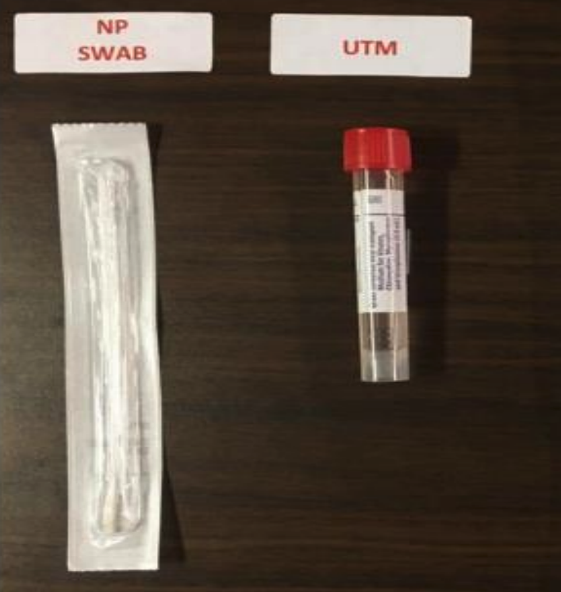

# 2019 - Coronavirus (COVID-19) Specimen Collection Kit

### Use: 
* To collect nasopharyngeal specimens for 2019-Coronavirus (SARS-CoV-2), the virus that causes COVID-19.

### Kit contents:
* 1 Tube of Universal Transport Media (UTM)
* 1 Nasopharyngeal swab (smaller swab, flexible shaft) (CDC recommended)

# ~Question 1
What does a specimen collection kit for COVID-19 consist of?

[RIGHT] 1 Nasopharyngeal swab and 1 Tube of Universal Transport Media (UTM)
[WRONG] 1 Nasopharyngeal aspirate and 1 Tube of Universal Transport Media (UTM)
[WRONG] 2  Nasopharyngeal swabs and 1 Tube of Universal Transport Media (UTM)

# Specimen Collection Types

### Nasopharyngeal specimen (CDC recommended specimen type)
Materials: 1 Flock swab in viral transport media (i.e. Hank's® Media)

The individual collecting the specimen should wear a face mask, gown, gloves and face shield. An N95 Mask is not required.

The individual collecting the swab should wear a face mask, gown, gloves and face shield.

#### Steps for Nasopharyngeal swab (NP):

1. The distance from the patient's nose to ear gives an estimate of the distance the swab should be inserted.

    * Tilt patient’s head back 70 degrees.
    * Insert one swab straight back into one nostril (swab should reach depth equal to distance from nostrils to outer opening of ear).
    * Leave swab in place in the nostril for a few seconds.
    * Repeat in the other nostril, using the same swab for both nostrils.
    * Immediately place the swab into a vial containing viral transport media (i.e. Hank’s® Media) and break off remaining shaft to close the vial.

2. Send the swab to the laboratory (tube station 91).

3. If unable to obtain a specimen, escalate.

Another option for upper respiratory tract specimens, especially in children is NP wash/aspirate or nasal aspirate: 
* collect 2-3mL of specimen in a sterile, leak-proof, screw-cap sputum collection cup or sterile dry container.

# ~Question 2
What should an individual wear while collecting a specimen for COVID-19 testing?

[RIGHT] Face mask, gown, face shield and gloves
[WRONG] Face mask, gown, gloves
[WRONG] Face mask, face shield and gloves

# ~Question 3
Is an individual collecting a specimen for COVID-19 required to wear an N95 mask?

[RIGHT] No
[WRONG] Yes

# ~Question 4
How deeply should the Nasopharyngeal Swab (NP) be inserted into the nostril?

[RIGHT] The distance from the patient's nose to ear
[WRONG] As deep as the patient is comfortable with
[WRONG] The distance from the patient’s chin to ear
[WRONG] The distance from the patient’s lips to ear

# ~Question 5
When using a Nasopharyngeal Swab (NP), to what degree should the patients’ head be tilted back?

[RIGHT] 70 Degrees
[WRONG] 45 Degrees
[WRONG] 30 Degrees
[WRONG] 15 Degrees

# Laboratory Submission

* Once the specimen is collected, securely tighten the cap on the tube of UTM.
* Label the UTM specimen according to hospital policy with the appropriate laboratory label. Have the patient identification labeling verfied by a second professional.
* Insert tube into specimen transport bag and close bag tightly.
* Submit the specimen to the laboratory.

# ~Question 6
Where are COVID-19 specimens currently tested?

[RIGHT] In laboratories
[WRONG] At the point of testing
[WRONG] In a government facility
