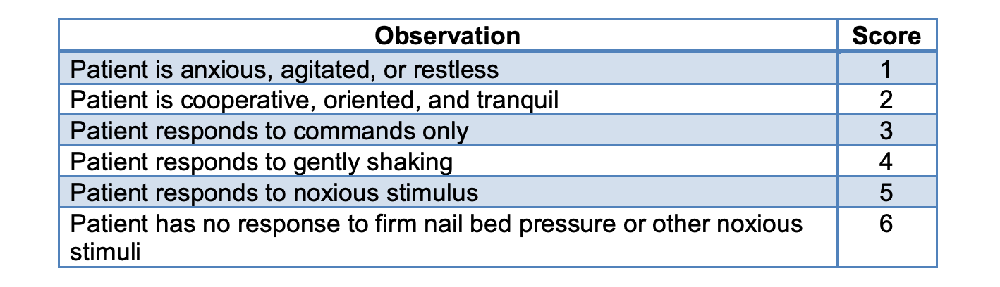
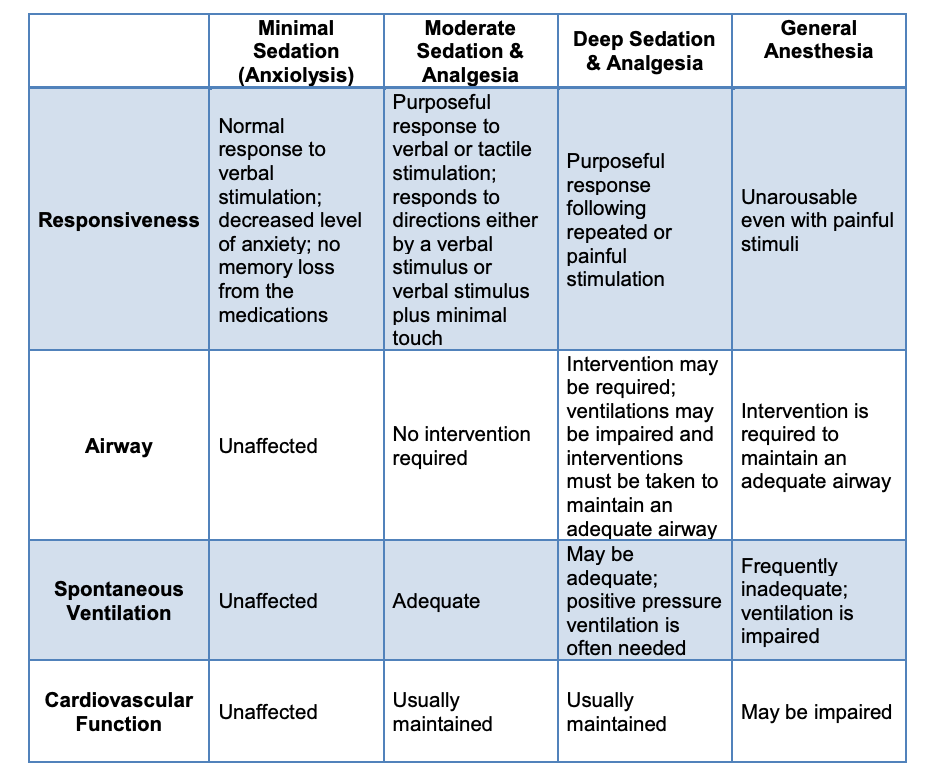

# Introduction to Sedation Monitoring

## After successful completion of this course, you will be able to:
1. Differentiate minimal, moderate or procedural sedation/analgesia, deep sedation, and anesthesia.
2. Describe the desired outcomes of moderate sedation.
3. Describe appropriate pre-procedural, intra-procedural, and post-procedural management of patients receiving procedural sedation.
4. State recommended dosage, rate of administration, onset and duration of action, and adverse effects of sedation agents.
5. Describe the recommended dosage, rate of administration, onset, and duration of action of reversal agents for opiates and benzodiazepines.
6. Demonstrate techniques to maintain a patent airway and adequate oxygenation.
7. Identify potential complications related to sedation.
8. List criteria for monitoring during procedural sedation.
9. State the post-procedural monitoring and discharge criteria.

## Brief Introduction
Moderate sedation is a high risk nursing activity that has become common practice in many healthcare facilities. Due to the nature of sedation, protocols for medication usage, monitoring, and documentation standards have been established, all of which will be discussed throhgout this course. 

### Note!
As you review this course, keep in mind that your facility will also have very specific policies and procedures that indicate where and who can perform or assist with sedation. Become familiar with these guidelines and do not assist with procedural sedation unless you have received appropriate training and yearly competency in the delivery of care for those patients.

# Patient Sedation
Sedation will decrease anxiety, pain, and discomfort. Sometimes amnesia is possible, minimizing the risk as compared to general anesthesia, and also allows for a more rapid recovery.

The benefit of using moderate sedation is that it can be used in a variety of healthcare settings including, but not limited to, outpatient clinics, inpatient procedural areas, emergency rooms, and operating rooms

## Review of Procedural Sedation
It is important that healthcare professionals learn and understand that the administration of varying types of procedural sedation and analgesia will result in different levels of sedation.

The response to and effects of procedural sedation medications is directly related to the type of drug administered, the dose, and the individual’s own response. The healthcare professional is responsible for being able to recognize the different levels of sedation, ensure patient safety, and assist with patient recovery from sedation.

## Goals or Objectives of Procedural Sedation
When sedating a patient for a procedure, the primary desired outcome is a patient who is sedate and cooperative.

The other goals include:
* Amnesia-absence of awareness or recall is desired but not required, analgesia-reduced pain perception, and anxiolysis–decreased anxiety.
* Patient will likely experience slurred speech, nystagmus (indicates desired effect), but at no time should patient lose consciousness.

## Dynamic Sedation Level
With the administration of procedural sedation, the patient’s level of sedation may be dynamic. Patients may suddenly or gradually experience an increased or decreased awareness that may or may not affect their ability to protect their own airway. In some situations, patients may move into a deeper level of sedation than intended. The best way to safely manage patients undergoing procedural sedation is to be knowledgeable about the types of medications that are administered for procedural sedation, the usual response to the medications, and any potential side effects related to the medication.

Additionally, both The Joint Commission and the American Society of Anesthesiologists (ASA) recommend that persons administering or monitoring procedural sedation be trained to administer any advance lifesaving measures if the patient changes from moderate sedation to deep sedation.

# Levels of Anesthesia
There are four levels of anesthesia:
1. Minimal or light sedation (anxiolytics)
2. Moderate sedation/analgesia or procedural sedation and analgesia (PSA)
3. Deep sedation/analgesia
4. General anesthesia

## Minimal or Light Sedation (Anxiolytics)
This is defined as a “trancelike” cataleptic state. Patients respond normally to verbal commands, although there may be impaired cognitive function and physical coordination. There is analgesia and amnesia. There is retention of protective airway reflexes, spontaneous respirations, and cardiopulmonary stability.

## Moderate Sedation
Very commonly, moderate sedation is used in conjunction with many procedures in the gastrointestinal or endoscopy suite, pulmonary lab, intensive care units (ICUs), emergency departments (EDs), and other clinical locations. According to The Joint Commission, patients covered by sedation policies include:
* Situations that do not require the services of a qualified anesthesia provider (generally relatively non-invasive procedures on healthy patients).
* All non-intubated patients receiving moderate sedation for diagnostic and therapeutic procedures.

## Definition of Moderate Sedation
A minimally depressed level of consciousness induced by the administration of pharmacologic agents in which a patient retains the ability to independently and continuously maintain an open airway and a regular breathing pattern. The patient can respond appropriately and rationally to physical stimulation and verbal commands. Moderate sedation may be induced by parenteral or oral medications or a combination thereof. Drugs, dosages, and techniques utilized are not intended to produce loss of consciousness.

## Clinical Characteristics Moderate Sedation
* Maintenance of protective reflexes (e.g., ability to control secretions, avoid aspiration, and breathe without assistance)
* Independent and continuous maintenance of a patent airway
* Appropriate response to physical stimulation and/or verbal command
* Easy arousal and responds to verbal or light tactile stimulation
* Cardiovascular status is usually maintained

## Deep Sedation/Analgesia
Deep sedation/analgesia is a drug-induced depression of consciousness during which the patient cannot be easily aroused, but responds purposefully following repeated or painful stimulation.

Independent ventilatory function may be impaired. The patient may require assistance to maintain a patent airway. Spontaneous ventilation may be inadequate. Cardiovascular function is usually maintained

## Clinical Characteristics of Deep Sedation
* Not easily aroused
* May require repeated or painful stimulation to elicit a response
* Partial or complete loss of protective reflexes
* Loss of ability to maintain a patent airway
* Cardiovascular function usually maintained

## General Anesthesia
A drug-induced loss of consciousness during which the patient is not arousable, even to painful stimuli. The ability to maintain independent ventilatory function is often impaired. Assistance is often required in maintaining a patent airway. Positive pressure ventilation may be required due to depressed spontaneous ventilation or drug-induced depression of neuromuscular function. Cardiovascular function may be impaired.

# Levels of Sedation: Modified Ramsay Scale

The goal of moderate sedation is to have the patient at level 2 or 3 on the sedation scale where the patient is tranquil and able to respond to commands.

## Review of the Levels of Sedation
1. No sedation
2. Light sedation
3. Moderate sedation
4. Deep sedation
5. General anesthesia

## Clinical Characteristics of Different Levels of Sedation

## Levels of Sedation
The non-anesthesia provider should be knowledgeable about the differences in the sedation levels and be able to determine when the patient is approaching deep sedation or general sedation. It is not always possible to predict a patient’s response to sedation.

Practitioners should be able to rescue a patient who moves to an unintended level of sedation.

### The Sedation Continuum

# Regulation and Oversight of Sedation
The requirements for safe administration of medications and safe practice of procedural sedation are defined by The Joint Commission and other accreditation agencies, the Board of Registration in Medicine, individual states, and individual hospital policies. Practitioners should review and understand their scope of practice with procedural sedation as they will need to follow the policy for their patient safety and to ensure regulatory compliance.

From the nursing standards, states will have their own Nurse Practice Act. This act will provide regulations and guidelines on the role of the RN during procedural sedation.

## Accreditation Standards
According to accreditation agencies, the following are required for the administration of
procedural sedation and will be reviewed in detail:
1. Procedural sedation is provided by qualified individuals. Qualified individuals have competency-based education, training, and experience. Sufficient numbers of qualified personnel are present in addition to the licensed independent practitioner performing the procedure.
2. A pre-sedation or pre-anesthesia assessment is performed for each patient before beginning procedural sedation induction.
3. Each patient’s procedural sedation care is planned.
4. The patient’s physiological status is monitored during sedation.
5. Discharge standards are followed.

## Procedural Sedation Provided by Qualified Individuals
The accreditation standards include the requirement of trained healthcare providers during procedural sedation. During procedural sedation, someone needs to be the operator and someone needs to be the monitor. With some procedures, such as a bronchoscopy, a respiratory therapist may be required.

# Question 1

The sedation level of a patient who responds only to painful stimulation but displays adequate spontaneous ventilation is best described as:

[WRONG] Moderate sedation
[RIGHT] Deep sedation
[WRONG] General anesthesia

# Question 2

Rescue training is the ability to recognize and support a compromised airway should
over-sedation occur.

[RIGHT] True
[WRONG] False

# Medications Generally Associated with Sedation
## Propofol
Propofol is an intravenous anesthetic that is used for procedural sedation, during monitored anesthesia care, or as an induction agent for general anesthesia. It may be administered as a bolus or an infusion or some combination of the two. Propofol is prepared in a lipid emulsion which gives it the characteristic milky white appearance.

### Clinical uses of Propofol:
* Induction of general anesthesia in patients ≥ three years old; though it may be used as an induction agent if a child less than three years of age has IV access. 
* Maintenance of anesthesia in patients > 2 months old
* Sedation during monitored anesthesia care for patients undergoing procedures
* Sedation in intubated, mechanically-ventilated ICU patients

### Mechanism of Action
Like most general anesthetic agents, the mechanism of action for propofol is poorly understood but thought to be related to the effects on GABA-mediated chloride channels in the brain. Propofol may work by decreasing dissociation from GABA receptors in the brain and potentiating the inhibitory effects of the neurotransmitter. This, in turn, keeps the channel activated for a longer duration resulting in an increase in chloride conductance across the neuron causing a hyper-polarization of the cell membrane making it harder for a successful action potential to fire

### Administration 
**Route of Administration:** Intravenous 

**Onset of action:** Propofol has a rapid onset of action that is dose-dependent and less than a minute.

**Duration of action:** An induction dose of propofol will have clinical effect for approximately 10 minutes. The prolonged or repeated administration will accumulate in peripheral tissues and will cause an increased duration of action. 

**Distribution:** Large volume of distribution.

**Protein Binding:** 97% to 99%.

**Metabolism:** Hepatic oxidation and conjugation to sulfate and glucuronide conjugates.

**Clearance:** Hepatic clearance is approximately 60% with extra hepatic clearance making up the remaining 40%; the majority of which is via the kidneys.

**Half-life:** Propofol is bi-phasic with its initial half-life being relatively quick, around 40 minutes, and its terminal half-life usually being 4 to 7 hours. Context-sensitive half-time may be up to 1-3 days after a 10-day infusion.  The clinical effect of propofol is much shorter in duration.

**Excretion:** Primarily renal.

After a single bolus or short-term infusion, the termination of action is primarily by redistribution, owing to the lipophilicity of the drug.  Metabolism and excretion play minor roles in termination of effects following a single bolus.  Prolonged infusions may lead to slower emergence from anesthesia once the tissues and blood have reached a steady-state concentration. 

### Adverse reactions 
* Transient local pain at the injection site is the most common adverse reaction which may be decreased by administering IV lidocaine before propofol bolus. 
* Hypotension
* Myoclonus
* Occasionally has been seen to cause EKG changes (QT interval prolongation).  This is rarely clinically significant.
* Discolored urine (a green tint); this is exceedingly rare

### Pregnancy: 
Propofol is safe for use in pregnancy but will cross the placenta and may be associated with neonatal CNS and respiratory depression.  It is the drug of choice for induction of general anesthesia in the stable obstetric patient and in the lowest risk class of all of the induction agents currently used.

Propofol was formerly listed as a Category B drug for use in pregnancy.  However, in late 2014 the FDA removed the lettering system to denote the degree of potential harm in pregnancy or lactation and moved to a more descriptive system based on individual effects of pharmacologic agents. 

### Drug Interactions:
Propofol may potentiate other medications that cause CNS or respiratory depression and a decrease in blood pressure. Caution is advised when using other agents that may prolong QT interval. Propofol has weak CYP3A4 inhibitory effects but is unlikely to be of clinical concern. 

### Contraindications
Propofol is contraindicated in any patient that has any known hypersensitivity reaction to the drug. Caution should be taken in any patient with abnormally low blood pressure.  

Some package inserts state that propofol should not be given to those with reported allergies to eggs, egg products, soy or soy products. An allergic reaction occurs secondary to exposure to specific proteins from both egg and soy sources and not the fats (lecithin and oil, respectively) that make up the emulsion.  The oils used to manufacture propofol are unlikely to contain quantities of proteins significant enough to produce an allergic cross-reaction.  That being said, patients with atopy have been reported to have a higher incidence of allergic reaction to many medications, and there are case reports of cross sensitivity to propofol in the atopic patient.  Clinical judgment should be exercised on a case-to-case basis. 

### Monitoring
**Therapeutic effects of propofol:**
When administered as a bolus propofol has a rapid and smooth onset that is extremely predictable in its duration. It has low organ toxicity and is very compatible with a wide range of other commonly used drugs in the setting of anesthesia.

**Central nervous system effects:**
Propofol causes a dose-dependent decreased level of consciousness and can be used for moderate sedation to general anesthesia.  This decreased sensorium may lead to loss of protective airway reflexes and propofol should not be used in any patient unless they are appropriately fasting.  The American Society of Anesthesiologists' (ASA) NPO guidelines should be used as a template for the duration of fast following varying oral intake. 

In addition to depression of cognition, propofol will cause a decrease in cerebral blood flow, intracranial pressure, and cerebral oxygen consumption.  Propofol causes increased latency and decreased amplitude during somatosensory evoked potential monitoring and at higher doses can lead to burst suppression and even an isoelectric EEG.  In rat models, propofol has neuroprotective effects on the brain and will decrease oxidative damage and apoptosis. 

It also has been shown to cause transient excitatory phenomena such as choreiform movements and opisthotonus (abnormal posturing caused by spasm of the muscles) after injection. Propofol has also been shown to suppress seizure activity in the brain and is seldom used off-label to treat refractory status epilepticus.

**Cardiovascular effects:**
Propofol causes vasodilation by inhibiting sympathetic vasoconstrictor activity along with mild depression of myocardial contractility which accounts for the hypotension often seen when administered. This effect can be substantial with a profound reduction in the mean arterial pressure, especially when propofol is administered as a bolus. Caution should be used in hypovolemic or in catecholamine-depleted patients.

**Respiratory effects:**
Propofol causes dose-dependent respiratory depression due to the inhibition of the hypercapnic ventilatory drive.  This respiratory depression is potentiated by concurrent use of other sedative agents (benzodiazepines, opioids, central acting alpha two agonists, or other anesthetic medications).  An induction dose of propofol will cause apnea.

Propofol has also been seen to cause a low incidence of bronchospasm in asthmatic patients.

**Additional monitoring requirements/precautions:**
Propofol can cause profound cardiovascular and respiratory depression and will ultimately end in general anesthesia if given in large enough doses.  For this reason, any practitioner who administers propofol must be qualified to care for a patient who is at any level of sedation (ranging from moderate sedation to general anesthesia).  Emergency equipment must be readily available and in good working order.  At a minimum, the ASA recommends monitoring of oxygenation, circulation, ventilation and temperature for all anesthetics.  Appropriate anesthesia personnel must be continually present during all anesthetic cases requiring general anesthesia, monitored anesthesia care or a regional anesthetic. 

Rescue equipment should include a bag valve mask, two sources of oxygen (centrally supplied or cylinders), laryngoscopes, endotracheal tubes of differing sizes, laryngeal mask airways, a crash cart with appropriate ACLS medications and a defibrillator.   The ASA guidelines for NPO status should be followed for any patient receiving an anesthetic since the loss of protective airway reflexes carries the risk of gastric content aspiration.

### Toxicity
**Propofol Infusion Syndrome (PRIS):** Is a rare but serious side effect of prolonged infusion of propofol (usually > 4mg/kg/h for more than 24 hours). The syndrome presents as metabolic acidosis, hyperkalemia, hyperlipidemia, and rhabdomyolysis and may proceed to renal and cardiac failure and ultimately death.

It is thought to occur due to alterations in mitochondrial metabolism and electron transport chain function, but the exact mechanism of PRIS is still unknown. The onset of PRIS usually occurs within four days of the initial propofol treatment. This syndrome has been noted to occur during prolonged infusions at high doses in pediatric/young adult patients or those with the need for prolonged sedation, such as mechanically ventilated patients with head trauma.

## Fentanyl
A strong synthetic opioid, which similar to morphine produces analgesia but to a greater extent. This robust pharmacologic agent is typically 50 to 100 times more potent. A dose of only 100 micrograms can produce equivalent analgesia to approximately 10 mg of morphine. However, fentanyl exhibits vastly different properties and pharmacokinetics. Clinically, it is most often used as a sedative in intubated patients, as well as in severe cases of pain in patients with renal failure owing to its primarily hepatic elimination. At times, fentanyl may also be indicated to treat chronic pain patients who have developed tolerance to opiates. When used as a sedative, it is most commonly administered as a drip, owing to its versatility in titration scenarios. It may often require large doses when used as a sedative in patients with mechanical ventilation requirements. As pre-medication for procedures, namely those anticipated to cause discomfort, fentanyl can also be given perioperatively. Lastly, fentanyl uses can be extended to the treatment of epilepsy. That is, in combination with certain neuroleptic medications as part of therapeutic neuroleptanalgesia.

### Mechanism of Action
Fentanyl is similar to other opioid drugs. Fentanyl molecules target a subclass of opioid receptor systems in the body, many of which are localized in the brain within specialized neuroanatomical structures particularly regarded to the control of emotions, pain, and speaking to the point of its infamous addictive properties, reward. Biochemically, it is referred to as a Mu-selective opioid agonist. However, it has the capabilities to activate other opioid system receptors such as the delta, and potentially the kappa-receptors. Consequently, the activation of these receptors, particularly the Mu-receptors, produce analgesia. Also, the neurotransmitter dopamine (Da) is increased in the reward areas of the brain, which elicits the stereotypical exhilaration and relaxation effects, and is typically associated with the addiction to the drug.

### Administration
Fentanyl is typically administered intravenously (IV), intramuscularly (IM), transdermally (TD) as skin patches (Durogesic DTrans; Fencino; Fentalis), intranasally (IN) in the form of a volatile nasal spray (Instanyl or PecFent, and intrathecally (IT). It is also available as a buccal soluble thin film (Breakyl), which can dissolve in the mouth, similarly to the sublingual tablets (Abstral or Recivit). However, in contrast to other opiates, it is less common to find forms of the synthetic drug as oral tablets or powders. A novel medication currently being used to address the gastrointestinal (GI) side effects without counteracting its primary analgesic aims is Relistor. The latter acts selectively on the GI mu-opioid receptors and can aid in alleviating constipation while still providing pain relief, a dilemma previously treated off-label in some hospitals by suspending a vial of naloxone in ice water and taking the mix enterally.

### Adverse Effects
Fentanyl's side effects are similar to those of heroin, which produce euphoria, confusion, respiratory depression (which, if extensive and untreated, may lead to arrest), drowsiness, nausea, visual disturbances, dyskinesia, hallucinations, delirium, a subset of the latter known as “narcotic delirium”, analgesia, constipation, narcotic ileus, muscle rigidity, constipation, addiction, loss of consciousness, hypotension, coma, and even death. Alcohol and other drugs (i.e., cocaine, heroin) can synergistically exacerbate fentanyl's side effects, creating multi-layered clinical scenarios that can be complex to manage. These substances taken together generate undesirable conditions which complicate the patient’s prognosis.

### Contraindications
The use of fentanyl is contraindicated in patients,
* After operative interventions in the biliary tract, as these may slow hepatic elimination of the drug
* With respiratory depression or obstructive airway diseases (i.e., asthma, COPD, obstructive sleep apnea, obesity hypoventilation also know as, Pickwickian syndrome)
* With liver failure
* With known intolerance to fentanyl or other morphine-like drugs including codeine
* With known hypersensitivity (i.e., anaphylaxis) or to any of the common drug delivery excipients (i.e., sodium chloride, sodium hydroxide). 

The drug fentanyl should not be used concomitant with certain medications such as CYP3A4 inhibitors like macrolide antibiotics or azole-antifungal agents, and protease inhibitors since may increase plasma concentrations of fentanyl extending the opioid drug action and exacerbating the opioid-induced respiratory depression (OIRD). On the other hand, the cessation of a CYP3A4 inducer medication, (i.e., carbamazepine, phenytoin) in patients treated with Fentanyl Citrate Injections may potentially increase fentanyl plasma concentrations prolonging the opioid adverse reactions.

### Monitoring
When using fentanyl citrate injections along with medications such as CYP3A4 inhibitors, or stopping the CYP3A4 inducers in patients treated with fentanyl injections, the patients should be monitored closely and frequently. Also, consider lowering the dose of fentanyl. Similarly, when using fentanyl citrate injection along with CYP3A4 inducer medications, or stopping the CYP3A4 inhibitors, an undesirable reduction in fentanyl plasma concentrations may occur, thus decreasing its systemic efficacy. The use of fentanyl citrate injection with CYP3A4 inducers, or stopping the CYP3A4 inhibitor, will require close and repetitive monitoring of the patient. Also, consider augmenting the dose of fentanyl, as needed.

### Toxicity
Typically, a fentanyl overdose manifests as an extrapolation of its pharmacological side effects. Although the clinical scenarios may vary among patients, one of the main concerns is the level of expression of OIRD. In such cases, oxygen administration and respiratory assistance should be performed accordingly. An opioid drug antagonist such as naloxone is also indicated to correct OIRD symptoms. Commonly, repetitive doses are required since the respiratory depression may overcome with time the effects of the antagonist drug, namely with opiates such as fentanyl in which increased receptor affinity may be noted as compared to other opiates. Thus, the therapeutic approach is continued until a normal respiratory rate coincides with appropriate oxygen saturation levels. Naloxone/naltrexone are robust opioid antagonists that function by blocking µ-receptors. The FDA has approved these antidote medications for emergency treatment of patients with known or suspected opioid overdose experiencing respiratory and/or central nervous system (CNS) depression. Naloxone is commonly administered IV, IM, IN or subcutaneously (SC). More recently, a caveat regarding the intranasal route for naloxone administration has been posed. Since the incidence of obstructive nasal pathology is relatively high in patients who experience serious OIRD, relevant instances of treatment failures have been documented when using the IN formulations.

Also, an IV neuromuscular blocker may be employed in cases of severe muscular rigidity to assist the controlled respiration treatments.

## Versed
Intravenous midazolam (also known as Versed) is used for the induction of anesthesia and also in the management of acute seizures. Because of its water-soluble nature, midazolam has a rapid onset of action and can be used to manage status epilepticus when intravenous administration of other medications is not feasible. Midazolam has a high rate of tolerance, and dose can be increased to maintain the therapeutic effect. Because of its easy mode of administration through buccal and intranasal route, it is a viable option in children for the management of seizures. For its use in anesthesia, the response to the induction dose is more variable compared to thiopental. Midazolam can be used for anxiolysis and hypnosis during the maintenance phase of general anesthesia and is also superior to thiopental in the maintenance of anesthesia because of the less need for adjunct medications. Midazolam is used as an adjunct medication to regional and local anesthesia for a wide range of diagnostic and therapeutic procedures and has greater patient and physician acceptance.

### Mechanism of Action
Midazolam has poor oral absorption and has an elimination half-life of 1.5 to 2.5 hours. Midazolam converts into its active metabolite alpha-1 hydroxy midazolam, which contributes to 10% of drug action. Midazolam metabolism occurs via hepatic CYP450 enzymes and glucuronide conjugation. The mechanism of action of midazolam indirect and is related to GABA accumulation and its affinity to the benzodiazepine receptors. Two separate receptors for GABA and benzodiazepine couple to a common chloride channel. It increases the frequency of chloride channel opening. Occupation of both the receptors cause membrane hyperpolarization and neuronal inhibition. The anticonvulsant activity of midazolam is related to the excess GABA action on motor circuits in the brain. Midazolam acts on glycine receptors and produces muscle relaxation effect. Almost all the pharmacologic effects, including sedation, anxiolysis, anterograde amnesia, and anticonvulsant effect, can are explainable through its action on GABA receptors. Age-related deficits, hepatic, and renal insufficiency, also affect the pharmacokinetics of midazolam.

### Administration
Midazolam administration can be through oral, intranasal, buccal, intravenous, and intramuscular routes. For the perioperative use of midazolam, the induction dose is 0.15 to 0.40 mg/kg via the intravenous route. For the premedication, the dose is 0.07 to 0.10 mg/kg with the intramuscular route. For intravenous sedation, the dose is titrated at 0.05 to 0.15 mg/kg. For children 1 to 5 months old, the recommended intranasal dose is 0.2mg/kg. For children six months and older, 0.2 to 0.3 mg/kg intranasal dose is the recommendation

### Adverse Effects
The common adverse effects associated with midazolam use are hiccoughs, cough, nausea, and vomiting. Thrombophlebitis, thrombosis, and pain on injection are other adverse effects. The incidence of thrombophlebitis is less than with diazepam but similar to that of thiopental. Midazolam causes anterograde amnesia, drowsiness, ataxia, falls, and confusion in the elderly. Residual hangover effect can happen with nighttime administration of midazolam, which can impair the cognitive and psychomotor abilities, which can result in falls in elderly and impaired coordination during driving. Hypotension and tachycardia can occur with rapid intravenous administration. A higher dose can result in midazolam infusion syndrome and respiratory depression. Instances of midazolam infusion syndrome require continuous ventilator support. Paradoxical effects of midazolam are possible in individuals with a history of alcohol abuse and aggressive behavior, potentially leading to involuntary movements, verbalization, uncontrollable crying, and aggressive behavior. Respiratory depression can happen with a dose of 0.15 mg/kg, and the risk increases when used along with fentanyl. Concomitant use of midazolam with other CNS depressants can result in severe respiratory depression and death even at therapeutic doses.

### Contraindications
Contraindications for the use of midazolam include acute angle-closure glaucoma, hypotension, and shock. Careful dose adjustment is necessary in cases of kidney and liver diseases, alcohol, and drug-dependent individuals. Caution is necessary for pregnant individuals, children, and individuals with comorbid psychiatric conditions. Administration in elderly individuals and acutely ill patients requires caution to prevent the accumulation of active metabolites. Extra precautions should be taken in critically ill individuals as dose accumulation can occur.

### Monitoring
Frequent monitoring of blood levels of midazolam and its metabolites is a requirement during the treatment of midazolam overdose. Levels of midazolam and its metabolites can are measurable in blood, plasma, and serum. Monitoring is essential for elderly individuals and individuals with liver and kidney disease. The elimination of both the drug and its metabolite decreases with renal insufficiency. Monitoring is also necessary for drug interactions with erythromycin, clarithromycin, diltiazem, sertraline, protease inhibitors, rifampin, phenytoin, phenobarbital, carbamazepine, opioids, antipsychotics, and alcohol. Induction and inhibition of CYP450 3A4 play a role in decreased and increased levels of the drug in the circulation. Grapefruit juice reduces the activity of the CYP 450 enzyme and increases the level of the drug. St. John's wort induces the enzyme and reduces the blood level of midazolam.

### Toxicity
Toxicity with midazolam is rare but can happen when combined with other CNS depressants like alcohol, opioids, and other tricyclic antidepressants. The risk increases with intravenous administration and in elderly individuals with COPD. Symptoms of overdose include ataxia, nystagmus, hypotension, slurred speech, slurred speech, impaired motor coordination, coma, and death. Impaired reflexes, impaired balance and dizziness, dysarthria, and vasomotor collapse can also occur. Flumazenil is the antidote for midazolam toxicity. Supportive treatment is the initial therapy course. Activated charcoal is an option within 1 hour of intoxication. In many instances, flumazenil is not prudent, as it can precipitate seizures when used in a mixed overdose of CNS depressants. Rapid intravenous infusion in elderly individuals having COPD can also result in an overdose.

## Dilaudid
Hydromorphone (also known as Dilaudid) is a pure opioid indicated for moderate to severe acute pain and severe chronic pain. It is only prescribed when other first-line of treatments have failed, due to its high potency, abuse potential, and overdose risk. Moreover, it can be prescribed off-label for refractory cough suppression

### Mechanism of Action
Hydromorphone is an opioid agonist that binds to several opioid receptors. Its analgesic characteristics are through its effect on the mu-opioid receptors. It also acts centrally at the level medulla, depressing the respiratory drive and suppressing cough.

### Administration and dosing
Hydromorphone administration can be through intramuscular, intravenous, subcutaneous, or oral routes.

**Intramuscular, intravenous, or subcutaneous:** injected at a concentration up to 10 mg/ml.

**Oral:** Patients can take it orally with or without food in the immediate or extended-release form. The latter cannot be crushed, chewed, or dissolved, because it will void immediate release of the formulation

### Pharmacology
Immediate-release oral formulations have an onset of action at 15 to 30 minutes, peak at 30 to 60 minutes, and last 3 to 4 hours. Half-life is 2 to 3 hours.

Extended-release formulations have an onset of action at 6 hours, peak at 9 hours, and lasts 13 hours. Half-life is approximately 11 hours but varies between 8 to 15 hours.

The volume of distribution is 4 L/kg, where 8% to 19% of the drug is protein bound. Metabolism occurs in the liver through glucuronidation where most of it converts to hydromorphone-3-glucuronide.

Excretion is mainly through urine in the glucuronidated form. The residual unchanged form gets excreted in the urine (7%) and the feces (1%).

The equivalence of hydromorphone to other opioids will follow later.

### Availabilities
As seen above, oral tablets can be in the immediate release form and an extended-release form.

* Immediate-release oral solutions have a dosage of 1 mg/1 ml, while oral tablets can be either 2 mg, 4 mg, or 8 mg.
* The dosage of extended-release oral tablets is either 8 mg, 12 mg, 16 mg, or 32  mg. This latter does not have an oral solution form.
* Injection solutions can be found in the following concentrations: 1 mg/ml, 2 mg/ml, 4 mg/ml, and 10 mg/ml.
* Intravenous solutions are available in the following formulations: 2 mg/1 ml, 2500 mg/250 ml, 10 mg/1 ml, 500 mg/50 ml.

### Adverse Effects
Hydromorphone has potential adverse effects on several organ systems: the integumentary, gastrointestinal, neurologic, cardiovascular, endocrine, and respiratory systems.

Common adverse effects include flushing, pruritus, sweating, dry mouth, nausea/vomiting, constipation, asthenia, dizziness, headache, and somnolence.
Serious adverse effects include hypotension, syncope, adrenal insufficiency, coma, raised intracranial pressure, seizure, suicidal thoughts, apnea, respiratory depression or respiratory arrest, drug dependence or drug withdrawal, and drug withdrawal syndrome in newborns

### Contraindications
Hydromorphone is contraindicated in patients reporting allergies to the drug itself, sulfites, or any other component of the formulation used.

Clinicians should not administer this drug to patients with bronchial asthma, or any other form of respiratory disease with clinical respiratory compromise; this can induce respiratory arrest. In terminal cancer patients, clinicians should not restrain opioid therapy even when signs of respiratory depression are evident. 

Hydromorphone is to be avoided in any gastrointestinal obstruction or hypomotility, including ileus. Postoperative ileum should prompt careful administration of hydromorphone, to prevent prolonged ileus.

Hydromorphone should also to be avoided in genitourinary obstructions, central nervous system (CNS) depression, hypotension, and hypovolemia. It requires careful administration in cases of concomitant psychiatric illness.

### Monitoring

**Drug interactions**
Naltrexone and nalmefene are opioid receptor antagonists that can precipitate withdrawal symptoms when used along with hydromorphone, decreasing its analgesic effect.

The use of hydromorphone in patients taking safinamide (MAO inhibitor) can precipitate serotonin syndrome and necessitates caution in dosing. It also requires careful administration for patients taking selective serotonin inhibitors (SSRI) or tricyclic antidepressants (TCA) for this same reason.

Concurrent use of hydromorphone with other CNS depressants, including benzodiazepine and barbiturates, can induce severe respiratory and/or CNS depression. For this purpose, the use of alternative analgesic agents is necessary.

### Toxicity
Hydromorphone is a rapid-acting potent opioid used in acute and chronic pain. It is interchangeable with other opioids and has a specific conversion scale. Hydromorphone is available in multiple forms, including injection and oral forms, immediate-release, and extended-release forms. The risk profile of this drug requires careful prescription and administration, with thorough knowledge of the potential harms and interactions.

Threatening life events are to be managed promptly as the respiratory depression it causes in overdose may lead to death. Finally, hydromorphone is a target of research in intrathecal pumps, which has a promising role in refractory pain.

## Precedex
The FDA-approved indications for dexmedetomidine are sedation of intubated and mechanically ventilated patients in the intensive care unit (ICU), and peri-procedural (or peri-operative) sedation of non-intubated patients. Over time, usage has expanded to off-label uses, including treatment and prevention of delirium, adjunctive analgesia, therapy for insomnia in the ICU, and treatment of alcohol withdrawal. This expanded list of indications is because it commonly produces a sedated state allowing patients to be both comfortable and cooperative during mechanical ventilation. Additionally, it does not require stoppage to accomplish extubation and is safe to use in non-intubated patients because it does not produce significant respiratory depression.

### Mechanism of Action
Dexmedetomidine is an alpha agonist having sedative, anxiolytic, hypnotic, analgesic, and sympatholytic properties. It produces these effects by inhibition of central sympathetic outflow by blocking the alpha receptors in the brainstem, thereby inhibiting the release of norepinephrine. It has a selectivity of 1600 to 1 for the alpha2 receptor as compared to alpha1. This selectivity is especially significant when comparing this to another alpha agonist, clonidine, with a selectivity of 220 to 1. The mechanism by which dexmedetomidine may increase the duration of a peripheral nerve block is not fully understood but is believed to most likely be a perineural mechanism rather than a systemic or central mechanism, which appears to prolong the duration by blocking the cation current

### Administration
For ICU sedation, the typical dosage range is 0.2 to 0.7 mcg/kg per hour. However, the dose can be increased to 1.5 mcg/kg per hour to achieve the desired sedation level. Doses as high as 2.5 mcg/kg per hour have been described, but it is unlikely that doses higher than 1.5 mcg/kg per hour achieve any further therapeutic benefit in the absence of increased side effects. Dosage adjustments for renal or hepatic impairment are not required but should be considered, especially for hepatic impairment. The manufacturer does not recommend durations longer than 24 hours; however, longer durations have demonstrated to be safe and effective. Clinicians can administer a loading dose of 0.5 to 1.0 mcg/kg; this is usually avoidable if the medication is for labile critically ill patients or those with tenuous hemodynamics.

When used in anesthesia, the typical dosing is a loading dose of 0.5 to 1.0 mcg/kg, usually followed by a continuous infusion of 0.2 to 0.7 mcg/kg per hour titrated to desired sedation goals. As mentioned, higher infusion doses can help achieve the desired effect.

### Adverse Effects
The most common adverse effects of dexmedetomidine are hypotension, bradycardia, and hypertension. Hypertension can result from the stimulation of alpha subtypes of receptors in vascular smooth muscles. Hypertension usually does not require treatment and can be avoided by the slow administration or omission of the loading dose. Hypotension and bradycardia are the results of the stimulation of presynaptic alpha receptors, which leads to a decreased release of norepinephrine; this is in addition to the decrease in the central sympathetic outflow. These are concerns regardless of the route of administration. 
### Contraindications
There are no absolute contraindications to the use of dexmedetomidine. However, it should be used cautiously in patients with bradycardia and hypotension as the medication may exacerbate these findings. Additionally, it should be used cautiously in patients with known heart failure as there is level B evidence showing dexmedetomidine can potentially exacerbate myocardial dysfunction.

### Monitoring
There are no specific drug monitoring requirements. The level of sedation, heart rate/rhythm, blood pressure, and pulse oximetry require close monitoring.

### Toxicity
At present, there is no chemical reversal or antidote for dexmedetomidine. Supportive care and close monitoring are the staples of treatment for overdose.

# Complications of Sedation
Complications can occur when giving procedural sedation. Some of those complications are:
* Airway issues
* Hemodynamic instability
* Agitation
* Anaphylaxis
* Drug reactions

All of which will be discussed in the following articles. 

## Airway Complications

### Hypopnea/Apnea from Over-Sedation
* To prevent this, vigilance is key
* Oxygen desaturation is late sign, about two to three minutes

**What do we do about it?**
* Provide supplemental oxygen
* Keep supine
* Stimulate patient, encourage deep breathing
* Head tilt/chin lift or jaw-thrust maneuver
* Airway adjunct (nasal or oral airway)
* Provide positive pressure ventilation; bag/mask
* Administer appropriate reversal agents
* Intubation

### Obstruction
* Know the risk factors: obesity, OSA
* Know the signs
 * Snoring: early obstruction
 * No condensation on O 2 mask
 * Paradoxical respiratory movements

***What do we do about it?***
* Provide supplemental oxygen
* Keep supine
* Stimulate patient, encourage deep breathing
* Head tilt/chin lift or jaw-thrust maneuver
* Airway adjunct (nasal or oral airway)
* Provide positive pressure ventilation; bag/mask
* Administer appropriate reversal agents
* Intubation

### Laryngospasm
A partial laryngospasm often responds to supplemental oxygen, calming measures and having the patient breathe slowly and deeply and try to cough.

***What do we do about it?***
* If above steps ineffective, low doses of IV Midazolam or lidocaine may be effective
* If condition deteriorates, positive pressure ventilation, 100% O2, suction
* Small doses of Succinylcholine (0.5 mg/kg IV) and intubation to be done by anesthesiologist or ER physician

### Bronchospasm
Bronchospasm can happen from medications such as morphine or could be from pulmonary edema.

Symptoms:
* Audible wheezing
* Tachypnea
* Dyspnea
* Decreased O 2 saturation
* Accessory muscle use
* Restlessness
* Tightness in chest

***What do we do about it?***
* Pre-treat patients with history of broncho-spastic disease with bronchodilators
* Treat with bronchodilators and humidified oxygen

### Vomiting/Aspiration
***What do we do about it?***
* Suction must be available
* Anti-emetics
* Prevention: Observe pre-operative fasting guidelines
* Observe sedated patient closely for post-operative nausea/vomiting (PONV)
* Remove airway adjuncts as soon as possible to prevent gagging and regurgitation
* Medications may be ordered to decrease gastric secretions (anticholinergic), neutralize gastric secretions (H2 receptor antagonists), foster gastric emptying (metoclopramide) or reduce n/v
* Treatment includes supplemental O 2 suctioning, CPAP, intubation, antibiotics, bronchodilators, steroids

## Hemodynamic Instability

### Hypotension
Hypotension is generally due to vasodilation. When managing hypotension, consider the following key actions:

1. Check the airway. Is it intact? If not, establish airway by head tilt/chin lift, airway adjuncts, bag valve mask, or intubation. Consider reversal of sedation.
2. Check ventilation and oxygen saturation. Is there effective ventilation and O2 saturation? If not, provide ventilatory support, supplemental O2 , and intubate if needed. Consider pulmonary emboli.
3. Check the rhythm. Is it the patient’s rhythm at baseline? If not, obtain 12 lead then correct tachycardia, brady arrhythmias, and non-sinus arrhythmias. Does the patient have any signs of MI or ischemia?
4. Give a bolus of fluid. Was it effective? If not, look and treat for causes such as bleeding, anaphylaxis, sepsis, equipment malfunction, or complication of procedure.
5. Start vasopressors.

### Bradycardia
First, the practitioner must rule out hypoxia. Bradycardia is usually vaso-vagal secondary to the procedure (bowel or bladder distension, pain, uterine traction).

**What do we do about it?**
* Increase oxygen if needed
* Stop stimulus and assess rhythm
* Atropine: 0.5-1 mg IV q 3-5 minutes not to exceed 3 mg

### Tachycardia
Tachycardia is usually from pain. The healthcare providers should consider the cause and co-morbidities of the patient. Sometimes it can be caused from epinephrine given locally.

**What do we do about it?**
* Fentanyl for pain: Vagotonic properties
* If from the epinephrine, will generally resolve in a few minutes
* β-Blocker if prolonged and problematic, IV

### Hypertension
Hypertension is usually from pain or from the epinephrine. The healthcare providers should consider hypercarbia.

**What do we do about it?**
* Analgesics as appropriate
* Labetalol: α and β antagonist 5-10 mg IV push
* Hydralazine: Direct vasodilator 5-10 mg IV (wait 10-20 minutes)

## Agitation
With agitation, the healthcare providers must rule out hypoxia or hypercarbia. It could also be from a paradoxical drug reaction, especially in elderly.

**What do we do about it?**
* Give benzodiazepines
* Monitor respiratory status and treat accordingly

## Managing Allergic Reactions/Anaphylaxis
Anaphylaxis is most common with opioids but can occur with any drug. Reactions can occur within 60 minutes, with symptoms ranging from urticarial to bronchoconstriction, laryngeal edema, hypotension, or circulatory collapse. Other reactions include drug fever, vasculitis, serum sickness syndrome, and gastrointestinal symptoms (abdominal pain, nausea, vomiting, and diarrhea).

**What do we do about it?**
* For mild reactions, stop offending agent and administer diphenhydramine (Benadryl).
* For severe reactions, O2 , IV crystalloids, epinephrine, and aminophylline. Diphenhydramine and ranitidine block unoccupied histamine receptors. Hydrocortisone and methylprednisolone also may be administered.

## Other complications include:
* Local anesthetic toxicity
* Myocardial ischemia/infarction
* Shivering
* Re-sedation

# Patient Monitoring, Documentation and Discharge

## Patient Monitoring

### Basic Safety Measures
* The nurse should provide verbal contact with patient throughout the procedure. Talk to the patient and listen attentively.
* Assess the patient’s comfort levels.
* Make sure the side rails are up and the wheels are locked.
* Ensure the suction device is set-up and ready.
* Ensure time-out is completed with RN, MD, and patient prior to administering any medications.

Each hospital has their policy and procedure about documentation during procedural sedation. Baseline vital signs should be documented prior to procedure. Most facilities require that every five minutes, the following should be documented:
* Heart rate/ECG rhythm
* Respiratory rate
* Blood pressure
* O2 saturations/capnography
* Sedation score: Evaluate patient’s response to verbal commands or tactile stimulation (level of consciousness)
* Pain level
* Assess for and treat any unexpected patient reactions
* Dose and timing of medications should be documented

### Capnography
More hospitals are using capnography to monitor the concentration of exhaled carbon dioxide in order to assess physiologic status or determine the adequacy of ventilation during anesthesia.

This measurement verifies whether ventilation is occurring and will identify bradypnea,
hypoventilation, and apnea much sooner than pulse oximetry.

### Carbon Dioxide
Normal CO2 = 35-45 mmHg

Hypercarbia:
* 45- 55 mmHg: Acidosis, somnolence, respiratory arrest
* >65 mmHg: Sedation; however, when sedation occurs with a sedated patient, the two have an insidious synergy until respiratory arrest occurs

### Ramsay Sedation Scale (Modified)
Part of the assessment is to state the patient’s sedation scale. This will assist in proper medication administration and over sedation.

**NOTE!**
Various sedation scales may be used, including the Richmond Agitation Sedation Scale (RASS), the Pasero Opioid-Induced Sedation Scale (POSS), and the Innova Health System Sedation Scale (ISS). Determine which scale your facility uses and become familiar with thatparticular scale.

## Intra- and Post-Procedural Documentation

### Intra-Procedural Documentation
At the completion of the procedure, a procedure note should be written with the following:
* Procedure performed
* Medication administered, dose, time, route, effect
* IV fluid administered
* Documentation of vital signs (BP, HR, RR, O2 sat, level of consciousness, every 5-10 minutes), PetCO 2 monitoring with each set of vital signs during deep sedation
* Complications, if any
* Status of patient at conclusion

#### Post-Procedural Monitoring and Documentation
After the completion of the procedure, monitoring is not completed. Conscious sedation may extend beyond the conclusion of the procedure. Patients must be observed until they are no longer at increased risk for cardiorespiratory depression. The RN will needto monitor the level of consciousness of the patient.

* Monitor until patient returns to pre-procedure state
* Vital signs (BP, HR, RR), pulse oximetry, airway, level of consciousness every 5-10 minutes for a minimum of 30 minutes following last administered dose of IV sedation
* Assess for pain
* After 30 minutes if patient is stable check vital signs (BP, HR, RR) and room air pulse oximetry every 15 minutes for one hour or until patient reaches pre-procedure state
* If **flumazenil or naloxone** have been administered, the patient should be observed for a minimum of one hour to assure that the patient is no longer at risk for respiratory or CNS depression if the patient is staying in hospital
* If the patient is going home, then they must wait two hours 

**NOTE!** 
The RN should maintain IV access until the patient Note! is fully recovered.

## Discharging Patients

### Discharge Criteria Checklist
Some hospitals use checklists where all sections must be checked prior to discharge. The following is an example:

### Recovery Score
A recovery score evaluates readiness for transfer to inpatient unit or home:
* Documented every 15 minutes until score is met
* Goal score:
 * Outpatient = 10
 * Inpatient = 8-10
* 0-2 points each for five separate categories
* Must be > 8 for transfer; all patients should be > 8 on arrival to post-procedure area

### Recovery Score: Five Areas Assessed

### Outpatient Discharge Criteria
* Recovery score of ten or pre-procedure baseline (at least two hours if reversal agents are used).
* Hydration adequate/able to drink fluids.
* Voided or unable to void but comfortable.
* Patient and/or family given written discharge instructions which will include an explanation of anticipated limitation on activities (e.g., refrain from operating heavy machinery, driving a car), behavior (e.g., deferring important decisions) and diet (e.g., refraining from consuming alcohol for the next 24 hours).
* A 24 hour emergency contact (person/service).
* Completion of the discharge criteria.
* Discharge order written, if applicable.
* Ambulatory patients may not leave the hospital unless accompanied by a competent adult.
* A follow-up phone call is recommended, within 24 hours post-procedure.

### Discharge to a Nursing Unit
* Vital signs are stable.
* Patient can sit unaided if appropriate to baseline and procedure.
* Swallow, cough, and gag reflexes are at baseline.
* Patient is alert and activity level has returned to pre-procedure.
* Nausea and dizziness are minimal.
* Dressing and/or procedure site checked.
* Minimal pain managed by appropriate analgesia.
* Patient is alert.
* Orders written.

### Written Discharge Instructions
Written discharge instructions include:
* Explanation of potential or anticipated post-sedation effects and limitations of activities and dietary restrictions.
* 24 hour emergency contact telephone number.
* Explanation of pain management protocol.