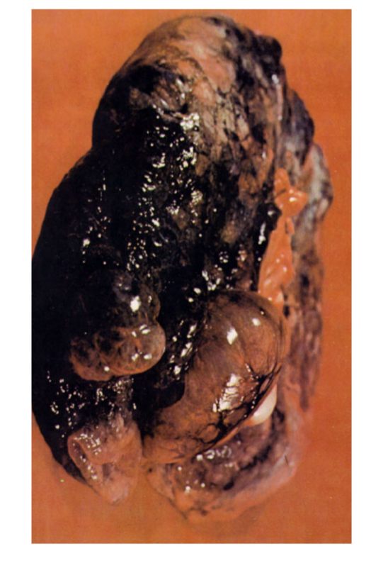

# Risk Factors

# Question 1
Which factors increase a person's risk for COPD?

[RIGHT] Cigarette smoking, chronic respiratory infections, and occupational/environmental exposure
[WRONG] History of pneumonia, chronic sinus infections, and allergies
[WRONG] Traumatic pneumothorax, poor diet, and obesity

# Question 2
Which examples of occupational and environmental exposures contribute to development of COPD?

[RIGHT] Dust, chemicals, and fumes
[WRONG] Heat, physical activity, and sun exposure
[WRONG] Poor ergonomics, toxic chemicals, and heat

# Emphysema

### Pathology
* Airway obstruction
* Hyperinflation
* Loss of lung elastic recoil
* Destruction of the alveolar-capillar interface

### Alveolus in Emphysema

### Lung in Emphysema

### Destroyed Lung parenchyma

### CXR of patient with Emphysema

### Emphysema (Pink puffer)
* Progressive constant dyspnea
* Onset after 50 years of age
* Mild sputum – clear
* Thin, wasted, chest AP diameter increased
* BARREL chest
* Percussion – hyperresonant
* HCT normal
* CXR – bullae, blebs, hyperinflation
* Pursed lip breathing

### Emphysema
* Decreased ventilation despite increased lung capacity
* Decreased pulmonary diffusion surface
* Changes more prominent during exhalation
* Air trapping
* Tissue loses elasticity
* Alveolar septum is destroyed
* Increased number of mucus-secreting glands and cells
* Submucosal edema
* Narrowing of bronchial lumen
* Thickening of bronchial/bronchiolar walls
* Increased deadspace
* Dilation of distal airways

# Question 3
Which data are characteristic of a patient with emphysema?

[RIGHT] Onset after 50 years of age, AP diameter increased, lung capacity increased, pursed lip breathing
[WRONG] Onset after 50 years of age, AP diameter decreased, lung capacity decreased, pursed lip breathing
[WRONG] Onset after 50 years of age, AP diameter increased, lung capacity decreased, percussion (hyper resonant)
[WRONG] Onset after 50 years of age, AP diameter decreased, lung capacity increased, percussion (hyper resonant)

# Question 4
Which condition is characterized by an abnormal permanent enlargement of the air spaces distal to the bronchioles?

[RIGHT] Emphysema
[WRONG] Chronic bronchitis
[WRONG] Pneumonia

# Question 5
Which condition is NOT considered a category of COPD?

[RIGHT] Pneumonia
[WRONG] Emphysema
[WRONG] Chronic bronchitis

# Chronic Bronchitis

### Pathology
* Thickened bronchial walls
* Hyperplasia and hypertrophied mucous glands
* Mucosal inflammation in the bronchial wall and airways

### Chronic Bronchitis (Blue Bloater)
* Intermittent mild/moderate dyspnea
* Onset after 35 years of age
* Copious sputum production
* Purulent sputum during acute infection
* Stocky, obese with normal chest AP diameter
* Percussion – normal
* HCT increased
* Hypercapnea
* Hypoxemia
* Smoker's cough
* Pulmonary HTN
* Hepatomegaly

### Chronic Bronchitis (Blue Bloater)
* Cough and sputum production for at least 3 months/year
* Overinflation of alveoli
* Abnormal distribution of ventilation
* Narrowed airways due to thickened bronchial walls
* Mucus plugs
* Bronchial and bronchiolar wall inflammation
* Decreased number and function of cilia
* Increased number and size of mucus-secreting glands

### Airway in Chronic Bronchitis

### Risk Factors
* Cigarette smoking
* Chronic respiratory infections
* Occupational/environmental exposure – dust,chemicals, fumes
* Allergies
* A-protease inhibitor deficiency

COPD gradually worsens. HOWEVER, early detection, treatment and modification of risk factors can alter the disease course.

# Question 6
Chronic bronchitis is characterized by:

[RIGHT] Excessive secretion of bronchial mucus
[WRONG] Irritation of the sinus cavities
[WRONG] Permanent enlargement of air spaces distal to the bronchiole

# Question 7
Which condition is manifested by a productive cough for greater than 3 months in at least 2 consecutive years in the absence of any other disease?

[RIGHT] Chronic bronchitis
[WRONG] Acute pneumonia
[WRONG] Pneumothorax

# Infection and Pulmonary Hypertension

### Acute Infection
The most common cause of death

### Pulmonary Hypertension

May result in signs and symptoms of right heart failure
* Dyspnea
* Angina at rest
* Syncope
* Cyanosis
* Peripheral edema
* Hepatomegaly
* Renal dysfunction

# Question 8
Which condition is a complication of pulmonary hypertension?

[RIGHT] Right heart failure
[WRONG] Pulmonary embolism
[WRONG] Pleuritis

# Question 9
Which findings are signs and symptoms of right heart failure?

[RIGHT] Dyspnea, syncope, peripheral edema
[WRONG] Productive cough, fever, elevated white blood count
[WRONG] Hypotension, erythema, palpitations

# Question 10
Which of the following conditions require a higher PEEP to be applied in recruiting collapsed alveoli?

[WRONG] Asthma
[RIGHT] Acute Respiratory Distress Syndrome
[WRONG] Bronchietasis
[WRONG] Emphysema

# Question 11
As a cause of death in the United States, COPD ranks:

[WRONG] Second
[WRONG] Third
[RIGHT] Fourth
[WRONG] Fifth

# Question 12
Two diseases common to the etiology of COPD are:

[WRONG] Asthma and atelectasis
[RIGHT] Chronic bronchitis and emphysema
[WRONG] Pneumonia and pleurisy
[WRONG] Tuberculosis and pleural effusion

# Question 13
The underlying pathophysiology of COPD is:

[WRONG] Inflamed airways that obstruct airflow
[WRONG] Mucus secretion that blocks airways
[WRONG] Alveolar wall destruction
[RIGHT] Characterized by variations in all of the above

# Question 14
The abnormal inflammatory response in the lungs occurs primarily in the:

[WRONG] Airways
[WRONG] Parenchyma
[WRONG] Pulmonary vasculature
[RIGHT] Areas identified in all of the above

# Question 15
The most important environmental risk factor in emphysema is:

[WRONG] Air pollution
[WRONG] Allergens
[WRONG] Infectious agents
[RIGHT] Cigarette smoking
