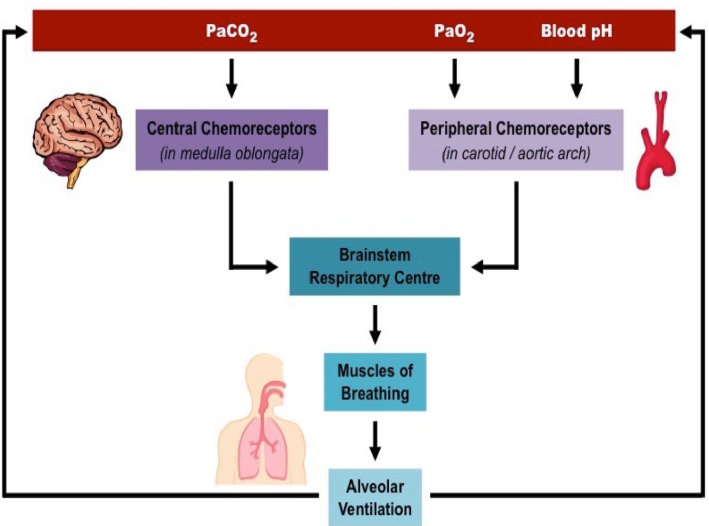
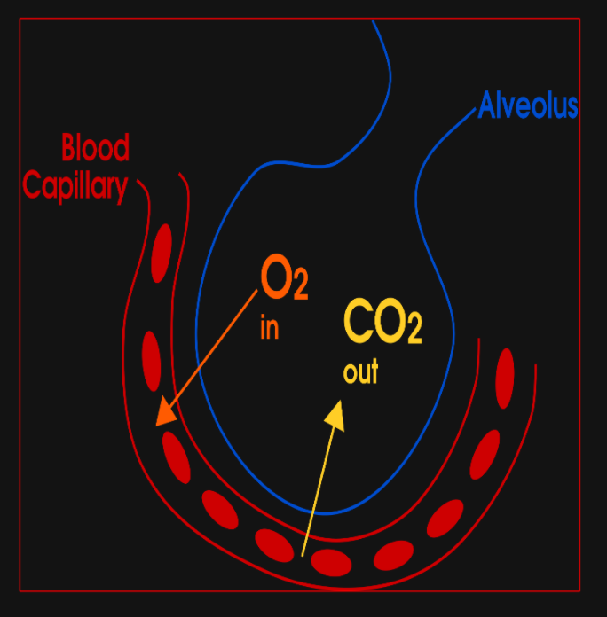
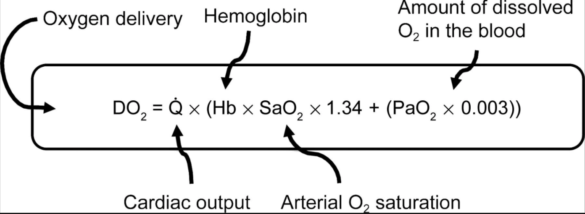

# Oxygenation and Ventilation
<!---15a59950-9d02-493d-822a-ad2acddec748-->

Oxygenation and ventilation are measured differently.

**Oxygenation**

* PaO2 (Partial Pressure of Oxygen)
* SaO2 (Oxygen Saturation)

**Ventilation**

* PCO2 (35-45 mmHg)
* End tidal CO2 (30-43 mmHg)
* Minute ventilation
 * Vt (tidal volume) x RR

# ~Question 1
<!---d5201ad0-e0ff-4f03-a2df-463a188c89b5-->
What can be used to measure oxygenation?

[RIGHT] PaO2 
[WRONG] PCO2
[WRONG] End Tidal CO2
[WRONG] Minute ventilation

# ~Question 2
<!---b6f5a918-cc15-4fbd-9761-2faf9d89371e-->
What is NOT a measure for ventilation?
[RIGHT] SaO2
[WRONG] PCO2
[WRONG] End tidal CO2