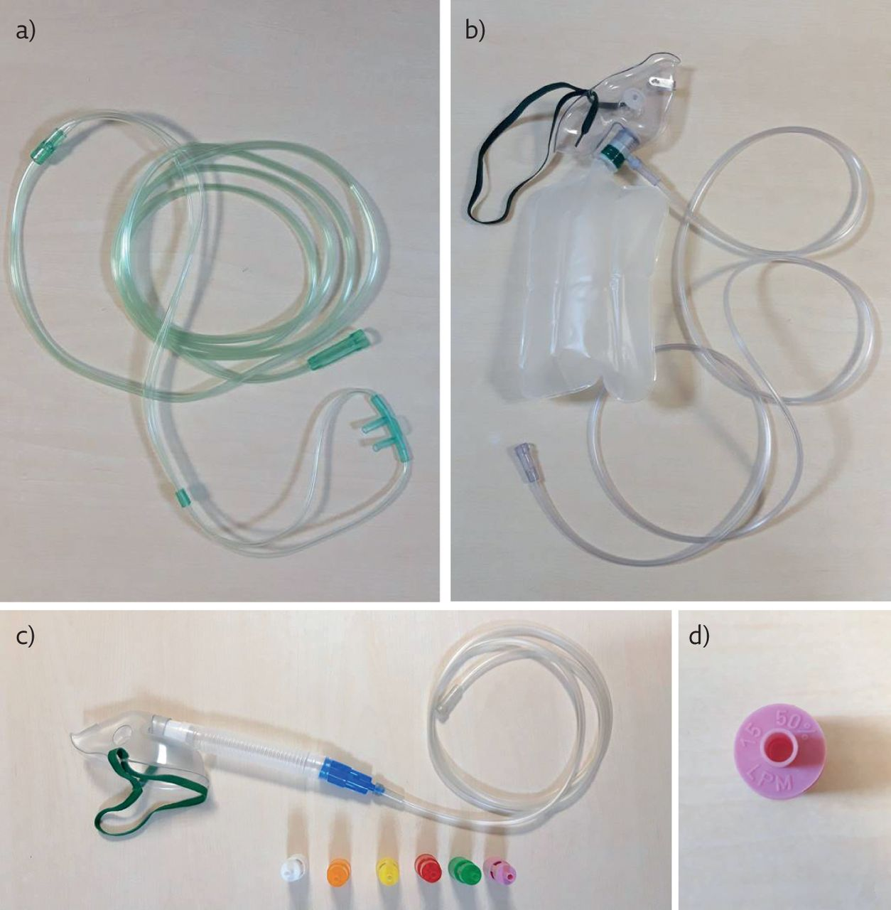
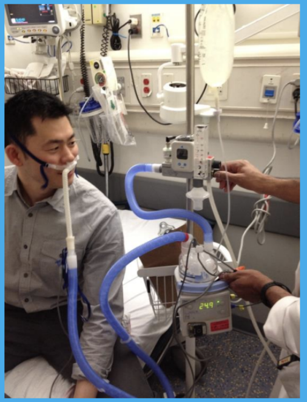

# Oxygen Delivery Systems
<!---ff73d472-8625-4680-a44a-24bb9dfb4162-->
## Low-Flow Oxygen Delivery Systems

a) Nasal cannula. b) Non-rebreather mask. c) Venturi mask with different sized ports to change the FIO2 delivered (24–50%). d) FIO2 and oxygen flow are clearly stated on the bottom of each port.

Used for patients that need supplemental oxygen and have sufficient respiratory drive (breathing on their own)

#### Nursing Implications for Low-Flow Systems

* Can dry the airway, thicken secretions, and therefore cause difficulty in clearing secretions
* Consider humidification for oxygen flow greater than 4L/min
* Monitor respiratory drive and effort- watch for signs of decompensation
* Increases infection risk of the patient
* Can cause patient discomfort
* Actual amount of inspired oxygen (FiO2) cannot be precisely controlled or predicted (is affected by patient's respiratory pattern)

## High-Flow Oxygen Delivery Systems

#### Nursing Implications for High-Flow Systems
* Provides a reservoir of oxygen in the patient's nasopharynx which enhances delivery of oxygen with each breath
* FiO2 delivery is fairly consistent
* Indicated for patients with a more variable ventilatory pattern
* Use of N95 mask required when caring for patients on HFNC.
* Oxygen flow rate typically 10-50L
* FiO2: 60-100%
* No Alarms (close monitoring by the nurse is necessary)
* Monitor respiratory drive and effort- watch for signs of decompensation
* Monitor for kinking in tubing
* If FiO2 goes higher than originally set, there might be a kink on the cannula prongs

# ~Question 1
<!---1bc50152-ff80-4399-b8a8-1ee6af35f91a-->
When should Low-flow Oxygen Delivery Systems be used?

[RIGHT] For patients that need supplemental oxygen and are breathing on their own
[WRONG] For patients that need supplemental oxygen and have decreased respiratory drive
[WRONG] For patients that need supplemental oxygen and have variable respiratory effort

# ~Question 3
<!---c0722ef9-b354-4280-8b87-b271728b880d-->
What potential complications should nurses monitor in patients using low flow oxygen delivery systems?

[WRONG] Dryness of mucous membranes, reduced secretions, infection risk increases
[WRONG] Dryness of mucous membranes, reduced secretions, infection risk decreases
[RIGHT] Dryness of mucous membranes, thickened secretions, infection risk increases

# ~Question 4
<!---2d75dea8-b446-48c6-9bc5-ca213da2c4cf-->
What are the nursing implications of a High Flow Nasal Cannula (HFNC)?

[WRONG] Does not require the patient to have respiratory drive
[RIGHT] Provides more predictable and precise delivery of FiO2
[WRONG] Reduces risk for infection

# ~Question 5
<!---7b9a4e5d-ac5e-4635-b413-8e409c063bba-->
When caring for a patient using HFNC, the nurse must

[RIGHT] Use an N95 mask
[WRONG] Ensure the patient is properly sedated
[WRONG] Use a simple face mask
[WRONG] Keep oxygen flow to less than 10 L/min
