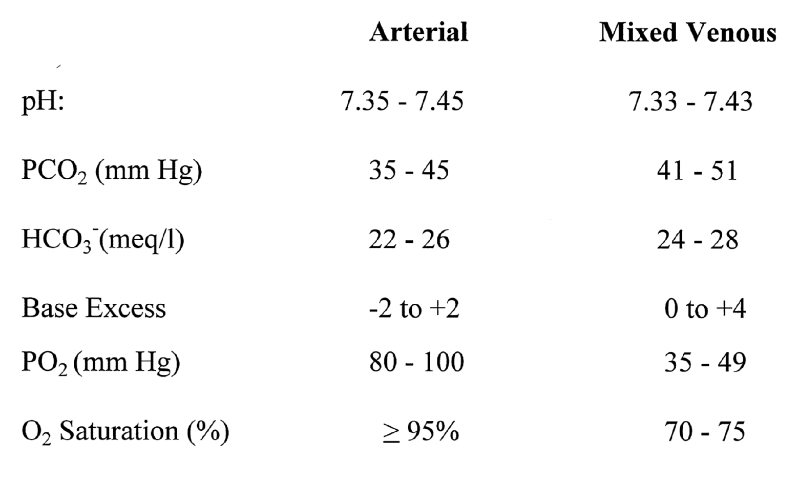
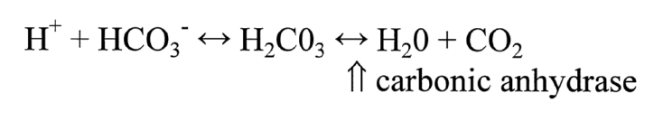
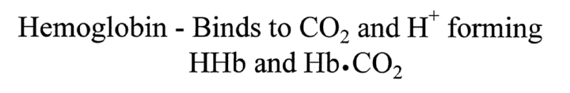
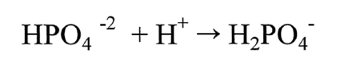

# ABG Overview
<!---386326b8-831c-406d-b8f5-2d9276f79948-->

Please watch the following video for an overview on ABG.

[embed](https://www.youtube.com/watch?v=rjrzZiprg04&list=PLZS9jYlFdlUDTGXMa5Q5xnN2S52RfwZUG&index=7)

# ~Question 21
<!---6f79d62d-caa0-4b6d-84fc-6378608368bc-->
A 10 year old male was rushed to the hospital due to vomiting and a decreased level of consciousness. The patient displays fast and deep respirations (Kussmaul breathing). The patient is lethargic and irritable in response to stimulation. He appears to be dehydrated—his eyes are sunken and mucous membranes are dry—and he has a two week history of polydipsia, polyuria, and weight loss. ABG results are: pH 7.1, PaO2 90 mm Hg, PaCO2 23 mm Hg, and HCO3 12 mmol/L.
Which best reflects this patient's acid base disturbance?

[WRONG] Uncompensated respiratory acidosis
[WRONG] Fully compensated metabolic acidosis
[WRONG] Mixed acidosis
[RIGHT] Partially compensated metabolic acidosis
 
* Considering the age of this patient as well as his accompanying symptoms, the most likely cause is diabetic ketoacidosis. Kussmaul breathing demonstrates the patient's respiratory system attempting to compensate for the acidosis.

# Acid Base Terminology
<!---ca38a9f8-ba09-4cfe-920d-ee353a647cca-->

* Arterial Blood Gas (ABG): Used to assess acid base balance of the arterial blood
* Acid: Donates a hydrogen ion (H+)- pH 0-7
* Base: Accepts a hydrogen ion (H+)- pH 7-14
* pH: Negative logarithm of the hydrogen ion concentration
* Mixed Venous Blood Gas: 
 * Sampled from a Pulmonary Artery Catheter
 * Used to assess tissue oxygenation

## Normal Arterial Blood Gas Values 
* pH: 7.35-7.45
* PaCO2 (partial pressure of carbon dioxide in the blood) : 35-45 mm Hg
* HCO3- (amount of bicarbonate in the blood): 22-26 meq/l
* Base Excess (reflects the sum of all of the buffer bases in the body): -2 to +2
* PaO2 (partial pressure of oxygen in the blood): 80-100 mm Hg
* SaO2 (percentage of hemoglobin saturated with oxygen): 92-99%

# ~Question 1
<!---d8397f63-a1de-4aec-99cb-d3471492bed7-->
What is Arterial Blood Gas used for? 

[RIGHT] To assess acid base status and alveolar oxygenation
[WRONG] To ensure tissue oxygenation

# ~Question 2
<!---0ce9ef93-0d85-4b8f-94ea-992797f75851-->
What does pH represent?

[RIGHT] The negative logarithm of the hydrogen ion concentration
[WRONG] The negative logarithm of the hydroxide ion concentration
[WRONG] The logarithm of the hydrogen ion concentration
[WRONG] The logarithm of the hydroxide ion concentration

# Acidemia vs. Alkalemia
<!---b8b0a086-05d7-4d2a-8a54-9a383e3bf53a-->

### Acidemia
* pH < 7.35
* Caused by accumulation of too much acid OR loss of bases
* pH < 6.8 incompatible with life

### Alkalemia
* pH > 7.45
* Caused by accumulation of too much base OR loss of acids
* pH > 7.8 incompatible with life

## Buffers

### Carbonic Acid

### Protein

### Phosphate

# ~Question 3
<!---c06d7daa-4a99-4a4f-96ba-43d9e06eb389-->
At what pH value should you suspect acidemia?

[RIGHT] pH < 7.35
[WRONG] pH = 7.45
[WRONG] pH > 7.30

# ~Question 4
<!---3b538494-8b17-4df0-8002-116fea78a0d0-->
At what pH value should you suspect alkalemia?

[RIGHT] pH > 7.45
[WRONG] pH = 7.35
[WRONG] pH < 7.30

# Respiratory & Renal Systems
<!---7d31619e-a5c2-4a3d-a62a-85c52e1f8d21-->

## Respiratory System
### Effects of Changes in Ventilation

* Hypoventilation leads to ineffective clearance of CO2--> ↑CO2 retention in the arterial blod -> Acidemia --> lowered pH
* Hyperventilation leads to too much clearance of CO2-> ↓CO2 in the arterial blood -> Alkalemia--> increased pH

### Influence of Non-Respiratory Acid Base Disturbances ("Metabolic Disturbances") on the Respiratory System

* Non-respiratory Acidosis [Metabolic Acidosis] -> Respiratory system attempts to compensate by "blowing off" CO2--> patient presents with increased ventilation
* Non-respiratory Alkalosis [Metabolic Alkalosis] -> Respiratory system attempts to compensate by retaining CO2--> patient presents with decreased ventilation

## Renal System
### Metabolic Causes of Acidosis

* Causes of acidosis (lowered pH) outside of the respiratory system that leads to too much retention of H+ or too much excretion of HCO3-
* Patient presents with: ↓HCO3- and ↓pH
* Kidneys may attempt to compensate by increasing excretion of H+ and retention of HCO3-

### Metabolic Causes of Alkalosis

* Causes of alkalosis (increased pH) outside of the respiratory system that leads to too much retention of HCO3- or too much excretion of H+
* Patient presents with: ↑HCO3- and ↑pH
* Kidneys may attempt to compensate by increasing excretion of HCO3- and retention of H+

# ~Question 5
<!---dd3ff144-1a7b-430b-b189-e6849a94e47b-->
What is the effect of Hypoventilation? 

[RIGHT] Increased CO2 retention, Acidemia
[WRONG] Increased CO2 retention, Alkalemia
[WRONG] Decreased CO2 retention, Acidemia
[WRONG] Decreased CO2 retention, Alkalemia

# ~Question 6
<!---f4960394-d678-4a50-9857-ad9abc3daefc-->
What is the effect of Hyperventilation? 

[RIGHT] Decreased CO2 retention, Alkalemia
[WRONG] Decreased CO2 retention, Acidemia
[WRONG] Increased CO2 retention, Alkalemia
[WRONG] Increased CO2 retention, Acidemia

# ~Question 7
<!---85724625-aa19-4715-bcbf-441184188a5a-->
Which of the following is NOT a cause of hyperventilation? 

[RIGHT] Opioid overdose
[WRONG] Pneumonia
[WRONG] Hypoxia
[WRONG] Anxiety

# ~Question 8
<!---8add07dc-6a64-41c8-8741-7aa8eb8062a9-->
Which of the following is NOT a cause of hyperventilation?

[WRONG] Asthma
[WRONG] Being at a high altitude
[WRONG] Hypoxia
[WRONG] Dyspnea
[RIGHT] CO2 poisoning

# Anion Gap
<!---9d5779a7-b1e8-492f-bbfc-74ba858a9226-->

Definition: Unmeasured anions in the serum

Calculated: (Na+ + K+) - (HCO3- - Cl-)

Normal Value: 12 ± 2

Acidosis with increased anion gap: Accumulation of anions other than Cl-

Acidosis with normal anion gap: Renal absorption of Cl- due to the loss of HCO3-

# ~Question 11
<!---557166cd-f853-4d4b-93f9-ece1d3e1a9bd-->
What is the Normal Value of the Anion Gap?

[RIGHT] 12 ± 2
[WRONG] 10 ± 2
[WRONG] 14 ± 2

# Acidosis, Alkalosis
<!---d6e03011-7b35-4b9c-8ec6-9a49c748416c-->

## Respiratory Acidosis 

### Blood Gas Values

* pH < 7.35
* PaCO2 > 45 mm Hg
* HCO3- normal or elevated 

### Causes (Alveolar Hypoventilation):

* Respiratory depression (eg. head injury, opioid use)
* Respiratory muscle paralysis or weakness
* Chest wall disorders
* Disorders of the lung parenchyma
* Abdominal complications causing reduced lung expansion

### Signs and Symptoms:

* CNS Depression
* Decreased lung sounds
* Arrhythmias
* Tachycardia, hypertension, diaphoresis (due to increased WOB)
* Restlessness
* Palpitations
* Flushed skin

### Treatment

Increase/improve ventilation:
* Address underlying issue (eg. administer naloxone if cause is opioids)
* Raise HOB/reposition for optimal ventilation
* Positive pressure ventilation (either NPPV or intubation and mechanical ventilation)

## Respiratory Alkalosis 

### Blood Gas Values

* pH > 7.45
* PaCO2 < 35 mm Hg
* HCO3- normal or decreased 

### Causes (Alveolar Hyperventilation):

* Psychogenic (eg. anxiety, pain)
* CNS Stimulation
* Hypermetabolic states

### Signs and Symptoms:

* Headache
* Vertigo
* Paresthesias, carpal pedal spasm and tetany
* Tinnutis

### Treatment

Slow the hyperventilation
* Address the underlying cause (eg. anxiety, pain)
* Changes to mechanical ventilator to reduce ventilation

## Metabolic Acidosis 

### Blood Gas Values

* pH < 7.35
* PaCO2 normal or decreased 
* HCO3- < 22 meq/l

### Causes (increase in H+ or an excess loss of HCO3-):

* Overproduction of organic acids (eg. shock states)
* Impaired renal excretion of acid (eg. renal failure)
* Abnormal loss of HCO3- (eg. diarrhea)
* Ingestion of acid (eg. Aspirin overdose)

### Signs and Symptoms:

* Cardiac Arrhythmias
* Flushed skin
* Nausea
* Malaise
* Electrolyte abnormalities

### Compensation

* Lungs increase ventilatory effort

### Treatment

* Address underlying cause
* Assess hemodynamic and respiratory status
* Careful administration of NaHCO3

## Metabolic Alkalosis

### Blood Gas Values

* pH > 7.45
* PaCO2 normal or increased 
* HCO3- > 26 meq/l

### Causes (A loss of hydrogen ions or an increase in HCO3-):

* Large losses of gastric contents (eg. vomiting)
* Loss of potassium chloride (eg. loop diuretics)
* Ingestion of large amounts of bicarbonate (eg. antacid overdose)
* Prolonged use of diuretics

### Signs and Symptoms:

* Diaphoresis
* Nausea and vomiting
* Increased neuromuscular excitability
* Shallow breathing
* EKG changes
* Confusion, lethargy to coma
* Electrolyte abnormalities

### Compensation

* Decrease in respiratory rate and depth of ventilation to retain CO2

### Treatment

* Address underlying cause (eg. antiemetic, medication changes)

# ~Question 12
<!---46f1400f-b9ff-45aa-af48-3480bb4317bc-->
Your patient exhibits the following acid base parameters: pH = 7.31, PaCO2 = 48, HCO3- = 24. 
What is this patient's acid base disturbance?

[RIGHT] Uncompensated respiratory acidosis
[WRONG] Mixed acidosis
[WRONG] Uncompensated metabolic acidosis
[WRONG] Mixed alkalosis

# ~Question 13
<!---8adbda11-48d4-4c2f-8e2d-06243f5fde2a-->
A patient presents with the following arterial blood gas values: pH: 7.47, PaCO2: 49, HCO3: 33
What is this patient's acid base disturbance?

[WRONG] Fully Compensated Respiratory Alkalosis
[WRONG] Uncompensated Metabolic Acidosis 
[WRONG] Mixed alkalosis
[WRONG] Mixed acidosis
[RIGHT] Partially Compensated Metabolic Alkalosis

# ~Question 14
<!---95b2a0e8-e30b-452c-ba14-e8c6b72d2c0f-->
Your patient exhibits the following acid base parameters: pH = 7.32, PaCO2 = 56, HCO3- = 15. 
What is this patient's acid base disturbance?

[RIGHT] Fully compensated respiratory acidosis
[WRONG] Fully compensated respiratory alkalosis
[WRONG] Partially compensated metabolic acidosis
[RIGHT] Mixed Acidosis

# ~Question 15
<!---8e778dca-145e-46f5-a276-3ba195c65d97-->
What do Blood Gas Values pH < 7.35, PaCO2 > 45mm Hg, HCO3- = Normal or Elevated indicate?

[RIGHT] Uncompensated Respiratory Acidosis
[WRONG] Normal acid base parameters
[WRONG] Fully Compensated Respiratory Alkalosis

# ~Question 16
<!---6d7cdbef-a22e-45bd-84fb-6d3e1989cc2b-->
What do Blood Gas Values pH > 7.45, PaCO2 = Normal , HCO3- > 26 meq/l indicate?

[RIGHT] Uncompensated Metabolic Alkalosis
[WRONG] Normal acid base values
[WRONG] Uncompensated Respiratory Acidosis
[WRONG] Partially Compensated Respiratory Aciosis
 
# ~Question 20
<!---a873bd0b-087e-4934-ac96-6761baae9732-->
A 54 year old male with a history of chronic obstructive pulmonary disease and was rushed to the emergency department with increasing shortness of breath, fever, and a productive cough with yellow-green sputum. ABG results are: pH= 7.3, PaCO2= 68 mmHg, HCO3= 28 mmol/L, and PaO2= 60 mm Hg. 

[RIGHT] Partially compensated respiratory acidosis with hypoxemia
[WRONG] Uncompensated Respiratory acidosis with hypoxemia
[WRONG] Partially compensated metabolic Acidosis
[WRONG] Uncompensated Metabolic alkalosis
 
* This patient has a low a pH so immediately think "acidosis." The PaCO2 is high which reflects acidosis-- therefore, it can be determined that the cause of the low pH is respiratory. Also based on the clinical presentation we can imagine that due to crackles and wheezes and the yellow sputum we can imagine that this patient is not ventilating efficiently and therefore building up CO2 in the blood. The HCO3- is elevated, reflecting alkalosis (the opposite direction of the problematic pH), thus this reflects partial compensation because the pH is still abnormal. The patient's low PaO2 is also cause for concern- representing hypoxemia.
 
# ~Question 22
<!---91c24e29-c10e-49ca-9854-2b36c914faab-->
A 54 year old female arrived to the hospital and anxiously reports that she is having severe pain and anxiety. ABG results are: pH 7.6, PaO2 120 mm Hg, PaCO2 31 mm Hg, and HCO3 25 mmol/L. Which best reflects this patient's acid base disturbance?
 
[RIGHT] Uncompensated Respiratory Alkalosis
[WRONG] Uncompensated Respiratory Acidosis
[WRONG] Fully Compensated Metabolic Alkalosis
[WRONG] Partially Compensated Metabolic Acidosis
 
* The pH is high, reflecting alkalosis. The patient is in pain and is breathing fast, both causes of hyperventilation which lead to loss of CO2 (remember, low CO2 leads to high pH). The patient is not compensating (HCO3- is normal) and the hyperventilation has lead to hyperoxemia (PaO2>100mmHg).
 
# ~Question 23
<!---00293014-2114-4af7-b7a5-46bfec7a3021-->
A 80 year old female has suffered from persistent vomiting for two days. She appears to be lethargic and weak and has myalgia. She is diagnosed as having gastroenteritis and dehydration. ABG results are: pH 7.5, PaO2 85 mm Hg, PaCO2 40 mm Hg, and HCO3 34 mmol/L. Which best reflects this patient's acid base disturbance?
 
[WRONG] Fully Compensated Respiratory alkalosis
[WRONG] Mixed acidosis
[RIGHT] Uncompensated metabolic alkalosis
[WRONG] Partially compensated Metabolic alkalosis
 
* The pH indicates alkalosis. The HCO3- is high, reflecting alkalosis in the metabolic system. In this case, the cause of alkalosis is persistent loss of H+ (in stomach acid) due to vomiting. The respiratory system has started to compensate (PaCO2 is slightly elevated causing acidosis and attempting to bring the pH down into a more acidic range). 

# Hypoxia
<!---cde1a53b-8649-4d83-9923-70ad3804ba0e-->

## Factors Leading to Tissue Hypoxia

* Low cardiac output
* Decreased oxygen carrying capacity
* Non-functional hemoglobin
* Right to left cardiac shunt
* Impaired respiration

## Body's Compensation for Tissue Hypoxia

* Tachycardia
* Tachypnea
* Erythrocytosis
* Further desaturation of hemoglobin

# ~Question 19
<!---4025e5f6-fd87-416c-b0c9-878844ea0147-->
How does the body compensate for tissue hypoxia?

[RIGHT] Tachycardia, Tachypnea, Erythrocytosis, further desaturation of hemoglobin
[WRONG] Tachycardia, Tachypnea, Erythrocytosis, saturation of hemoglobin

