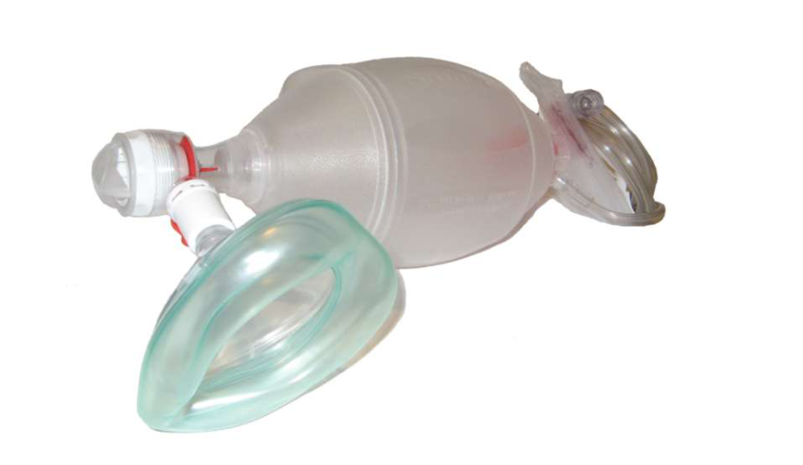

# Endotracheal Intubation for the COVID-19 Patient

Watch the following video for an introduction to endotracheal intubation.

[embed](https://www.youtube.com/watch?v=iyAQR_Zpf6U&list=PLCT7BA-HcHljIaDw56FoqWILbqGCIxsmG&index=5)

# Endotracheal Tube (ET Tube)
*  Endotracheal tubes are curved tubes used for intubation
* Tubes were previously made up of latex (indian rubber) and those still available , currently plastic tubes (PVC) are preferred because of following advantages: 
 * Disposable (less chances of infection)
 * Hypoallergenic ( since latex allergy is fairly common)
 * Transparent (easy visualization of blockage ETT due to blood, pus, secretions

### Tube Components

#### Proximal End 
15 mm adapter (connector) which fits to ventilator  or ambu bag

#### Central Portion 
1. A vocal cord guide (black line ) which should be placed at the level of the opening of the vocal cords so that the tip of the ET tube is positioned above the bifurcation if the trachea.
2. A radio-opaque marker which is essential for accurate visualization of the position of the ET tube within the trachea by means of an X-ray
3. The distance indicator (marked in centimeters) which facilitates placement of ET tube.
4. A cuff - in case of cuff ET tube

### Distal End 
Has Murphy’s eye (opening in the lateral wall ) which prevents complete blockage of ET tube incase the distal end is impacted with secretion, blood, etc.

### Types of Tubes
* ET tubes can be:
 * Cuffed
 * Uncuffed

* Cuffed ET tubes are used in children > 8 years
* The cuff when inflated maintains the ET tube in proper position and prevents aspiration of contents from GI tract into respiratory tract
* In children < 8 uncuffed ET tubes are used because the narrow subglottic area performs the function of a cuff and prevents the ET tube from slipping.

### Tube Size

* From 2 mm to 16 mm (internal diameter). 

* The size of the tube can be determined by: 

** Internal diameter of ETT (mm) = age in years + 4**

* Roughly the diameter of the childs little finger is the same as that required for the ETT

* The following table gives an idea abpout the size
of ETT in different age groups.

Then increase the size of the ET tube by 0.5 cm for every 6 months rise in age so that at approximately 6 years of age size of the ET tube to be used is approximately 8 mm

### Uses of ET tube
* For Mechanical Ventilation
* For Intermittent Postive Pressure Ventilation (IPPV)
* During resuscitation
* Direct suctioning of trachea in meconium
aspiration
* In Epiglottits &life threatening croup
* In tetanus (however for long term bases, tracheostomy is preferable)
* In diptheria
* In angioneurotic edema

### Complications
* Mechanical trauma to tongue, teeth, palate, pharynx & larynx during intubation procedure
* Stimulation of posterior of posterior pharyngeal wall leading to coughing, vomiting or vasovagal episode with resultant hypoxia, bradycardia.
* Prolonged intubation may cause pressure necrosis of laryngeal structures leading to persistant hoarseness (hence tracheostomy) is indicated in patients requiring long-term mechanical ventilation)
* Pneumothorax.

### Ambu Bag

#### Parts of the Ambu Bag
* Patient outlet (to which mask is attached)
* One-way valve unit (just proximal to patient outlet)
* Pressure releease valve
* Attachment site for maxnometer

#### Size 
The size of the bag varies depending on the volume (ranges from 250 ml to 750 ml for paediatric use)

#### Pressure release valves
Are usually set to release at pressure of 30-35cms of water

#### At the end there are two inlets
**Oxygen Inlet**
This inlet is attached to a tube carrying oxygen from the source (central oxygen line or oxygen cylinder)

**Air Inlet**
If kept open the concentration of 02 is approx 40% FiO2. for the Fi02 to be near 90 - 100%, and oxygen reservoir should be attached.

### Mechanism of Ventilation
In the resting stage the ambu bag is filled with air. On squeezing the bag to initiate ventilation the one wave valve proximal to the patients outlet opens resulting in release of air, stored in the bag to the patient. On releasing the pressure the bag gets re-inflated with air. The patients exhaled air cannot re-enter the bag due to one wave mechanism of the valve at the patient outlet.

#### Uses
for giving intermittent positive pressure ventilation

# ~Question 4
Which of the following is not a method of confirming correct positioning of an endotracheal tube?

[WRONG] End tidal CO2 detector
[RIGHT] Asking patient to speak
[WRONG] Breath sounds
[WRONG] Chest x-ray

# ~Question 6
How often should the bite block be cleaned for a patient with an endotracheal tube?

[RIGHT] Every 8 hours
[WRONG] Every 2 hours
[WRONG] Every 24 hours
[WRONG] Every 4 hours

# ~Question 1
A high volume, low pressure cuff can do which of the following?
[WRONG] Prevent aspiration
[WRONG] Depress cough
[RIGHT] Assure ventilation
[WRONG] More secure tubing

* The main reason to use high volume cuff is to obtain a good seal for better ventilation. The majority of endotracheal tubes are low-pressure high volume type. These tubes have a cuff which holds a large volume and consequently, there is a large contact area between the trachea and the tube. This type of endotracheal tube can develop folds near the contact area when inflated and consequently the risk of aspiration is high. The high-pressure low volume tubes provide better protection against aspiration but the downside is that they can induce tracheal mucosa necrosis.

# ~Question 2
A 55-year-old patient presenting with clinical features consistent with acute cervical radiculopathy following a C5-6 disc prolapse is being scheduled for an anterior cervical discectomy and fusion (ACDF) surgery. Intraoperatively, before applying the retractors within the longus colli muscular gutters, the operating surgeon asks the anesthesiologist for a temporary deflation of the endotracheal tube. What post-operative complication will be prevented by this simple maneuver in the patient?

[WRONG] Tracheal necrosis
[WRONG] Tracheo-oesophageal fistula
[RIGHT] Hoarseness
[WRONG] Tracheal edema

* Hoarseness is one of the most common complications seen in the immediate postoperative period following anterior cervical spine surgeries. The main factor responsible for this complication is the compression of the recurrent laryngeal nerve between the retractors and the endotracheal tube within the tracheoesophageal groove. Temporary deflation of the endotracheal tube helps in preventing sustained compression of the nerve. The repositioning of the tube also helps in preventing any sideward deviation of the tube, which can lead to inadvertent compression of the nerve at the same site. Tracheoesophageal fistula formation is a complication of thermal injury. Tracheal necrosis and edema are not common complications associated with endotracheal tube positioning.

# ~Question 4
A patient is brought to the emergency department with shortness of breath. The attending clinician notes that the oxygen saturation of the patient is dropping along with blood pressure. The attending clinician decides to secure the airway by intubating the patient. He believes the patient may require an endotracheal tube for an extended period of time and may become obstructed. What built-in anatomic mechanism of the endotracheal tube is meant to overcome distal obstruction?
[WRONG] Bevel
[RIGHT] Murphy's eye
[WRONG] Distal balloon
[WRONG] Distal airway safety mechanism

* The Murphy's eye is a safety mechanism built into the endotracheal tube. If the distal end of the endotracheal tube should become obstructed by the wall of the trachea, gas flow can still occur via Murphy's eye, positioned in the lateral wall of the tube. This prevents complete obstruction of the tube. The bevel is meant to facilitate placement into the trachea without injuring the vocal cords. A cuff is an inflatable balloon at the distal end of the endotracheal tube. The inflated cuff forms a seal against the tracheal wall. This prevents gastric contents from entering the trachea and facilitates the execution of positive pressure ventilation, however, it does not prevent distal obstruction of the tube. The “distal airway safety mechanism” is a fictional name for a portion of the tube that does not exist.

# ~Question 5
An 85-year-old male with a history of emphysema presented to the emergency department. After assessing the patient a decision is made to emergently intubate. Post intubation chest x-ray is performed and It appears he has a right mainstem intubation. How many centimeters above the carina should the distal tip of the ETT terminate to avoid this event?
[WRONG] 7cm +/-2cm
[WRONG] 21 cm +/-2cm
[RIGHT] 4cm +/-2cm
[WRONG] 23cm +/-2cm

* The normal depth of the distal tip of the endotracheal tube as seen on the chest x-ray is 4 cm above the carina (+/-2cm). A tube depth of 7 cm above the carina puts the patient at risk of placing the endotracheal tube into shallow a position potentially leading to the displacement of the endotracheal tube out of the trachea. The typical depth of the endotracheal tube is 23 cm for men and 21 cm for women, measured at the central incisors. Keep in mind that flexion or extension of the patient's head and neck will affect endotracheal tube depth. For instance, if you place an ett in the sniffing position, then confirm and tape it in the same position, the ett with be deeper when the patient's head returns to a neutral position. It is best practice to intubate in the sniffing position and then place the patient's head and neck in a neutral position to confirm the depth of ett before taping. This can mean the difference between endotracheal intubation (correctly placed depth of ETT) and endobronchial intubation (ETT in right mainstem bronchus), especially in infants.

# ~Question 6
A 65-year-old patient presents to the emergency department with massive hemoptysis. He is quickly intubated, and the healthcare practitioner reports significant continued bloody secretions during suctioning. The practitioner requests an emergent bronchoscopy. What is the minimum size of the endotracheal tube that is typically necessary for an adult standard bronchoscope?
[WRONG] 9.5 ett
[WRONG] 9.0 ett
[WRONG] 8.5 ett
[RIGHT] 8.0 ett

* Should the healthcare provider need to perform bronchoscopy on an adult patient with a standard bronchoscope (diameter 5.7 mm with a 2 mm suction channel) the patient typically needs to be intubated with a 7.5-8.0 size endotracheal tube (ETT) to ensure adequate ventilation during the procedure and that the bronchoscope does not get trapped in the endotracheal tube. A 9.5 endotracheal tube is very large and, although it provides the standard bronchoscope plenty of space, potentially places the vocal cords in danger for injury during placement. An endotracheal tube smaller than 8.0 is too small for the standard adult bronchoscope. It would have to be switched out in a controlled fashion to a larger endotracheal tube to facilitate bronchoscopy. Changing an endotracheal tube in this patient is potentially dangerous and can result in a lost airway with massive hemoptysis. Smaller bronchoscopes can be found and used in pediatric patients and adults with smaller endotracheal tubes, but they are harder to locate in most emergency departments. It is recommended that providers try passing these smaller bronchoscopes through the desired size endotracheal tube to see if it fits before placing the endotracheal tube into the patient. Not doing this can result in frustration and the need for many different bronchoscopes to find the one which is correctly sized.

# ~Question 7
An 8-year-old boy presents in the emergency department with severe respiratory distress. His mother reports he developed fever and cough 3 days ago. He is shifted to the pediatric intensive care unit (PICU). He has decreased respiratory effort and needs intubation. What size cuffed endotracheal tube should be placed in this patient?
[WRONG] 5.0
[RIGHT] 5.5
[WRONG] 6.0
[WRONG] 6.5

* The formula for uncuffed endotracheal tube size is (Age/4) + 4. In this case, (8/4) + 4 = 2 + 4 = size 6 uncuffed ETT. An 8-year-old child would get a 5.5 cuffed endotracheal tube. A cuffed endotracheal tube is now standard of care in children and a tube ½ size smaller would be used in this child.

# ~Question 8
A 2-year-old boy presents in the emergency department with severe respiratory distress and spastic paralysis. His mother reports her baby had developed fever and cough 3 days ago. He is shifted to the newborn intensive care unit (NICU). He has decreased respiratory effort and needs intubation. What size cuffed endotracheal tube (ETT) should be placed in this patient?
[WRONG] 3.5
[RIGHT] 4.0
[WRONG] 5.0
[WRONG] 5.5

* The formula for cuffed endotracheal tube size is (Age/4) + 3.5. In this case, (2/4) + 3.5 = 0.5 + 3.5 = size 4.0 cuffed ETT. In clinical practice, pediatric anesthesiologists use a 4.0 or 4.5 cuffed ETT for a 2-year-old child, often chosen depending on their size and stature. Either size would be acceptable clinically. A cuffed endotracheal tube is now standard of care in children. Uncuffed endotracheal tubes are only commonly used in the neonatal period.

# ~Question 9
A 5-year-old girl presents in the emergency department with severe respiratory distress and spastic paralysis. Her mother reports her child developed fever and cough 3 days ago. She is shifted to the pediatric intensive care unit (PICU). She has decreased respiratory effort and needs intubation. What size cuffed endotracheal tube (ETT) should be placed in this patient?
[WRONG] 4.5
[WRONG] 4.75
[RIGHT] 5.0
[WRONG] 5.5

* The formula for cuffed endotracheal tube (ETT) size is (Age/4) + 3.5. In this case, (5/4) + 3.5 = 1.25 + 3.5 = size 4.75 cuffed ETT. A 4.75 cuffed ETT does not exist, a 4.5 or 5.0 cuffed endotracheal tube would be acceptable. Most 5-year-old children would receive a 5.0 cuffed ETT since 3-4-year-olds receive a 4.5 cuffed ETT and 5-year-olds are proportionally larger. A cuffed endotracheal tube is the standard of care in children. Uncuffed endotracheal tubes are only commonly used in the neonatal period.

# ~Question 10
A preterm infant is born via emergency C-section at 27 weeks gestational age and is having respiratory distress in the delivery room requiring emergency intubation. Which of the following is the most appropriate endotracheal tube for this patient?
[WRONG] 2.0 uncuffed
[RIGHT] 2.5 uncuffed
[WRONG] 3.0 uncuffed
[WRONG] 3.0 cuffed/ microcuffed

* 2.5 uncuffed ETTs are placed in preterm infants, often in those who are <2 kg. Term infants (those greater than or equal to 37 weeks gestational age) and babies >2 kg commonly receive 3.0 uncuffed ETTs. Outside the neonatal period (>1 month old), a 3.0 cuffed ett would commonly be used up to age 6 months, when a 3.5 cuffed ett can be considered. 2.0 uncuffed ETTs exist but are never commonly used, and kept in case of emergency for when a small preterm neonate may have developed subglottic stenosis.

# ~Question 11
A 46-year-old female undergoes an uneventful exploratory laparotomy. Chest and abdominal x-rays are performed to evaluate for a lost sponge in the counts at the end of the case. The chest x-ray incidentally reveals that the endotracheal tube is sitting just at the carina. One of the trainee surgeons becomes worried and asks for the tube to be adjusted. However, the anesthetist does not show concern. Which of the following best explains why the anesthetist is unconcerned?

[WRONG] It's the end of the case and the endotracheal tube is coming out anyways
[WRONG] Placement of the endotracheal tube at the level of the carina is optimal
[RIGHT] Both lungs appear to be inflated on the chest x-ray; this is likely because the lungs are being ventilated via the Murphy eye of the endotracheal tube
[WRONG] Both lungs appear to be inflated on the chest x-ray; this is likely because the positive pressure ventilation is blowing the carina away from the endotracheal tube and allowing both lungs to be ventilated

* The Murphy eye is a safety mechanism to allow for ventilation to continue even if the tip of the endotracheal tube is hubbed against the wall of the endobronchial tree. Nearly all endotracheal tubes have a Murphy eye for this purpose. The Murphy eye is a second smaller hole off the side of the distal end of the endotracheal tube (positioned 90 degrees from the tip). Optimal placement of the tip of the endotracheal tube is at the level of the T2-T4 vertebrae in the middle third of the trachea, not at the carina. It is nice that both lungs appear to be inflated on the chest x-ray, but this is not because the positive pressure ventilation is blowing the carina away from the endotracheal tube. Answer 1 is also correct and true, the endotracheal tube will come out shortly as the case is over, but it is not a good explanation of why the anesthesiologist is unconcerned. It is necessary to ventilate both lungs throughout the entire case properly.

# ~Question 12
A 2.5-year-old male is about to be intubated in the emergency room who has been admitted with status asmaticus. The child has a history of being born at 26 weeks gestation, chronic lung disease on inhaled steroids twice a day and albuterol nebulizers as needed, and seasonal allergies on montelukast. His condition is worsening and the bedside nurse calls for help. The bedside nurse pushes induction drugs and paralytic, and upon direct laryngoscopy, the provider has a grade 1 view of the entire vocal cords, however the 4.5 cuffed endotracheal tube will not pass. The patient is mask ventilated anda 4.0 cuffed endotracheal tube with a stylet is arranged. A second perfect view of the vocal cords with direct laryngoscopy is obtained, however the 4.0 cuffed endotracheal tube will not pass either. A 3.5 cuffed endotracheal tube is tried which does pass, albeit tightly. Which of the following best explains the reason for this problem recurring?
[WRONG] Foreign body aspiration
[WRONG] 4.0 and 4.5 were too big for the patient
[RIGHT] Undiagnosed tracheal stenosis
[WRONG] Chronic lung disease

* Children born with extreme prematurity commonly require intubation and mechanical ventilation at birth or shortly after, and can remain intubated for weeks to months. Tracheal stenosis is not uncommon in these children, especially in the ones who have poorer lungs and require higher peak inspiratory pressures for adequate ventilation. It is best practice to ask about intubation vs. CPAP vs. SiPAP (nasal BiPAP) in these children when you are taking a history from the parents. Asking about discharge from the NICU on nasal cannula oxygen and/or discharge with a pulse oximeter will help to clue you into which children had the most severe lung disease, as they will answer yes to both questions. Toddler age children are most at risk for foreign body ingestion, which can lodge in either the esophagus or trachea. However, this child with a history of chronic lung disease will be prone to the development of asthma (generally not formally diagnosed until age 4) and can develop status asthmatics for a reason other than a foreign body. Foreign bodies in the trachea can be associated with wheezing, but generally, are not associated with status asthmaticus. Because the formula for cuffed endotracheal tube size at 2.5 years-old is 4.125, a 4.0 or 4.5 cuffed endotracheal tube may be chosen. Given that this is an emergency situation, a 4.0 cuffed endotracheal tube may have been a more appropriate choice as it was most likely to go into the trachea on the first try than the larger size. However, given that it also did not pass through the glottis indicates this is a problem more involved than the incorrect endotracheal tube size. There is no association between chronic lung disease of prematurity and smaller trachea size.

# ~Question 13
A trauma patient was just dropped off from the emergency department (ED) to the intensive care unit (ICU). The resident covering the ICU overnight was just urgently paged to the patient's room because the bedside nurse and respiratory therapist are having trouble ventilating the patient. A quick physical exam reveals that the pilot balloon has been cut off of the endotracheal tube, causing a huge air leak and inability to properly ventilate the patient, who received a dose of a paralytic in the ED just prior to transport. The pulse oximeter is reading 93% and has been steadily in the low 90s during the 5-minute exam. What is the next best move?

[RIGHT] Use a 20 gauge peripheral IV catheter and insert the plastic cannula piece into the cut end where the pilot balloon should be. Then take a needle-free IV connector (sometimes called a clave, often blue or clear in color) and screw it onto the end of the IV cannula. This will allow you to add air to the cuff and ventilate the patient while taking time to plan for re-intubation in a non-emergency situation
[WRONG] Pull the endotracheal tube out and mask ventilate. The patient is going to become unstable at any moment
[WRONG] Pull the endotracheal tube out and replace it. It will never work
[WRONG] After resecuring a new endotracheal tube, call the ED and tell them what they did was inappropriate and that they really should be more careful when cutting off a trauma patient's clothes

* The patient is best managed by using a 20 Gauge angiocath and a needleless IV catheter will provide a temporary solution to this problem and allow time to plan for a successful re-intubation, which may require more help or equipment being brought to the patient's room. See picture for an example of how this works. Pulling the endotracheal tube and mask ventilating, is the correct thing to do if the patient is desaturating and about to code from a bradycardic arrest, but that was not the clinical scenario given. In the question, the patient has a large leak around the endotracheal tube but is saturating consistently in the low 90s, which will not cause harm and gives one time to make a better plan. Pulling out the endotracheal tube and replacing it immediately is a cowboy move and if one misses, this could cause the patient to further desaturate and possibly cause a hypoxic or bradycardic arrest. This is a relatively stable patient with a SpO2 reading consistently in the low 90s, which is totally compatible with life. Take the time to make a plan before attempting reintubation. Calling the ED is not the best option. This is a reportable incident and should probably go into the institutions patient safety reporting system, but do not personally call the ED team to yell at them. One could consider a call to inform them of what happened, but even these calls are not always well received.

# ~Question 14
A 5-foot-2 inch tall 43-year-old woman has just been intubated in the emergency department. The respiratory therapist (RT) confirms + end-tidal CO2 and is taping the 6.0 cuffed endotracheal tube at 22 cm at the patient's teeth. On a follow up confirmatory chest x-ray, the left lung is found to be atelectatic. Which of the following best explains this finding?

[WRONG] The endotracheal tube is too small
[RIGHT] The endotracheal tube is likely too deep
[WRONG] The endotracheal tube is turned the wrong way
[WRONG] The patient needs a few recruitment breaths to re-expand the left lung

* The provider placing the tube should listen for bilateral breath sounds, nor feel for the balloon in the sternal notch. Had they listened, they would have noticed that 22 cm depth on a shorter adult female is way too deep and they likely taped the endotracheal tube in the right mainstem bronchus. The follow-up chest x-ray showed atelectasis because the left lung was not being ventilated. An adult female should receive adequate ventilation from either a 6.0 cuffed or 7.0 cuffed endotracheal tube. The endotracheal tube diameter should not make that much of a difference, making answer number 1 incorrect. Tube size choices are often institutional, and some places may use a 6.0 cuffed in all women and others may use a 6.5 cuffed or 7.0 cuffed endotracheal tube preferentially in women, all will work. Turning an endotracheal tube 90 degrees without pulling it back will not do anything to help the atelectasis in this patient. The patient could certainly use a few recruitment breaths to re-expand the left lung, but this will only work if done AFTER the endotracheal tube has been pulled back to a proper position above the carina in the middle third of the trachea.

# ~Question 15
A high volume, low pressure cuff can do which of the following?
[WRONG] Prevent aspiration
[WRONG] Depress cough
[RIGHT] Assure ventilation
[WRONG] More secure tubing

* The main reason to use high volume cuff is to obtain a good seal for better ventilation. The majority of endotracheal tubes are low-pressure high volume type. These tubes have a cuff which holds a large volume and consequently, there is a large contact area between the trachea and the tube. This type of endotracheal tube can develop folds near the contact area when inflated and consequently the risk of aspiration is high. The high-pressure low volume tubes provide better protection against aspiration but the downside is that they can induce tracheal mucosa necrosis.

# Nasal Trumpet (Nasopharyngeal Airway)

An NPA, also known as a nasal trumpet, is an airway adjunct designed to be inserted into the nasal passageway to maintain an open airway. When a patient is unconscious, the muscles in the jaw relax, and the tongue slides back and obstructs the airway. This makes airway management necessary. The flared end is designed to prevent the device from completely entering the nose.

An NPA is used when an artificial form of airway maintenance is necessary, but tracheal intubation is impossible or inadvisable. A nasopharyngeal airway often is used in conscious patients where an oropharyngeal airway would trigger the gag reflex.

# ~Question 1
Insertion of a nasopharyngeal airway is contraindicated in a patient with which condition?
[WRONG] Pneumothorax
[WRONG] Pleural effusion
[RIGHT] Severe facial injuries
[WRONG] Perforated stomach

* A nasopharyngeal airway (NPA) does not extend into the lower airway and may be used in certain situations. Insertion of an NPA is contraindicated in patients with severe head trauma or facial injuries.

# ~Question 2
Which is an indication for a nasotracheal airway?
[WRONG] Epiglottitis
[WRONG] Basal skull fracture
[WRONG] Congestive heart failure exacerbation
[RIGHT] Macroglossia

* Macroglossia results in obstruction of the oropharynx due to an enlarged tongue. Therefore, intubation via orotracheal route is not possible. Nasotracheal intubation via flexible bronchoscopy allows for visualization of the hypopharynx and is not blocked by the enlarged tongue. Indications for nasotracheal intubation include any form of limited mouth opening,intraoral masses, trismus, and angioedema. When a patient has macroglossia blind nasotracheal intubation should be avoided. Intubation should occur awake and with flexible bronchoscopy. Macroglossia is an indication for awake intubation as sedating and paralyzing the patient will stop the patient's respiratory drive and increase the risk of desaturation if any complications occur during attempted nasal intubation.

# ~Question 3
Which complication of nasopharyngeal intubation is most common?
[WRONG] Placement into the brain
[WRONG] Nasal fracture
[RIGHT] Epistaxis
[WRONG] Abscess

* The most common complication of nasopharyngeal intubation is epistaxis due to a small nasal opening, turbinate damage, and poor technique. The nose is in direct communication with the multiple sinuses of the face, brain via cribriform plate, and the pharynx, esophagus, and trachea via the nasopharynx. The nose is separated into two nares separated by a mostly cartilaginous nasal septum. Each naris is made up of two pathways, the lower and upper pathway. The lower pathway lies along the nasal floor underneath the inferior turbinate, and the upper pathway lies above the inferior turbinate and below the middle turbinate. The middle turbinate is a vascular structure connected with the cribriform plate, so care has to be taken not to cause damage to the middle turbinate. Therefore, the lower pathway is the ideal pathway to take when placing nasotracheal (NT) intubation. Epistaxis can occur due to trauma from intubation causing turbinate fracture or just local irritation. By prepping the nose with Oxymetazoline or another vasoconstricting agent the risk of epistaxis from irritation or local injury. can be reduced. Turbinate fracture injury can be reduced by ensuring proper technique is utilized and the tube is placed in the lower turbinate pathway. Care should be taken to avoid placing a nasopharyngeal tube cephalad, but rather aimed toward the occiput and nasopharynx caudally along the nasal floor.

# ~Question 4
An obese 55-year-old male with past medical history of chronic obstructive pulmonary disease calls emergency medical services due to difficulty breathing after eating Chinese food. You find him at home with swollen lips and tongue, drool coming from his mouth with oxygen saturation of 80%. There are expiratory wheeze on lung exam. His oxygen saturation only increases to 90% with a non-rebreather you only get up to 90%. Which airway approach should be used?
[WRONG] Sedate and paralyze and place a blind airway via a supraglottic airway
[WRONG] Sedate and paralyze and place an endotracheal tube via the oral route
[WRONG] Sedate and paralyze and place an endotracheal tube via the nasal route
[RIGHT] Place an awake blind nasotracheal intubation

* In the emergent circumstance, the healthcare provider should consider nasotracheal intubation (NT) when the patient presents with a strong gag reflex, limited mouth opening, macroglossia, cervical spine instability, severe cervical kyphosis, severe arthritis, intraoral masses, structural abnormalities, trismus, or angioedema. This patient has macroglossia and will have a difficult oral airway. Blind NT intubation can be performed while the patient is awake in the sitting up position. It increases patient comfort, and greatly reduces the risk of losing the airway if this patient with COPD is sedated and paralyzed. By keeping the patient awake you allow them to keep their airway drive. If intubation is unsuccessful the patient is still breathing and they can be transferred to a hospital. Blind nasotracheal intubation requires skill and practice but is an important skill to have in a situation where an oral airway is not a possibility and where there is need to keep the patient awake.

# ~Question 5
A young teenager with an asthma exacerbation requires a nasopharyngeal airway (NPA). How is the correct size determined?
[WRONG] It does not matter what size you used
[WRONG] Measure from the nasal opening to the mastoid
[RIGHT] Measure from the nasal opening to the angle of the mandible
[WRONG] Measure from the nasal opening to the cricoid cartilage

* When placing an NPA, the healthcare provider should be knowledgeable regarding the sizing of the NPA. Adult sizes range from 6 mm to 9 mm. Sizes 6 to 7mm should be considered in the small adult, 7 to 8 mm in the medium size adult, and 8 to 9 mm in the large adult. If the healthcare provider is unsure of which size to use, and there is time to assess which size to use, then place the NPA at the nasal opening and orient it down toward the angle of the mandible. If the NPA goes past the mandible then it is too long and if it does not reach the mandible it is too short. Pediatric sizes should be measured via Broselow tape or should be measured from the nasal opening to the angle of the mandible. 24 french correlated with 6 mm, 28 French with 7 mm and 32 French with 8 mm. One should start with less than 5 mm in a child.

# Tracheostomy

Training is essential in all acute and community care settings to ensure that patients with tracheostomies receive appropriate care. Cohorting of tracheostomy patients reduces the number of staff needing training and enables staff to maintain their skills and confidence. Ward areas should have appropriate equipment to ensure safe and effective tracheostomy care.Patients should have a bed-head sign and relevant algorithms available for use in an emergency. An emergency tracheostomy box should be available for all patients with tracheostomies on critical care units, wards or at home.

### Key points
 * A tracheostomy is a temporary or permanent artificial opening in the trachea
 * Patients with a tracheostomy follow a complex pathway through critical care to general wards
 * Half of tracheostomy-related deaths are due to displacement of tubes
 * All patients with a tracheostomy should have a bed-head label with information about their tube and airway management
 * An emergency tracheostomy box should accompany patients on transfer

## Permanent Tracheostomy

Discharge planning and ongoing support is essential in supporting patients who live in the community with a tracheostomy. Community practitioners, general practitioners, district nurses and paramedics need clear guidance to ensure continuity of care on discharge and to maintain patients’ safety. Locally agreed numbers of tracheostomy beds in nursing homes would help in reducing the length of stay in the acute care settings for many permanent tracheostomy patients, as well as enabling discharge teams and clinical commissioning groups to provide a more robust and cost-effective discharge pathway.

### Key points
* A permanent tracheostomy is non-weanable and cannot be removed
* Patients have to cope with an altered body image and communication difficulties
* Pre- and postoperative psychological assessment/counselling can help reduce depression and reclusive behaviour on discharge  
* Patients need support to learn new ways to communicate  
* Discharge needs to be planned carefully, as patients have complex needs

### Care of patients with permanent tracheostomy
Patients with a laryngectomy have similar problems of airway management as those with a tracheostomy. However, they also face a unique set of challenges around voice production and the effect of their surgery on their lifestyle. Patients need to be cared for by competent health professionals who also have insight into their unique problems and can offer compassionate support as they adapt to major life changes.

### Key points
* Laryngectomy is the surgical removal of the larynx
* A permanent stoma is used for breathing after a patient has had a laryngectomy  
* Patients need to learn to maintain their airway
* Laryngectomy causes a permanent loss of speech, but patients can use speaking aids
* Patients should be given information on local/regional support groups

# ~Question 2
Which artificial airway is used for long-term airway management?

[RIGHT] Tracheostomy tube
[WRONG] Nasopharyngeal airway
[WRONG] Endotracheal tube
[WRONG] Laryngeal mask airway (LMA)

# ~Question 7
Which of the following is not a goal of tracheostomy care?

[WRONG] Prevent infection
[WRONG] Maintain airway patency
[RIGHT] Ensure that the patient can swallow
[WRONG] Prevent skin breakdown

# Question 5
Identify one way to assist a patient with an artificial airway to communicate:

[WRONG] Tell family to take the patient’s glasses home
[WRONG] Encourage patient to talk
[RIGHT] Use a communication board
[WRONG] Teach the patient sign language

# Question 1
Which artificial airway intubates both the trachea and esophagus?

[WRONG] Laryngeal mask airway (LMA)
[RIGHT] Combitube
[WRONG] Oropharyngeal airway
[WRONG] Tracheostomy tube

# Question 3
Which lab value must the nurse know for a patient who may receive succinylcholine?

[WRONG] Sodium
[WRONG] PaCO2
[WRONG] Calcium
[RIGHT] Potassium