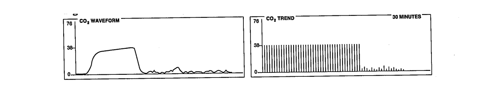

# Introduction to Capnography 
Capnography is a recent advancement for monitoring ventilatory status of critically ill patients. Its use is now spreading to other units within the hospital, such as the emergency room, critical care units, and general wards. As of today, capnography is often used on sedated intubated patients. Capnography provides a continuous, non-invasive measurement of arterial partial pressure of carbon dioxide (PaCO2) through the entire respiratory cycle.  The capnogram measures end-tidal partial pressure of CO2 (PetCO2) which is closely correlated to the PaCO2.

Common signs of an increased CO2 levels (called hypercapnia) are:
- [ ] confusion
- [ ] feelings of paranoia or depression
- [ ] muscle twitching
- [ ] irregular heartbeat
- [ ] hyperventilation
- [ ] seizures
- [ ] panic attack
- [ ] fainting
- [ ] headache
- [ ] blurred vision.

However, many of these symptoms will not manifest in a sedated patient or a patient who has an airway management device in place, like an ET tube. In such patients, hypercapnia may not be noted until the patient is at serious risk of death. 

The normal capnography waveform appears as a somewhat rounded rectangle: 
- [ ] it rises vertically on exhalations as CO2 is exhaled
- [ ] remains flat at the end of expiration but before the beginning of inspiration
- [ ] falls vertically on inhalation
- [ ] remains flat at the end of the inhalation until the next exhalation.

Changes in the shape of the waveform and the partial pressure of end tidal CO2 (PetCO2) reading (normal level, 35%–45%) in combination with pulse oximetry and respiratory rate readings can alert a medical worker that a problem needs to be addressed.

# Question 1
What is end tidal CO2?

[WRONG] Amount of arterial CO2 in the blood
[WRONG] Amount of venous CO2 in blood
[RIGHT] Amount of CO2 in lungs measured at the end of expiration
[WRONG] 2nd derivative of Cardiac Output
[WRONG] Cardiac output during exhalation

# Physiology
Monitoring end-tidal CO2 (PetCO2) provides instantaneous information about:
- [ ] Ventilation (how effectively CO2 gas is being exhaled/eliminated by the respiratory system)
- [ ] Perfusion (how effectively CO2 is being transported through the vascular system to the lungs)
- [ ] Metabolism (how effectively CO2 is being produced by cellular metabolism). 

### To use PetCO2 as a measure of blood flow:
* Ventilation must be constant (inhalation and exhalation are stable/normal
* Metabolism must be constant (activity/metabolic demand are stable)
* Under these conditions, PetCO2 will reflect pulmonary blood flow and can serve as gauge for effectiveness of chest compressions or mechanical ventillation 
 * As cardiac output increases from compressions or return of spontaneous circulation (ROSC), more CO2 is returned to the lungs, increasing the level of PetCO2
 * If perfusion decreases from poor compressions or decreasing cardiac output, less CO2 is returned to lungs, decreasing the level of PetCO2

### Normal CO2 Physiology
Oxygen (02) is used by the cells through the process of aerobic metabolism, and CO2 is produced as an end product. 

CO2 diffuses more readily than O2. Therefore, pressures for CO2 diffusion are lower than the pressures for 02 diffusion. 

The PCO2 of the venous blood entering the pulmonary capillary is 45 mmHg and the CO2 diffuses more PCO2 of alveolar air (PACO2) is 40 mmHg. 

The PACO2 is the measurement of CO2 that is continually being formed in the body, then discharged into the alveoli; and continually being removed from the alveoli by ventilation. This amount is measured through the PACO2. This pressure difference of 5 mmHg causes all of the required CO2 to diffuse out of pulmonary capillaries into the alveoli. 

Capnography is used by the critical care nurse to assess ventilation-perfusion (V/Q) relationships, and indirectly estimate dead space ventilation.

Patients with diseases such as chronic obstructive pulmonary disease and adult respiratory distress syndrome produce increased dead space ventilation and have high V/Q ratios. This occurs when lung units have more dead space ventilation than perfusion and end-tidal gas has less CO2.

# Question 2
End tidal CO2 is a useful measurement for all of the following EXCEPT:

[WRONG] Ventilation
[WRONG] Approximating PaCO2
[RIGHT] Oxygenation
[WRONG] Perfusion
[WRONG] Metabolism

# The Capnogram
The capnogram displays a waveform of CO2 concentration through the entire respiratory cycle, allowing for both real time assessment and trends over time. The capnogram is a pictorial diagram used to represent the CO2 concentration during the respiratory cycle and is read from left to right.

A capnograph is a visual display of the result of a colorimetric device which is connected to the patient airway (i.e. ET tube, mechanical airway, tracheal tube).

The critical care nurse should be able to recognize normal capnograms and understand when changes indicate a decline in ventilatory status of the patient. 

### The capnogram consists of four phases: 
1. Baseline
2. Ascending limb 
3. Alveolar plateau 
4. Descending limb. 

At baseline, the beginning of exhalation (AB), the initial sample is of CO2 free gas from anatomic dead space with a CO2 concentration of 0 mmHg. On the ascending limb (BC), CO2 concentration increases as CO2 empties from rapidly exchanging alveolar spaces and mixes with dead space gas. During alveolar plateau, the gas from uniformly ventilated alveoli are exhaled, the CO2 concentration remains relatively stable (CD). At the end of exhalation, where CO, concentration is highest (D), PetCO2, is measured. It is taken at a point 4/5 of the time after the beginning of exhalation and represents alveolar gas.

### Normal capnographs must have the following to be considered an accurate estimator of PaCO2 (within +/- 1.5 mmHg). 

* A zero baseline
* A rapid, sharp ascending limb
* An alveolar plateau
* A well-defined end-tidal point 
* A rapid, sharp descending limb for the PetCO2

# Nursing Actions
In viewing capnogram waveforms, the critical care nurse should monitor for a **sudden loss of PetCO2**, on the capnograms waveform to baseline or near baseline (0 mmHg) because it implies immediate danger as no respirations are detected. This indicates a loss of ventilation to the patient. Possible causes are esophageal intubation, complete ventilator malfunction, airway disconnection from ventilator or kinked/ obstructed ETT.

A sudden drop of PetCO2 to near zero value may indicate a catastrophic loss of ventilation to the patient. 

Next look for **decreases in PetCO2 waveform**, which can indicate a catastrophic event in the cardiopulmonary system of critically ill patients. A large widening of the P(a - ET)CO, from a sudden increase in dead space ventilation is the physiological basis for this decrease. For example, an interruption in pulmonary perfusion, such as cardiac arrest, is when decreases in PetCO2, can be seen. 

Identify capnogram waveforms that have a gradual decline in PetCO, which can indicate a decrease in perfusion (systemic or pulmonary) or a decrease in the production of CO2. Possible causes for this gradual decline are a decreasing body temperature, decreased pumping action of the heart with decreased cardiac output, and iypovoremnis 

An exponential decay in PetCO2 is seen with a sudden interruption in pulmonary perfusion, such as cardiac arrest. 

In patients with **chronic pulmonary disease**, observe for a sustained low PetCO2 with a good alveolar plateau showing pulmonary diseases, such as emphysema, bronchitis, asthma, pneumonia and pulmonary emboli, along with hyperventilation and hypovolemia that produce changes in normal waveform.

Observe for gradual increases in the PetCO2, which are related to
hyperthermia, hypoventilation, partial obstruction of the airway, absorption of CO2 from exogenous sources, or increases in CO2 production. Transient increases occur in the PetCO2 when increased amounts of CO2 are delivered to the pulmonary circulation. This can be seen with the injection of sodium bicarbonate or by releasing the pressure from a tourniquet on an extremity

# Measurement
### MSBI Nurses 
You may/will see a Pulmonary/CC Attending or Fellow measuring PetCO2 during in a Code (and some RRT-intubation).

A colorimetric CO2 detector can be used to help determine whether an airway is established leading to normal and adequate expiration of CO2. However, this device can not verify that an airway management device is correctly placed as this requires a confirmatory chest x-ray.

In a code, staff will use a hand held device (like the colorimetric CO2 detector) that will attach to the bag-valve to either a mask or to an ET or trach tube via tubing and connector (see below).

In some units/areas the PetCO2 may be measured on a bedside monitor (or portable/transport monitor defibrillator) with module and connector as seen below.

# End Tidal CO2
Continuous PetCO2 in line between airway and BVM or ventilator circuit.

Sensor links to monitor & displays numeric ETCO2 and waveform.

Remember, CO2 is a result of tissue metabolism and circulation. Therefore, if you have circulation/perfusion, the end result will be production of CO2. and then PetCO2 can be measured. Better the numeric = better the perfusion/circulation.

End Tidal CO2 Can also be measured and monitored in spontaneously breathing patients via nasal cannula or mask (see pictures below)

The same connectors and monitor would be used as seen in the previous section. This monitoring is often employed in PACU and procedure/post procedure areas.

# Requesting Capnography
Capnography helps the critical care nurse to monitor pulmonary blood flow, respiratory failure, and the adequacy of ventilation. In addition, monitoring intubation and ETT positioning, mechanical ventilation, and perfusion during cardiopulmonary resuscitation (CPR) are all clinical applications of capnography. 

### Verifying ETT Positioning
Capnograms provide information verifying ETT placement. The measurement of PetCO2 has been considered the most reliable method in determining the placement of an ETT. Once proper ETT placement has been established, capnography helps monitor the positioning of the tube. 

* After intubation, if PetCO2 >10mm Hg – tube in trachea
 * If undetectable, ETT may be in esophagus or cardiac output too low to detect

### Evaluation of Mechanical Ventilation
Capnography also assists in evaluating the effectiveness of mechanical ventilation. The critical care nurse monitors the optimum level of positive end-expiratory pressure (PEEP) needed for adequate oxygenation of the critically ill patient with increased intrapulmonary shunt and impaired oxygenation 

### Confirm Adequacy of Chest Compressions
* Measurement of a low PetCO2 value (< 10 mmHg) during CPR in an intubated patient suggests that the quality of chest compressions needs improvement.
 * Ensure proper rate (approximately 100/min)
 * Ensure proper depth with adequate release/recoil of thorax (1/2 thorax or minimum 2.5 inches)
* Persistently low PetCO2 values (<10mmHg) despite optimal chest compressions in intubated patients suggest ROSC is unlikely (data not available for patients receiving bag-valve ventilation (given that air leak can result in a low measured PetCO2 )

### Identification of Returning of Circulation
* Monitor for a significant increase in the PetCO 2 to near normal (normal ETCO 2 = 35- 45 mmHg) – represents marked increase of CO2 delivery to lungs, suggesting ROSC
* If patient develops an organized rhythm after VF/VT/asystole – check PetCO2 to see if ROSC has occurred

# Contraindications and Pitfalls for Capnography 
Capnography does not provide an accurate measurement of PetCO2 in spontaneously breathing patients because of entrainment of room air that dilutes the measurement.

Second, it has also been demonstrated that the use of capnography in patients with respiratory failure, lung disease and V/Q mismatch have a poor correlation between PaCO2 and PetCO2. This limitation necessitates the need to correlate the PetCO2 level with PaCO2 rather than used alone as a diagnostic factor.

#### If PetCO2 level is low/undetectable, can be explained by
* pulmonary blood flow is low (large/massive PE)
* pulmonary exhaled air is low (status asthmaticus)
* poor offloading of C02 to lungs (pulmonary edema)

#### NaHC03 will increase PetCO2 (because it splits into CO2 and H20)
* So, if rises after NaHCO3, do not misinterpret as ROSC

#### Vasopressors will decrease PetCO2 (they cause high afterload, increasing BP and myocardial blood flow but a decrease in cardiac output)
* PetCO2 may decrease after epinephrine

# AHA guideline recommendations (for intubated patients):
#### Use PetCO2 to confirm Endotracheal Tube Placement (IA)
* Will not be able to detect CO2 if ETT in esophagus
* If PetCO2 < optimize compression parameters – rate/depth (IIB).
* If PetCO2 abruptly increases to 35-40 mmHg, may indicate ROSC (IIB).

The value of using quantitative waveform capnography in non-intubated patients to monitor and optimize CPR quality and detect ROSC is uncertain (Class IIb, LOE C).

# Protocol
#### CO2 detectors will be carried to all cardiac arrests by PCCM Team (Fellow/Attending)
* Detectors to be stored and kept charged by PCCM Division

#### C02 detector must be immediately attached to BVM (or ETT if applicable)
* Code team members and PCCM Division must learn PetCO2 monitor installation and operation during Code team training exercises
* PetCO2 monitor to be placed on bed within view of compression team
* Compression team to monitor PetCO2 levels while performing compressions, must inform code leader of:
 * Initial measured PetCO2 level
 * Any significant change in PetCO2 level
  * Achievement of PetCO2 levels >10mmHg
  * Sudden increase to near 35-40mm Hg
  * Inability to achieve PetCO2 >10mm Hg

# Question 3
You should expect a normal to high end-tidal CO2 in all of the following except:

[WRONG] 25 year old who just ran up a flight of stairs
[WRONG] Return of normal circulation during CPR
[RIGHT] Arsenic poisoning impeding cellular metabolism 
[WRONG] Patient in cardiac arrest with proper intubation and good compressions
[WRONG] A patient on a ventilator

# Question 4
You should expect a low-end tidal CO2 in all of the following except:

[WRONG] A person who just suffered a pulmonary embolism
[WRONG] A patient in hemorrhagic shock
[WRONG] A patent in cardiac arrest
[WRONG] A patient receiving vasopressors
[RIGHT] A patient receiving sodium bicarbonate

# Question 5
An end tidal CO2 level < 10 mmHg is associated to any of the following except:

[WRONG] Endotracheal tube placed into esophagus
[RIGHT] Return of normal circulation during CPR
[WRONG] Poor chest compressions during CPR
[WRONG] Chronic pulmonary diseases (i.e. emphysema)
[WRONG] Hyperventilation
