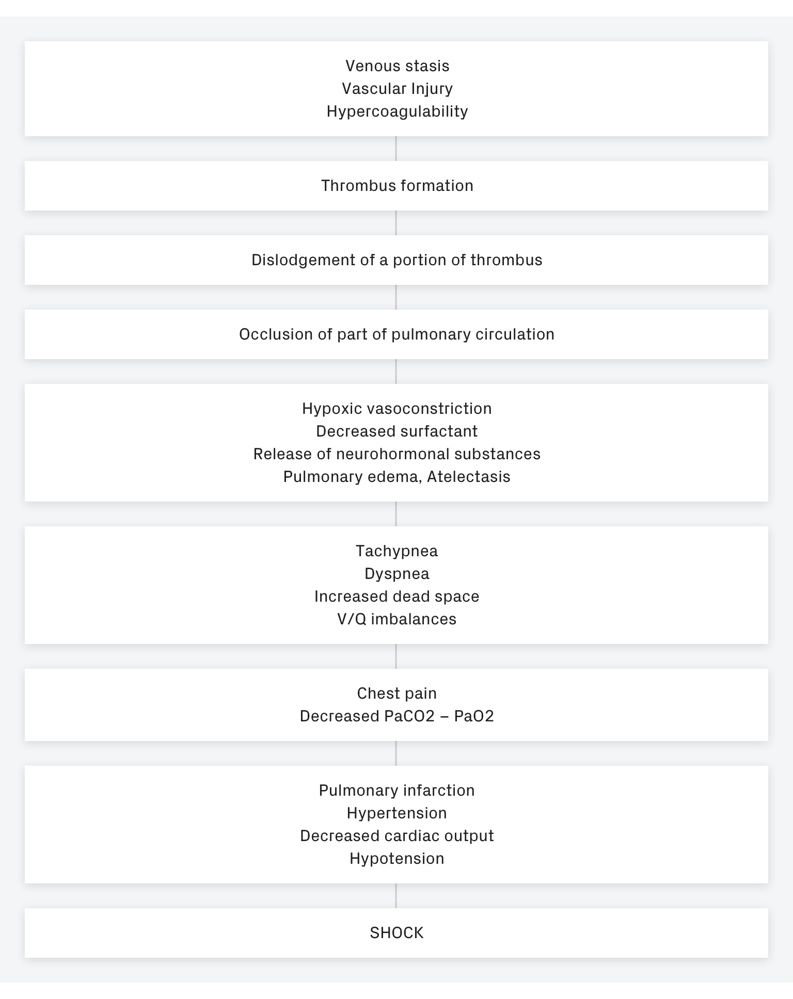

# Description
Pulmonary embolism is a common disorder that is related to deep vein thrombosis (DVT).

- [ ] **Pulmonary embolism** refers to the **obstruction** of the pulmonary artery or one of its branches by a thrombus that originates somewhere in the venous system or in the right side of the heart.
- [ ] **Deep vein thrombosis**, a related condition, refers to thrombus formation in the deep veins, usually in the calf or thigh, but sometimes in the arm, especially in patients with peripherally inserted central catheters.

# Classification
Most commonly, pulmonary embolism is due to a blood clot or thrombus, but there are other types of emboli: fat, air, amniotic fluid, and septic.

- [ ] **Fat emboli.** Fat emboli are cholesterol or fatty substances that may clog the arteries when fatty foods are consumed more.
- [ ] **Air emboli.** Air emboli usually come from intravenous devices.
- [ ] **Amniotic fluid emboli.** Amniotic fluid emboli are caused by amniotic fluid that has leaked towards the arteries.
- [ ] **Septic emboli.** Septic emboli originate from a bacterial invasion of the thrombus.
Pathophysiology
A series of happenings occur inside a patient’s body when he or she has emboli.

# Pathophysiology of Pulmonary Embolism.

Click the image to enlarge.
Pathophysiology of Pulmonary Embolism. Click the image to enlarge.

- [ ] **Obstruction.** When a thrombus completely or partially obstructs the pulmonary artery or its branches, the alveolar dead space is increased.
- [ ] **Impairment.** The area receives little to no blood flow and gas exchange is impaired.
- [ ] **Constriction.** Various substances are released from the clot and surrounding area that cause constriction of the blood vessels and results in pulmonary resistance.
- [ ] **Consequences.** Increased pulmonary vascular resistance due to regional vasoconstriction leading to increase in pulmonary arterial pressure and increased right ventricle workload are the consequences that follow.
- [ ] **Failure.** When the workload of the right ventricle exceeds the limit, failure may occur.

# Statistics and Epidemiology
Pulmonary embolism may also occur in healthy people.

There are 237, 000 nonfatal cases of pulmonary embolism in the United States every year.
294, 000 cases are considered fatal each year.

# Causes
Pulmonary embolism is linked to a lot of causes and these are the most common:

- [ ] **Trauma.** Trauma anywhere in the body could cause PE especially if a clot is released from the venous system.
- [ ] **Surgery.** Certain surgical procedures such as orthopedic, major abdominal, pelvic, and gynecologic surgeries could cause PE.
- [ ] **Hypercoagulable states.** A patient with hypercoagulability disorders would most likely develop a clot that could result in PE.
- [ ] **Prolonged immobility.** Being unable to move for a prolonged time predisposes a person to PE.

# Clinical Manifestations
Symptoms of pulmonary embolism depend on the size of the thrombus and the area of the pulmonary artery occluded by the thrombus.

- [ ] **Dyspnea.** Dyspnea is the most frequent symptom; the duration and intensity of the dyspnea depend on the extent of embolization.
- [ ] **Chest pain.** Chest pain occurs suddenly and is pleuritic in origin.
- [ ] **Tachycardia.** Increase in heart rate occurs because the right ventricle catches up with its workload.
- [ ] **Tachypnea.** The most frequent sign is tachypnea.

# Prevention
For patients at risk for PE, the most effective approach for prevention is to prevent DVT.

- [ ] **Avoid venous stasis.** Active leg exercises, early ambulation, and use of anti-embolism stockings are general preventive measures for DVT.
- [ ] **Sequential compression devices.** These are plastic sleeves that can be inflated with air for compression and relaxation of calf muscles.
- [ ] **Mechanical prophylaxis.** Mechanical prophylaxis can be classified as static or dynamic.
- [ ] **Graduated compression stockings.** This involves the sequential movement of air in the sleeve up the leg, followed by relaxation of the sleeve.
- [ ] **Anticoagulant therapy.** Anticoagulant therapy may be prescribed for patients whose hemostasis is adequate and who are undergoing major elective abdominal or thoracic surgery.

# Complications
When caring for a patient who has had PE, the nurse must be alert for potential complications.

- [ ] **Cardiogenic shock.** The cardiopulmonary system is endangered in a massive PE.
- [ ] **Right ventricular failure.** A sudden increase in pulmonary resistance increases the work of the right ventricle.

# Assessment and Diagnostic Findings
Death from PE commonly occurs within one (1) hour after the onset of symptoms; therefore, early recognition and diagnosis are priorities.

- [ ] **Chest x-ray.** The chest x-ray is usually normal but may show infiltrates, atelectasis, elevation of the diaphragm on the affected side, or a pleural effusion.
- [ ] **ECG.** The ECG usually shows sinus tachycardia, PR-interval depression,and nonspecific T-wave changes.
- [ ] **ABG analysis.** ABG analysis may show hypoxemia and hypocapnia; however, ABG measurements may be normal even in the presence of PE.
- [ ] **Pulmonary angiogram.** Pulmonary angiogram allows for direct visualization under fluoroscopy of the arterial obstruction and accurate assessment of the perfusion deficit.
- [ ] **V/Q scan.** The V/Q scan evaluates the different regions of the lung and allows comparisons of the percentage of ventilation and perfusion in each area.

# Medical Management
Because PE is often a medical emergency, emergency management is of primary concern.

- [ ] **Anticoagulation therapy.** Heparin, and warfarin sodium has been traditionally been the primary method for managing acute DVT and PE.
- [ ] **Thrombolytic therapy.** Urokinase, streptokinase, alteplase are used in treating PE, particularly in patients who are severely compromised.

# Surgical Management

Removal of the emboli may sometimes need surgical management.

- [ ] **Surgical embolectomy.** This is the removal of the actual clot and must be performed by a cardiovascular surgical team with the patient on cardiopulmonary bypass.
- [ ] **Transvenous catheter embolectomy.** This is a technique in which a vacuum-cupped catheter is introduced transvenously into the affected pulmonary artery.
- [ ] **Interrupting the vena cava.** This approach prevents dislodged thrombi from being swept into the lungs while allowing adequate blood flow.

# Nursing Management
A key role of the nurse is to identify the patient at high risk for pulmonary embolism, and to minimize the risk of PE in all patients.

## Nursing Assessment
All patients are evaluated for risk factors for thrombus formation and pulmonary embolus.

- [ ] **Health history.** Health history is assessed to determine any previous cardiovascular disease.
- [ ] **Family history.** History of any cardiovascular disease in the family may predispose the patient to PE.
- [ ] **Medication record.** There are certain medications that can increase the risk for PE.
- [ ] **Physical exam.** Extremities are evaluated for warmth, redness, and inflammation.

## Diagnosis
Based on the assessment data, the following nursing diagnoses for a patient with pulmonary embolism are developed:

- [ ] **Ineffective peripheral tissue perfusion** related to obstructed pulmonary artery.
- [ ] **Risk for shock** related to increased workload of the right ventricle.
- [ ] **Acute pain** related to pleuritic origin.

## Nursing Care Planning & Goals

Planning and goals for a patient with pulmonary embolism include the following:

- Increase perfusion
- Verbalize understanding of condition, therapy regimen, and medication side effects.
- Display hemodynamic stability.
- Report pain is relieved or controlled.
- Follow prescribed pharmacologic regimen.

## Nursing Interventions

Nursing care for a patient with pulmonary embolism includes:

- [ ] **Prevent venous stasis.** Encourage ambulation and active and passive leg exercises to prevent venous stasis.
- [ ] **Monitor thrombolytic therapy.** Monitoring thrombolytic and anticoagulant therapy through INR or PTT.
- [ ] **Manage pain.** Turn patient frequently and reposition to improve ventilation-perfusion ratio.
- [ ] **Manage oxygen therapy.** Assess for signs of hypoxemia and monitor the pulse oximetry values.
- [ ] **Relieve anxiety.** Encourage the patient to talk about any fears or concerns related to this frightening episode.

## Evaluation
Success of the treatment plan will be evaluated with the following:

- Increased perfusion.
- Verbalized understanding of condition, therapy regimen, and medication side effects.
- Displayed hemodynamic stability.
- Reported pain is relieved or controlled.
- Followed prescribed pharmacologic regimen.

## Discharge and Home Care Guidelines
After discharge, there are some guidelines that the nurse must teach the patient.

- [ ] **Prevent recurrence.** The nurse should instruct the patient about preventing recurrence and reporting signs and symptoms
- [ ] **Adherence.** The nurse should monitor the patient’s adherence to the prescribed management plan and enforces previous instructions.
- [ ] **Residual effects.** The nurse should also monitor for residual effects of the PE and recovery.
- [ ] **Follow-up checkups.** Remind the patient about keeping up with follow-up appointments for coagulation tests and appointments with the primary care provider.

## Documentation Guidelines
The focus of documentation should include:

- Individual findings, noting nature, extent, and duration of the problem, effects on independence and lifestyle.
- Characteristics of pain, precipitators, and what relieves pain.
- Pulses and BP.
- Plan of care.
- Teaching plan.
- Response to interventions, teaching and actions performed.
- Attainment or progress toward desired outcomes.
- Modifications to plan of care.
