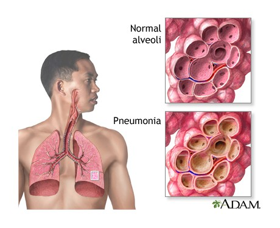

# Description
Respiratory diseases are rampant today because it is easier spread in crowded areas. Pneumonia is one of the most common respiratory problems and it affects all stages of life.

* **Pneumonia** is an **inflammation of the lung parenchyma** caused by various microorganisms, including bacteria, mycobacteria, fungi, and viruses.
* **Pneumonitis** is a more general term that describes the **inflammatory process in the lung tissue** that may predispose and place the patient at risk for microbial invasion.

# Classification
Pneumonia is classified into four: community-acquired pneumonia (CAP) and hospital-acquired pneumonia (HAP), pneumonia in the immunocompromised host, and aspiration pneumonia.

pneumonia-image

## Community-Acquired Pneumonia

* CAP occurs either in the community setting or within the **first 48 hours after hospitalization**.
* The **causative agents** for CAP that needs hospitalization include **streptococcus pneumoniae, H. influenza, Legionella, and Pseudomonas aeruginosa**.
* Only in 50% of the cases does the specific etiologic agent become identified.
* **Pneumonia** is the **most common cause of CAP** in people younger than 60 years of age.
* Viruses are the most common cause of pneumonia in infants and children.

## Hospital-Acquired Pneumonia
* HAP is also called **nosocomial pneumonia** and is defined as the onset of pneumonia symptoms **more than 48 hours after admission** in patients with no evidence of infection at the time of admission.
* HAP is the **most lethal nosocomial infection** and the leading cause of death in patients with such infections.
* Common microorganisms that are responsible for HAP include **Enterobacter species, Escherichia coli, influenza, Klebsiella species, Proteus, Serratia marcescens, S. aureus, and S. pneumonia**.
* The usual presentation of HAP is a **new pulmonary infiltrate** on chest x-ray combined with evidence of infection.

## Pneumonia in the Immunocompromised Host
* Pneumonia in immunocompromised hosts includes Pneumocystis pneumonia, fungal pneumonias and Mycobacterium tuberculosis.
* Patients who are immunocompromised **commonly develop pneumonia from organisms of low virulence**.
* Pneumonia in immunocompromised hosts may be caused by the organisms also observe in HAP and CAP.

## Aspiration Pneumonia
* **Aspiration pneumonia refers** to the pulmonary consequences resulting from entry of endogenous or exogenous substances into the lower airway.
* The most common form of aspiration pneumonia is a bacterial infection from aspiration of bacteria that normally reside in the upper airways.
* Aspiration pneumonia may occur in the community or hospital setting.
* Common pathogens are S. pneumonia, H.influenza, and S. aureus.

# Pathophysiology
Having an idea about the disease process helps the patient understand the treatment regimen and its importance, increasing patient compliance.

* Pneumonia arises from **normal flora** present in patients whose **resistance has been altered** or from aspiration of flora present in the oropharynx.
* An **inflammatory reaction** may occur in the alveoli, producing **exudates** that interfere with the diffusion of oxygen and carbon dioxide.
* **White blood cells** also migrate into the alveoli and **fill the normally air-filled spaces.**
* Due to secretions and mucosal edema, there are areas of the lung that are not adequately ventilated and cause partial occlusion of the alveoli or bronchi.
* **Hypoventilation** may follow, causing ventilation-perfusion mismatch.
* Venous blood entering the pulmonary circulation passes through the under ventilated areas and travels to the left side of the heart deoxygenated.
* The mixing of oxygenated and poorly oxygenated blood can result to **arterial hypoxemia**.

# Epidemiology
Pneumonia has affected a lot of people, especially those who have a weak immune system. Learning statistics on pneumonia could give you an idea about how many has fallen victim to this respiratory disease.

* Pneumonia and influenza account for nearly **60,000 deaths annually**
* Pneumonia also ranks as the **eighth leading cause of death** in the United States.
* It is estimated that more than 915, 000 episodes of CAP occur in adults 65 years old and above in the United States.
* HAP accounts for 15% of hospital-acquired infections and is the leading cause of death in patients with such infections.
* The estimated incidence of HAP 4 to 7 episodes per 1000 hospitalizations.

# Causes
Each type of pneumonia is caused by different and several factors.

## Community-Acquired Pneumonia

* **Streptococcus pneumoniae**. This is the **leading cause of CAP** in people younger than 60 years of age without comorbidity and in those 60 years and older with comorbidity.
* **Haemophilus influenzae.**  This causes a type of CAP that frequently affects elderly people and those with comorbid illnesses.
* **Mycoplasma pneumoniae.**

## Hospital-Acquired Pneumonia

* **Staphylococcus aureus.** Staphylococcus pneumonia occurs through inhalation of the organism.
* **Impaired host defenses.** When the defenses of the body are down, several pathogens may invade the body.
* **Comorbid conditions.** There are several conditions that lower the immune system, causing bacteria to pool in the lungs and eventually result in pneumonia.
* **Supine positioning.** When the patient stays in a prolonged supine position, fluid in the lungs pools down and stays stagnant, making it a breeding place for bacteria.
* **Prolonged hospitalization.** The risk for hospital infections or nosocomial infections increases the longer the patient stays in the hospital.

# Clinical Manifestations
Pneumonia varies in its signs and symptoms depending on its type but it is not impossible to diagnose a specific pneumonia through its clinical manifestations.

Clinical Manifestations of Pneumonia
* **Rapidly rising fever.** Since there is inflammation of the lung parenchyma, fever develops as part of the signs of an infection.
* **Pleuritic chest pain.** Deep breathing and coughing aggravate the pain in the chest.
* **Rapid and bounding pulse.** A rapid heartbeat occurs because the body compensates for the low concentration of oxygen in the body.
* **Tachypnea.** There is fast breathing because the body tries to compensate for the low oxygen concentration in the body.
* **Purulent sputum.** The sputum becomes purulent because of the infection in the lung parenchyma which produced sputum-filled with pus.

# Prevention
It is better to prevent the occurrence of pneumonia instead of treating the disease itself. Here are several ways that can help prevent pneumonia.

* **Pneumococcal vaccine.** This vaccine can prevent pneumonia in healthy patients with an **efficiency of 65% to 85%.**
* **Staff education.** To help prevent HAP, the CDC (2004) encouraged staff education and involvement in infection prevention.
* **Infection and microbiologic surveillance.** It is important to carefully observe the infection so that there could be an appropriate application of prevention techniques.
* **Modifying host risk for infection.** The infection should never be allowed to descend on any host, so the risk must be decreased before it can affect one.

# Complications
Pneumonia has several complications if left untreated or the interventions are inappropriate. These are the following complications that may develop in patients with pneumonia.

* **Shock and respiratory failure.** These complications are encountered chiefly in patients who have received no specific treatment and inadequate or delayed treatment.
* **Pleural effusion.** In **pleural effusion**, the fluid is sent to the laboratory for analysis, and there are three stages: uncomplicated, complicated, and thoracic empyema.

# Assessment and Diagnostic Findings
Assessment and diagnosis of pneumonia must be accurate since there are a lot of respiratory problems that have similar manifestations. The following are assessments and diagnostic tests that could determine pneumonia.

* **History taking.** The diagnosis of pneumonia is made through history taking, particularly a recent respiratory tract infection.
* **Physical examination.** Mainly, the number of breaths per minute and breath sounds is assessed during physical examination.
* **Chest x-ray.** Identifies structural distribution (e.g., lobar, bronchial); may also reveal multiple abscesses/infiltrates, empyema (staphylococcus); scattered or localized infiltration (bacterial); or diffuse/extensive nodular infiltrates (more often viral). In mycoplasmal pneumonia, chest x-ray may be clear.
* **Fiberoptic bronchoscopy.** May be both diagnostic (qualitative cultures) and therapeutic (re-expansion of lung segment).
* **ABGs/pulse oximetry.** Abnormalities may be present, depending on extent of lung involvement and underlying lung disease.
* **Gram stain/cultures.** Sputum collection; needle aspiration of empyema, pleural, and transtracheal or transthoracic fluids; lung biopsies and blood cultures may be done to recover causative organism. More than one type of organism may be present; common bacteria include Diplococcus pneumoniae, Staphylococcus aureus, a-hemolytic streptococcus, Haemophilus influenzae; cytomegalovirus (CMV). Note: Sputum cultures may not identify all offending organisms. Blood cultures may show transient bacteremia.
* **CBC.** Leukocytosis usually present, although a low white blood cell (WBC) count may be present in viral infection, immunosuppressed conditions such as AIDS, and overwhelming bacterial pneumonia. Erythrocyte sedimentation rate (ESR) is elevated.
* **Serologic studies, e.g., viral or Legionella titers, cold agglutinins.** Assist in differential diagnosis of specific organism.
* **Pulmonary function studies.** Volumes may be decreased (congestion and alveolar collapse); airway pressure may be increased and compliance decreased. Shunting is present (hypoxemia).
* **Electrolytes.** Sodium and chloride levels may be low.
* **Bilirubin.** May be increased.
* **Percutaneous aspiration/open biopsy of lung tissues.** May reveal typical intranuclear and cytoplasmic inclusions (CMV), characteristic giant cells (rubeola).

# Medical Management
The management of pneumonia centers is a step-by-step process that zeroes on the treatment of the infection through identification of the causative agent.

* **Blood culture.** Blood culture is performed for identification of the causal pathogen and prompt administration of antibiotics in patients in whom CAP is strongly suspected.
* **Administration of macrolides.** Macrolides are recommended for people with drug-resistant S. pneumoniae.
* Hydration is an important part of the regimen because fever and tachypnea may result in insensible fluid losses.
* **Administration of antipyretics.** Antipyretics are used to treat fever and headache.
* **Administration of antitussives.** Antitussives are used for treatment of the associated cough.
* **Bed rest.** Complete rest is prescribed until signs of infection are diminished.
* **Oxygen administration.** Oxygen can be given if hypoxemia develops.
* **Pulse oximetry.** Pulse oximetry is used to determine the need for oxygen and to evaluate the effectiveness of the therapy.
* **Aggressive respiratory measures.** Other measures include administration of high concentrations of oxygen, endotracheal intubation, and mechanical ventilation.

# Nursing Management
Nurses are expected to perform both dependent and independent functions for the patient to aid him or her towards the restoration of their well-being.

## Nursing Assessment
Nursing assessment is critical in detecting pneumonia. Here are some tips for your nursing assessment for pneumonia.

* **Assess respiratory symptoms.** Symptoms of fever, chills, or night sweats in a patient should be reported immediately to the nurse as these can be signs of bacterial pneumonia.
* **Assess clinical manifestations.** Respiratory assessment should further identify clinical manifestations such as pleuritic pain, bradycardia, tachypnea, and fatigue, use of accessory muscles for breathing, coughing, and purulent sputum.
* **Physical assessment.** Assess the changes in temperature and pulse; amount, odor, and color of secretions; frequency and severity of cough; degree of tachypnea or shortness of breath; and changes in the chest x-ray findings.
* **Assessment in elderly patients.** Assess elderly patients for altered mental status, dehydration, unusual behavior, excessive fatigue, and concomitant heart failure.

## Diagnosis
Through the data collected during assessment, the following nursing diagnoses are made:

* **Ineffective airway clearance** related to copious tracheobronchial secretions.
* **Activity intolerance** related to impaired respiratory function.
* **Risk for deficient fluid volume** related to fever and a rapid respiratory rate.

## Nursing Care Planning & Goals

Planning is essential to establish the interventions that are appropriate for the patient’s condition.

* Improve airway patency.
* Rest to conserve energy.
* Maintenance of proper fluid volume.
* Maintenance of adequate nutrition.
* Understanding of treatment protocol and preventive measures.
* Absence of complications.

## Nursing Priorities
1. Maintain/improve respiratory function.
2. Prevent complications.
3. Support recuperative process.
4. Provide information about disease process, prognosis, and treatment.

## Nursing Interventions
These nursing interventions, if implemented appropriately, would result in the achievement of the goals of the management of pneumonia.

To improve airway patency:

* **Removal of secretions.** Secretions should be removed because retained secretions interfere with gas exchange and may slow recovery.
* Adequate hydration of 2 to 3 liters per day thins and loosens pulmonary secretions.
* Humidification may loosen secretions and improve ventilation.
* **Coughing exercises.** An effective, directed cough can also improve airway patency.
* **Chest physiotherapy.** Chest physiotherapy is important because it loosens and mobilizes secretions.

**To promote rest and conserve energy:**

* Encourage avoidance of overexertion and possible exacerbation of symptoms.
* **Semi-Fowler’s position.** The patient should assume a comfortable position to promote rest and breathing and should change positions frequently to enhance secretion clearance and pulmonary ventilation and perfusion.

**To promote fluid intake:**

* **Fluid intake.** Increase in fluid intake to at least 2L per day to replace insensible fluid losses.

**To maintain nutrition:**

* Fluids with electrolytes. This may help provide fluid, calories, and electrolytes.
* Nutrition-enriched beverages. Nutritionally enhanced drinks and shakes can also help restore proper nutrition.

**To promote patient’s knowledge:**

* Instruct patient and family about the cause of pneumonia, management of symptoms, signs, and symptoms, and the need for follow-up.
* Instruct patient about the factors that may have contributed to the development of the disease.

## Evaluation
Expected patient outcomes include the following:

* Demonstrates improved airway patency.
* Rests and conserves energy by limiting activities and remaining in bed while symptomatic and then slowly increasing activities.
* Maintains adequate hydration.
* Consumes adequate dietary intake.
* States explanation for management strategies.
* Complies with management strategies.
* Exhibits no complications.
* Complies with treatment protocol and prevention strategies.

## Discharge and Home Care Guidelines
Patient education is crucial regardless of the setting because self-care is essential in achieving a patient’s well-being.

* **Oral antibiotics.** Teach the patient about the proper administration, potential side effects, and symptoms to report.
* **Breathing exercises.** Teach the patient breathing exercises to promote secretion clearance and volume expansion.
* **Follow-up check up.** Strict compliance to follow-up checkups is important to check the latest chest x-ray result or physical examination findings.
* **Smoking cessation.** Smoking should be stopped because it inhibits tracheobronchial ciliary action and irritates the mucous cells of the bronchi.

## Documentation Guidelines
Documentation of data must be accurate and up-to-date to avoid unnecessary legal situations that might occur.

- Document breath sounds, presence and character of secretions, use of accessory muscles for breathing.
- Document character of cough and sputum.
- Document respiratory rate, pulse oximetry/O2 saturation, and vital signs.
- Document plan of care and who is involved in planning.
- Document client’s response to interventions, teaching, and actions performed.
- Document if there is use of respiratory devices or airway adjuncts.
- Document response to medications administered.
- Document modifications to plan of care.

# Question 1
A patient who has a diagnosis of pneumonia reports a sudden onset of sharp pain on one side of the chest. The patient is dyspneic and oxygen saturation falls to 89, percent. After administering oxygen to the patient, which of these actions should the healthcare provider perform next?

[RIGHT] Auscultate lungs bilaterally 
[WRONG] Check capillary refill
[WRONG] Lower head of patient
[WRONG] Take a full set of vitals

# Question 2
What is an acute infection of the lung caused by bacteria or viruses?

[RIGHT] Pneumonia
[WRONG] Pneumoconiosis
[WRONG] Pulmonary edema

# Question 3
How are pneumonias classified?

[RIGHT] Community acquired or nosocomial
[WRONG] Natural acquired
[WRONG] Passive and active acquired

# Question 4
Pneumonia infections that are acquired in the hospital are known as what?

[RIGHT] Nosocomial acquired
[WRONG] Community acquired
[WRONG] Passively acquired

# Question 5
What protects the lungs from foreign pathogens?

[RIGHT] Macrophages
[WRONG] Microphages
[WRONG] Eosinophils

# Question 6
Which of the following are signs and symptoms of pneumonia?

[RIGHT] Fever, chills, purulent sputum
[WRONG] Increased energy, dry cough
[WRONG] Sinus congestion, headaches

# Question 7
Which of the following can be used to diagnose pneumonia?

[RIGHT] Infiltrates on chest x-ray
[WRONG] Decreased platelets
[WRONG] Elevated red blood cell count

# Question 8
An elevated white blood count and infiltrates on a chest x-ray are indications of which condition?

[RIGHT] Pneumonia
[WRONG] Pulmonary embolism
[WRONG] Pneumothorax

# Question 9
What diagnostic test is used to determine the presence of a bacterial infection of the blood (sepsis)?

[RIGHT] Blood culture
[WRONG] Complete blood count
[WRONG] CT scan

# Question 10
CAP occurs either in the community setting or within the first _____ hours after hospitalization.

[RIGHT] 48
[WRONG] 24
[WRONG] 72
[WRONG] 36

# Question 11
HAP is the onset of pneumonia symptoms more than _____ hours after admission in patients with no evidence of infection at the time of admission.

[RIGHT] 48
[WRONG] 24
[WRONG] 72
[WRONG] 36

# Question 12
Which of the following is not considered as pneumonia in the immunocompromised host?

[RIGHT] Nosocomial pneumonia.
[WRONG] Fungal pneumonia.
[WRONG] Pneumocystis pneumonia.
[WRONG] Mycobacterium tuberculosis.

# Question 13
What is the most common form of aspiration pneumonia?

[RIGHT] Bacterial infection.
[WRONG] Fungal infection.
[WRONG] Myocardial infarction.
[WRONG] Renal insufficiency.

# Question 14
What is the leading cause of CAP?

[RIGHT] S. pneumonia.
[WRONG] Fungal infection.
[WRONG] S. aureus.
[WRONG] H. influenza.
