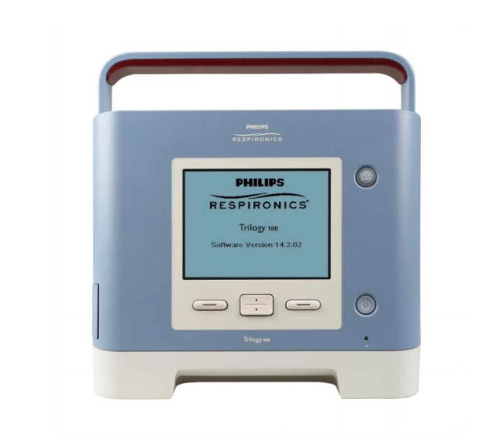

# Types of Mechanical Ventilators [if this is what is to be discussed in this section, then modes should be moved elsewhere, but I've inserted content I think needs to be included in modes below)

Mechanical ventilation is indicated for patients with respiratory failure who are unable to maintain adequate gas exchange.
Mechanical ventilators deliver positive pressure using a number of settings within a specified overall mode.

# Mechanical Ventilator Settings 
Mechanical ventilators can be programed to deliver a number of specific settings. Keep in mind that not all modes use all of the following settings.
* FiO2: fraction of inspired oxygen (percentage of oxygen delivered)
* RR/f: respiratory rate or frequency (number of breaths delivered per minute by the ventilator)
* Vt: tidal volume (size of each breath)
* PS: pressure support (amount of pressure delivered with each breath)
* PEEP: Positive End Expiratory Pressure (additional positive pressure provided at the end of expiratio to keep alveoli open)
* I:E ratio: Inspiratory/Expiratory ratio, or the duration of inhalation compared to exhalation

# Models of Mechanical Ventilators

The "mode" describes the ventilator's general relationship with the patient. Settings can vary within a mode. Modes can be pressure targetted or volume  targetted and the level of support can vary from mode to mode. In some modes, the ventilator does all of the work of breathing, while other modes can require the patient to do more work of breathing.

### Volume Targetted
* Preset volume of gas (tidal volume or "Vt") is predetermined and delivered despite the amount of pressure generated

### Pressure Targetted
* Preset pressure of gas delivery is predetermined
* Gas flow to patient ceases when pressure reaches preset level
* May mean that patient does not receive targeted
tidal volume

# Select modes (this list is not comprehensive)
All of these modes will include a pre-set PEEP and FiO2, from there, the additional support may be provided depending on the mode
* Assist Control (A/C) - A volume targetted mode
Provides a predetermined set number of breaths (RR), each with a pre-set tidal volume (Vt). The patient may take additional breaths above the pre-set number (RR setting), and those additional breaths will be supported by the preset tidal volume as well.

* Synchronized Intermittent Mandatory Ventilation (SIMV) - A volume targetted mode
Provides a predetermined set number of breaths (RR), each with a preset tidal volume (Vt). The patient may take additional breaths above the pre-set number (RR setting), however, those additional breaths will NOT be supported by the preset tidal volume- the volume of these breaths will be determined by patient effort

* Pressure Support (PS) - A pressure targetted mode
Provides a preset pressure when a patient "triggers" the ventilator (demonstrates inspiratory effort). There is NO pre-set respiratory rate or tidal volume. The patient will determine their own respiratory rate, but each effort to take a breath will be supported by a set pressure amount.

# Question 1
What differentiates Volume targetted and Pressure targetted modes of ventilation?

[RIGHT] Volume targetted ventilation has a predetermined tidal volume, Pressure targetted modes cease gas flow when pressure reaches the preset level
[WRONG] Pressure targetted ventilation has a predetermined tidal volume, Volume targetted modes begin gas flow when pressure reaches the preset level

# Question 2
A ventilator mode with a preset volume of gas that is delivered despite the amount of pressure generated is known as what?

[WRONG] Manual targetted
[WRONG] Pressure targetted
[RIGHT] Volume targetted

Types of Ventilators (I don't know that I see value in the information below if this is truly a "Crash course" in mechanical ventilation...)

### PB 840 Ventilator

* Modes: A/C, SIMV, PS, Bilevel
* Mandatory Breath Type: Volume (VC), Pressure (PC), PRVC (VC+); NIV mode
* Touchscreen and dial knob navigation
* Adult/Pediatric/Infant
* Inspiratory/Expiratory hold functions for Pplat and Intrinsic PEEP monitoring
* Pressure/Flow/Volume waveforms and Flow/Volume + Pressure/Volume loops
* External alarm and streaming capabilities

### PB980 Ventilator

* Modes: A/C, SIMV, PS, Bilevel
* Mandatory Breath Type: Volume (VC), Pressure (PC), PRVC (VC+); NIV mode
* Adult/Pediatric/Infant (>7 kg)
* Same as PB840 with additional monitor and patient safety features:
    * Multiple graph views (up to 5 can be displayed)
    * Adjustable patient data parameters (Default will look the same as the PB840)
    * Vt/IBW monitoring
* External alarm and streaming capabilities

### Draeger XL

* Modes: IPPV, IPPVAssist/CMV, CMVAssist–SIMV, SIMVPsupp–MMV, MMVPsupp–BIPAP1), BIPAP1) ASB, BIPAP1) Assist / PCV+, PCV+Psupp, PCV+Assist–APRV –CPAP, CPAPASB CPAP/Psupp, CPAP/Psupp–ILV
* Pressure/Flow/Volume waveforms and Flow/Volume + Pressure/Volume loops
* Plateau pressure monitoring

### Servo-I

* Modes: A/C, SIMV, PS, Bilevel
* Mandatory Breath Type: Volume (VC), Pressure (PC), PRVC (Similar to VC+); NIV mode
* Inspiratory/Expiratory hold functions for Pplat and Intrinsic PEEP monitoring
* Pressure/Flow/Volume waveforms and Flow/Volume + Pressure/Volume loops
* Adult/Pediatric/Infant

### VyaireVela

* Modes –A/C, SIMV, PS
* Breath Types: VC, PC, PRVC, APRV (Bilevel)
* Pressure/Volume waveforms as well as Flow/Volume loops available

### Nihon KodenNKV- 550

* There is very limited information due to
this ventilator just being new to market
* Specifications can be found here: https://www.accessdata.fda.gov/cdrh_docs/pdf18/K181695.pdf
* Indicated for continuous ventilation
* Adult/Pediatric/Neonatal: Assisted/Control Mandatory Ventilation (A/CMV), Synchronized Intermittent Mandatory Ventilation (SIMV) or Spontaneous Ventilation (SPONT)
* Lung Protection software
* PEEP recruitment software

### LTACH/Sub Acute Ventilators

* Ideally, these ventilators are meant for patients who are chronic ventilator patients or patients with
lower ventilator requirements.
* PEEP < 8 CmH2O, FiO2 < 50%, Stable PIP
* These ventilators may be used in the acute care settings however have limited monitoring capabilities
* No graphics, non streaming, does not have external alarm capabilities

### LTV 1200

* Modes –A/C, Spontaneous
* Mandatory breath type –PC, VC
* Lacks graphics and waveforms, only displays numerical data
* Ideal for chronic ventilator patients but can be used in the critical care setting on patients with minimal ventilator requirements

### Trilogy 100

* Typically used as a home ventilator
* Modes –A/C, SIMV, AVAPS-AE, NIV
* Mandatory Breath – PC/VC, SIMV-PS
* Normally does not have a 50 PSI connection and must have O2 bleed in from a flow meter

### Phillips V60 (Invasive Mode)

* Intended for spontaneously breathing patients who require assisted ventilation.
* Requires different adapters to connect to either trach or ETT.
* The mode of ventilation will be PCV
* Single limb circuit with bi-directional flow

