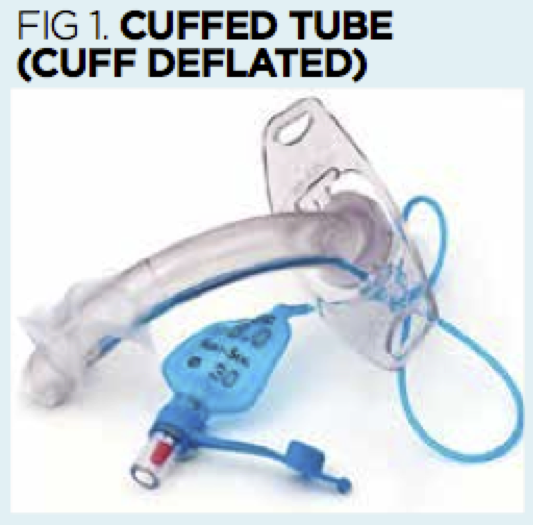
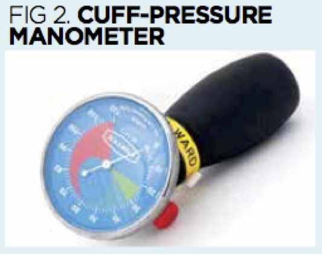
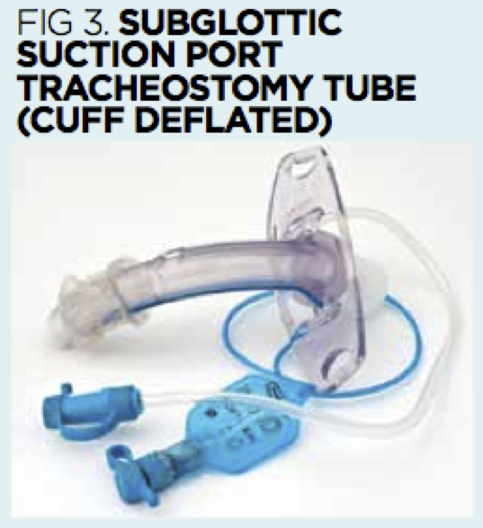
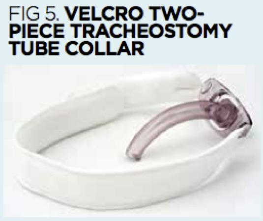
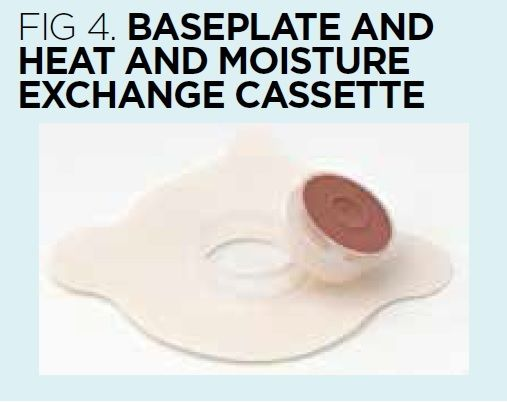

# PLACEHOLDER: add info on ETT, tracheostomy, nasal trumpet

# Nasal Trumpet (Nasopharyngeal Airway)

# Question 1
Insertion of a nasopharyngeal airway is contraindicated in a patient with which condition?
[WRONG] Pneumothorax
[WRONG] Pleural effusion
[RIGHT] Severe facial injuries
[WRONG] Perforated stomach

A nasopharyngeal airway (NPA) does not extend into the lower airway and may be used in certain situations.
Insertion of an NPA is contraindicated in patients with severe head trauma or facial injuries.
An NPA, also known as a nasal trumpet, is an airway adjunct designed to be inserted into the nasal passageway to maintain an open airway. When a patient is unconscious, the muscles in the jaw relax, and the tongue slides back and obstructs the airway. This makes airway management necessary. The flared end is designed to prevent the device from completely entering the nose.
An NPA is used when an artificial form of airway maintenance is necessary, but tracheal intubation is impossible or inadvisable. A nasopharyngeal airway often is used in conscious patients where an oropharyngeal airway would trigger the gag reflex.

# Question 2
Which is an indication for a nasotracheal airway?
[WRONG] Epiglottitis
[WRONG] Basal skull fracture
[WRONG] Congestive heart failure exacerbation
[RIGHT] Macroglossia

Macroglossia results in obstruction of the oropharynx due to an enlarged tongue. Therefore, intubation via orotracheal route is not possible. Nasotracheal intubation via flexible bronchoscopy allows for visualization of the hypopharynx and is not blocked by the enlarged tongue.
Indications for nasotracheal intubation include any form of limited mouth opening, intraoral masses, trismus, and angioedema.
When a patient has macroglossia blind nasotracheal intubation should be avoided. Intubation should occur awake and with flexible bronchoscopy.
Macroglossia is an indication for awake intubation as sedating and paralyzing the patient will stop the patient's respiratory drive and increase the risk of desaturation if any complications occur during attempted nasal intubation.

# Question 3
Which complication of nasopharyngeal intubation is most common?
[WRONG] Placement into the brain
[WRONG] Nasal fracture
[RIGHT] Epistaxis
[WRONG] Abscess

The most common complication of nasopharyngeal intubation is epistaxis due to a small nasal opening, turbinate damage, and poor technique.
The nose is in direct communication with the multiple sinuses of the face, brain via cribriform plate, and the pharynx, esophagus, and trachea via the nasopharynx. The nose is separated into two nares separated by a mostly cartilaginous nasal septum. Each naris is made up of two pathways, the lower and upper pathway. The lower pathway lies along the nasal floor underneath the inferior turbinate, and the upper pathway lies above the inferior turbinate and below the middle turbinate. The middle turbinate is a vascular structure connected with the cribriform plate, so care has to be taken not to cause damage to the middle turbinate. Therefore, the lower pathway is the ideal pathway to take when placing nasotracheal (NT) intubation.
Epistaxis can occur due to trauma from intubation causing turbinate fracture or just local irritation. By prepping the nose with Oxymetazoline or another vasoconstricting agent the risk of epistaxis from irritation or local injury. can be reduced. Turbinate fracture injury can be reduced by ensuring proper technique is utilized and the tube is placed in the lower turbinate pathway.
Care should be taken to avoid placing a nasopharyngeal tube cephalad, but rather aimed toward the occiput and nasopharynx caudally along the nasal floor.

# Question 4
An obese 55-year-old male with past medical history of chronic obstructive pulmonary disease calls emergency medical services due to difficulty breathing after eating Chinese food. You find him at home with swollen lips and tongue, drool coming from his mouth with oxygen saturation of 80%. There are expiratory wheeze on lung exam. His oxygen saturation only increases to 90% with a non-rebreather you only get up to 90%. Which airway approach should be used?
[WRONG] Sedate and paralyze and place a blind airway via a supraglottic airway
[WRONG] Sedate and paralyze and place an endotracheal tube via the oral route
[WRONG] Sedate and paralyze and place an endotracheal tube via the nasal route
[RIGHT] Place an awake blind nasotracheal intubation

In the emergent circumstance, the healthcare provider should consider nasotracheal intubation (NT) when the patient presents with a strong gag reflex, limited mouth opening, macroglossia, cervical spine instability, severe cervical kyphosis, severe arthritis, intraoral masses, structural abnormalities, trismus, or angioedema. This patient has macroglossia and will have a difficult oral airway.
Blind NT intubation can be performed while the patient is awake in the sitting up position. It increases patient comfort, and greatly reduces the risk of losing the airway if this patient with COPD is sedated and paralyzed.
By keeping the patient awake you allow them to keep their airway drive. If intubation is unsuccessful the patient is still breathing and they can be transferred to a hospital.
Blind nasotracheal intubation requires skill and practice but is an important skill to have in a situation where an oral airway is not a possibility and where there is need to keep the patient awake.

# Question 5
A young teenager with an asthma exacerbation requires a nasopharyngeal airway (NPA). How is the correct size determined?
[WRONG] It does not matter what size you used
[WRONG] Measure from the nasal opening to the mastoid
[RIGHT] Measure from the nasal opening to the angle of the mandible
[WRONG] Measure from the nasal opening to the cricoid cartilage

When placing an NPA, the healthcare provider should be knowledgeable regarding the sizing of the NPA. Adult sizes range from 6 mm to 9 mm. Sizes 6 to 7mm should be considered in the small adult, 7 to 8 mm in the medium size adult, and 8 to 9 mm in the large adult.
If the healthcare provider is unsure of which size to use, and there is time to assess which size to use, then place the NPA at the nasal opening and orient it down toward the angle of the mandible. If the NPA goes past the mandible then it is too long and if it does not reach the mandible it is too short.
Pediatric sizes should be measured via Broselow tape or should be measured from the nasal opening to the angle of the mandible.
24 french correlated with 6 mm, 28 French with 7 mm and 32 French with 8 mm. One should start with less than 5 mm in a child.

# Endotracheal Intubation for the COVID-19 Patient

Watch the following video for an introduction to endotracheal intubation.

[embed](https://www.youtube.com/watch?v=iyAQR_Zpf6U&list=PLCT7BA-HcHljIaDw56FoqWILbqGCIxsmG&index=5)

# Question 1
Which artificial airway intubates both the trachea and esophagus?

[WRONG] Laryngeal mask airway (LMA)
[RIGHT] Combitube
[WRONG] Oropharyngeal airway
[WRONG] Tracheostomy tube

# Question 2
Which artificial airway is used for long-term airway management?

[RIGHT] Tracheostomy tube
[WRONG] Nasopharyngeal airway
[WRONG] Endotracheal tube
[WRONG] Laryngeal mask airway (LMA)

# Question 3
Which lab value must the nurse know for a patient who may receive succinylcholine?

[WRONG] Sodium
[WRONG] PaCO2
[WRONG] Calcium
[RIGHT] Potassium

# Question 4
Which of the following is not a method of confirming correct positioning of an endotracheal tube?

[WRONG] End tidal CO2 detector
[RIGHT] Asking patient to speak
[WRONG] Breath sounds
[WRONG] Chest x-ray

# Question 5
Identify one way to assist a patient with an artificial airway to communicate:

[WRONG] Tell family to take the patient’s glasses home
[WRONG] Encourage patient to talk
[RIGHT] Use a communication board
[WRONG] Teach the patient sign language

# Question 6
How often should the bite block be cleaned for a patient with an endotracheal tube?

[RIGHT] Every 8 hours
[WRONG] Every 2 hours
[WRONG] Every 24 hours
[WRONG] Every 4 hours

# Question 7
Which of the following is not a goal of tracheostomy care?

[WRONG] Prevent infection
[WRONG] Maintain airway patency
[RIGHT] Ensure that the patient can swallow
[WRONG] Prevent skin breakdown

# Endotracheal Tube

# Question 1
A high volume, low pressure cuff can do which of the following?
[WRONG] Prevent aspiration
[WRONG] Depress cough
[RIGHT] Assure ventilation
[WRONG] More secure tubing

The main reason to use high volume cuff is to obtain a good seal for better ventilation.
The majority of endotracheal tubes are low-pressure high volume type. These tubes have a cuff which holds a large volume and consequently, there is a large contact area between the trachea and the tube.
This type of endotracheal tube can develop folds near the contact area when inflated and consequently the risk of aspiration is high.
The high-pressure low volume tubes provide better protection against aspiration but the downside is that they can induce tracheal mucosa necrosis.

# Question 2
A 55-year-old patient presenting with clinical features consistent with acute cervical radiculopathy following a C5-6 disc prolapse is being scheduled for an anterior cervical discectomy and fusion (ACDF) surgery. Intraoperatively, before applying the retractors within the longus colli muscular gutters, the operating surgeon asks the anesthesiologist for a temporary deflation of the endotracheal tube. What post-operative complication will be prevented by this simple maneuver in the patient?
[WRONG] Tracheal necrosis
[WRONG] Tracheo-oesophageal fistula
[RIGHT] Hoarseness
[WRONG] Tracheal edema

Hoarseness is one of the most common complications seen in the immediate postoperative period following anterior cervical spine surgeries.
The main factor responsible for this complication is the compression of the recurrent laryngeal nerve between the retractors and the endotracheal tube within the tracheoesophageal groove.
Temporary deflation of the endotracheal tube helps in preventing sustained compression of the nerve. The repositioning of the tube also helps in preventing any sideward deviation of the tube, which can lead to inadvertent compression of the nerve at the same site.
Tracheoesophageal fistula formation is a complication of thermal injury. Tracheal necrosis and edema are not common complications associated with endotracheal tube positioning.

# Question 3
A 55-year-old patient presenting with clinical features consistent with acute cervical radiculopathy following a C5-6 disc prolapse is being scheduled for an anterior cervical discectomy and fusion (ACDF) surgery. Intraoperatively, before applying the retractors within the longus colli muscular gutters, the operating surgeon asks the anesthesiologist for a temporary deflation of the endotracheal tube. What post-operative complication will be prevented by this simple maneuver in the patient?
[WRONG] Tracheal necrosis
[WRONG] Tracheo-oesophageal fistula
[RIGHT] Hoarseness
[WRONG] Tracheal edema

Hoarseness is one of the most common complications seen in the immediate postoperative period following anterior cervical spine surgeries.
The main factor responsible for this complication is the compression of the recurrent laryngeal nerve between the retractors and the endotracheal tube within the tracheoesophageal groove.
Temporary deflation of the endotracheal tube helps in preventing sustained compression of the nerve. The repositioning of the tube also helps in preventing any sideward deviation of the tube, which can lead to inadvertent compression of the nerve at the same site.
Tracheoesophageal fistula formation is a complication of thermal injury. Tracheal necrosis and edema are not common complications associated with endotracheal tube positioning.

# Question 4
A patient is brought to the emergency department with shortness of breath. The attending clinician notes that the oxygen saturation of the patient is dropping along with blood pressure. The attending clinician decides to secure the airway by intubating the patient. He believes the patient may require an endotracheal tube for an extended period of time and may become obstructed. What built-in anatomic mechanism of the endotracheal tube is meant to overcome distal obstruction?
[WRONG] Bevel
[RIGHT] Murphy's eye
[WRONG] Distal balloon
[WRONG] Distal airway safety mechanism

The Murphy's eye is a safety mechanism built into the endotracheal tube. If the distal end of the endotracheal tube should become obstructed by the wall of the trachea, gas flow can still occur via Murphy's eye, positioned in the lateral wall of the tube. This prevents complete obstruction of the tube.
The bevel is meant to facilitate placement into the trachea without injuring the vocal cords.
A cuff is an inflatable balloon at the distal end of the endotracheal tube. The inflated cuff forms a seal against the tracheal wall. This prevents gastric contents from entering the trachea and facilitates the execution of positive pressure ventilation, however, it does not prevent distal obstruction of the tube.
The “distal airway safety mechanism” is a fictional name for a portion of the tube that does not exist.

# Question 5
An 85-year-old male with a history of emphysema presented to the emergency department. After assessing the patient a decision is made to emergently intubate. Post intubation chest x-ray is performed and It appears he has a right mainstem intubation. How many centimeters above the carina should the distal tip of the ETT terminate to avoid this event?
[WRONG] 7cm +/-2cm
[WRONG] 21 cm +/-2cm
[RIGHT] 4cm +/-2cm
[WRONG] 23cm +/-2cm

The normal depth of the distal tip of the endotracheal tube as seen on the chest x-ray is 4 cm above the carina (+/-2cm).
A tube depth of 7 cm above the carina puts the patient at risk of placing the endotracheal tube into shallow a position potentially leading to the displacement of the endotracheal tube out of the trachea.
The typical depth of the endotracheal tube is 23 cm for men and 21 cm for women, measured at the central incisors.
Keep in mind that flexion or extension of the patient's head and neck will affect endotracheal tube depth. For instance, if you place an ett in the sniffing position, then confirm and tape it in the same position, the ett with be deeper when the patient's head returns to a neutral position. It is best practice to intubate in the sniffing position and then place the patient's head and neck in a neutral position to confirm the depth of ett before taping. This can mean the difference between endotracheal intubation (correctly placed depth of ETT) and endobronchial intubation (ETT in right mainstem bronchus), especially in infants.

# Question 6
A 65-year-old patient presents to the emergency department with massive hemoptysis. He is quickly intubated, and the healthcare practitioner reports significant continued bloody secretions during suctioning. The practitioner requests an emergent bronchoscopy. What is the minimum size of the endotracheal tube that is typically necessary for an adult standard bronchoscope?
[WRONG] 9.5 ett
[WRONG] 9.0 ett
[WRONG] 8.5 ett
[RIGHT] 8.0 ett

Should the healthcare provider need to perform bronchoscopy on an adult patient with a standard bronchoscope (diameter 5.7 mm with a 2 mm suction channel) the patient typically needs to be intubated with a 7.5-8.0 size endotracheal tube (ETT) to ensure adequate ventilation during the procedure and that the bronchoscope does not get trapped in the endotracheal tube.
A 9.5 endotracheal tube is very large and, although it provides the standard bronchoscope plenty of space, potentially places the vocal cords in danger for injury during placement.
An endotracheal tube smaller than 8.0 is too small for the standard adult bronchoscope. It would have to be switched out in a controlled fashion to a larger endotracheal tube to facilitate bronchoscopy. Changing an endotracheal tube in this patient is potentially dangerous and can result in a lost airway with massive hemoptysis.
Smaller bronchoscopes can be found and used in pediatric patients and adults with smaller endotracheal tubes, but they are harder to locate in most emergency departments. It is recommended that providers try passing these smaller bronchoscopes through the desired size endotracheal tube to see if it fits before placing the endotracheal tube into the patient. Not doing this can result in frustration and the need for many different bronchoscopes to find the one which is correctly sized.

# Question 7
An 8-year-old boy presents in the emergency department with severe respiratory distress. His mother reports he developed fever and cough 3 days ago. He is shifted to the pediatric intensive care unit (PICU). He has decreased respiratory effort and needs intubation. What size cuffed endotracheal tube should be placed in this patient?
[WRONG] 5.0
[RIGHT] 5.5
[WRONG] 6.0
[WRONG] 6.5

The formula for uncuffed endotracheal tube size is (Age/4) + 4. In this case, (8/4) + 4 = 2 + 4 = size 6 uncuffed ETT. An 8-year-old child would get a 5.5 cuffed endotracheal tube. A cuffed endotracheal tube is now standard of care in children and a tube ½ size smaller would be used in this child.

# Question 8
A 2-year-old boy presents in the emergency department with severe respiratory distress and spastic paralysis. His mother reports her baby had developed fever and cough 3 days ago. He is shifted to the newborn intensive care unit (NICU). He has decreased respiratory effort and needs intubation. What size cuffed endotracheal tube (ETT) should be placed in this patient?
[WRONG] 3.5
[RIGHT] 4.0
[WRONG] 5.0
[WRONG] 5.5

The formula for cuffed endotracheal tube size is (Age/4) + 3.5. In this case, (2/4) + 3.5 = 0.5 + 3.5 = size 4.0 cuffed ETT. In clinical practice, pediatric anesthesiologists use a 4.0 or 4.5 cuffed ETT for a 2-year-old child, often chosen depending on their size and stature. Either size would be acceptable clinically. A cuffed endotracheal tube is now standard of care in children. Uncuffed endotracheal tubes are only commonly used in the neonatal period.

# Question 9
A 5-year-old girl presents in the emergency department with severe respiratory distress and spastic paralysis. Her mother reports her child developed fever and cough 3 days ago. She is shifted to the pediatric intensive care unit (PICU). She has decreased respiratory effort and needs intubation. What size cuffed endotracheal tube (ETT) should be placed in this patient?
[WRONG] 4.5
[WRONG] 4.75
[RIGHT] 5.0
[WRONG] 5.5

The formula for cuffed endotracheal tube (ETT) size is (Age/4) + 3.5. In this case, (5/4) + 3.5 = 1.25 + 3.5 = size 4.75 cuffed ETT. A 4.75 cuffed ETT does not exist, a 4.5 or 5.0 cuffed endotracheal tube would be acceptable. Most 5-year-old children would receive a 5.0 cuffed ETT since 3-4-year-olds receive a 4.5 cuffed ETT and 5-year-olds are proportionally larger. A cuffed endotracheal tube is the standard of care in children. Uncuffed endotracheal tubes are only commonly used in the neonatal period.

# Question 10
A preterm infant is born via emergency C-section at 27 weeks gestational age and is having respiratory distress in the delivery room requiring emergency intubation. Which of the following is the most appropriate endotracheal tube for this patient?
[WRONG] 2.0 uncuffed
[RIGHT] 2.5 uncuffed
[WRONG] 3.0 uncuffed
[WRONG] 3.0 cuffed/ microcuffed

2.5 uncuffed ETTs are placed in preterm infants, often in those who are <2 kg. Term infants (those greater than or equal to 37 weeks gestational age) and babies >2 kg commonly receive 3.0 uncuffed ETTs. Outside the neonatal period (>1 month old), a 3.0 cuffed ett would commonly be used up to age 6 months, when a 3.5 cuffed ett can be considered. 2.0 uncuffed ETTs exist but are never commonly used, and kept in case of emergency for when a small preterm neonate may have developed subglottic stenosis.

# Question 11
A 46-year-old female undergoes an uneventful exploratory laparotomy. Chest and abdominal x-rays are performed to evaluate for a lost sponge in the counts at the end of the case. The chest x-ray incidentally reveals that the endotracheal tube is sitting just at the carina. One of the trainee surgeons becomes worried and asks for the tube to be adjusted. However, the anesthetist does not show concern. Which of the following best explains why the anesthetist is unconcerned?

[WRONG] It's the end of the case and the endotracheal tube is coming out anyways
[WRONG] Placement of the endotracheal tube at the level of the carina is optimal
[RIGHT] Both lungs appear to be inflated on the chest x-ray; this is likely because the lungs are being ventilated via the Murphy eye of the endotracheal tube
[WRONG] Both lungs appear to be inflated on the chest x-ray; this is likely because the positive pressure ventilation is blowing the carina away from the endotracheal tube and allowing both lungs to be ventilated

The Murphy eye is a safety mechanism to allow for ventilation to continue even if the tip of the endotracheal tube is hubbed against the wall of the endobronchial tree. Nearly all endotracheal tubes have a Murphy eye for this purpose. The Murphy eye is a second smaller hole off the side of the distal end of the endotracheal tube (positioned 90 degrees from the tip). Optimal placement of the tip of the endotracheal tube is at the level of the T2-T4 vertebrae in the middle third of the trachea, not at the carina. It is nice that both lungs appear to be inflated on the chest x-ray, but this is not because the positive pressure ventilation is blowing the carina away from the endotracheal tube. Answer 1 is also correct and true, the endotracheal tube will come out shortly as the case is over, but it is not a good explanation of why the anesthesiologist is unconcerned. It is necessary to ventilate both lungs throughout the entire case properly.

# Question 12
A 2.5-year-old male is about to be intubated in the emergency room who has been admitted with status asmaticus. The child has a history of being born at 26 weeks gestation, chronic lung disease on inhaled steroids twice a day and albuterol nebulizers as needed, and seasonal allergies on montelukast. His condition is worsening and the bedside nurse calls for help. The bedside nurse pushes induction drugs and paralytic, and upon direct laryngoscopy, the provider has a grade 1 view of the entire vocal cords, however the 4.5 cuffed endotracheal tube will not pass. The patient is mask ventilated anda 4.0 cuffed endotracheal tube with a stylet is arranged. A second perfect view of the vocal cords with direct laryngoscopy is obtained, however the 4.0 cuffed endotracheal tube will not pass either. A 3.5 cuffed endotracheal tube is tried which does pass, albeit tightly. Which of the following best explains the reason for this problem recurring?
[WRONG] Foreign body aspiration
[WRONG] 4.0 and 4.5 were too big for the patient
[RIGHT] Undiagnosed tracheal stenosis
[WRONG] Chronic lung disease

* Children born with extreme prematurity commonly require intubation and mechanical ventilation at birth or shortly after, and can remain intubated for weeks to months.
* Tracheal stenosis is not uncommon in these children, especially in the ones who have poorer lungs and require higher peak inspiratory pressures for adequate ventilation. It is best practice to ask about intubation vs. CPAP vs. SiPAP (nasal BiPAP) in these children when you are taking a history from the parents.
* Asking about discharge from the NICU on nasal cannula oxygen and/or discharge with a pulse oximeter will help to clue you into which children had the most severe lung disease, as they will answer yes to both questions.
* Toddler age children are most at risk for foreign body ingestion, which can lodge in either the esophagus or trachea. However, this child with a history of chronic lung disease will be prone to the development of asthma (generally not formally diagnosed until age 4) and can develop status asthmatics for a reason other than a foreign body. Foreign bodies in the trachea can be associated with wheezing, but generally, are not associated with status asthmaticus. Because the formula for cuffed endotracheal tube size at 2.5 years-old is 4.125, a 4.0 or 4.5 cuffed endotracheal tube may be chosen. Given that this is an emergency situation, a 4.0 cuffed endotracheal tube may have been a more appropriate choice as it was most likely to go into the trachea on the first try than the larger size. However, given that it also did not pass through the glottis indicates this is a problem more involved than the incorrect endotracheal tube size. There is no association between chronic lung disease of prematurity and smaller trachea size.

# Question 13
A trauma patient was just dropped off from the emergency department (ED) to the intensive care unit (ICU). The resident covering the ICU overnight was just urgently paged to the patient's room because the bedside nurse and respiratory therapist are having trouble ventilating the patient. A quick physical exam reveals that the pilot balloon has been cut off of the endotracheal tube, causing a huge air leak and inability to properly ventilate the patient, who received a dose of a paralytic in the ED just prior to transport. The pulse oximeter is reading 93% and has been steadily in the low 90s during the 5-minute exam. What is the next best move?
[RIGHT] Use a 20 gauge peripheral IV catheter and insert the plastic cannula piece into the cut end where the pilot balloon should be. Then take a needle-free IV connector (sometimes called a clave, often blue or clear in color) and screw it onto the end of the IV cannula. This will allow you to add air to the cuff and ventilate the patient while taking time to plan for re-intubation in a non-emergency situation
[WRONG] Pull the endotracheal tube out and mask ventilate. The patient is going to become unstable at any moment
[WRONG] Pull the endotracheal tube out and replace it. It will never work
[WRONG] After resecuring a new endotracheal tube, call the ED and tell them what they did was inappropriate and that they really should be more careful when cutting off a trauma patient's clothes

* The patient is best managed by using a 20 Gauge angiocath and a needleless IV catheter will provide a temporary solution to this problem and allow time to plan for a successful re-intubation, which may require more help or equipment being brought to the patient's room. See picture for an example of how this works.
* Pulling the endotracheal tube and mask ventilating, is the correct thing to do if the patient is desaturating and about to code from a bradycardic arrest, but that was not the clinical scenario given. In the question, the patient has a large leak around the endotracheal tube but is saturating consistently in the low 90s, which will not cause harm and gives one time to make a better plan.
* Pulling out the endotracheal tube and replacing it immediately is a cowboy move and if one misses, this could cause the patient to further desaturate and possibly cause a hypoxic or bradycardic arrest. This is a relatively stable patient with a SpO2 reading consistently in the low 90s, which is totally compatible with life. Take the time to make a plan before attempting reintubation.
* Calling the ED is not the best option. This is a reportable incident and should probably go into the institutions patient safety reporting system, but do not personally call the ED team to yell at them. One could consider a call to inform them of what happened, but even these calls are not always well received.

# Question 14
A 5-foot-2 inch tall 43-year-old woman has just been intubated in the emergency department. The respiratory therapist (RT) confirms + end-tidal CO2 and is taping the 6.0 cuffed endotracheal tube at 22 cm at the patient's teeth. On a follow up confirmatory chest x-ray, the left lung is found to be atelectatic. Which of the following best explains this finding?

[WRONG] The endotracheal tube is too small
[RIGHT] The endotracheal tube is likely too deep
[WRONG] The endotracheal tube is turned the wrong way
[WRONG] The patient needs a few recruitment breaths to re-expand the left lung

* The provider placing the tube should listen for bilateral breath sounds, nor feel for the balloon in the sternal notch. Had they listened, they would have noticed that 22 cm depth on a shorter adult female is way too deep and they likely taped the endotracheal tube in the right mainstem bronchus. The follow-up chest x-ray showed atelectasis because the left lung was not being ventilated.
* An adult female should receive adequate ventilation from either a 6.0 cuffed or 7.0 cuffed endotracheal tube. The endotracheal tube diameter should not make that much of a difference, making answer number 1 incorrect.
* Tube size choices are often institutional, and some places may use a 6.0 cuffed in all women and others may use a 6.5 cuffed or 7.0 cuffed endotracheal tube preferentially in women, all will work.
* Turning an endotracheal tube 90 degrees without pulling it back will not do anything to help the atelectasis in this patient. The patient could certainly use a few recruitment breaths to re-expand the left lung, but this will only work if done AFTER the endotracheal tube has been pulled back to a proper position above the carina in the middle third of the trachea.

# Question 15
A high volume, low pressure cuff can do which of the following?
[WRONG] Prevent aspiration
[WRONG] Depress cough
[RIGHT] Assure ventilation
[WRONG] More secure tubing

* The main reason to use high volume cuff is to obtain a good seal for better ventilation.
* The majority of endotracheal tubes are low-pressure high volume type. These tubes have a cuff which holds a large volume and consequently, there is a large contact area between the trachea and the tube.
* This type of endotracheal tube can develop folds near the contact area when inflated and consequently the risk of aspiration is high.
* The high-pressure low volume tubes provide better protection against aspiration but the downside is that they can induce tracheal mucosa necrosis.

# Tracheostomy 

# 1. Caring for patients with a tracheostomy
(The material in this section was adapted from this source: https://www.nursingtimes.net/clinical-archive/respiratory-clinical-archive/tracheostomy-1-caring-for-patients-with-a-tracheostomy-09-05-2016/)

Many nurses lack essential training to manage blocked or dislodged tracheostomy tubes. This article provides information on the care of patients with a tracheostomy

# What is a tracheostomy?
A tracheostomy is a temporary or permanent artificial opening (stoma) made into the trachea; 
a tracheostomy tube is inserted to maintain the patency of the stoma and the procedure can be performed either surgically or percutaneously. 
Surgical insertion is performed in theatre under general or local anaesthetic depending on the patient’s condition.

An opening is made into the anterior wall of the trachea, usually through the second-to-third or the third-to-fourth tracheal rings. 
A tracheostomy tube is then inserted to keep the stoma patent and the tube secured with sutures and/or tracheostomy collar.

Percutaneous insertion is performed in critical care units under sedation and local anaesthetic (NTSP, 2013). 
A needle is inserted through the neck into the trachea, then a guide wire is fed through the needle. 
The needle is removed and tract made bigger by dilators fed over the guide wire. When the stoma is large enough, the tracheostomy tube is fitted over the guide wire into the trachea, then the guide wire is removed and the tracheostomy tube secured with sutures and/or tracheostomy collar (Durbin, 2005).

Nurses caring for patients with tracheostomies must be aware of the insertion technique in case they are required to perform an emergency tube change; 
percutaneous guide wires should be available in the emergency tracheostomy box at the bedside.

It is important to know whether a tracheostomy is temporary (weanable) or permanent (non-weanable), as this will affect the plan of care. 
Nurses will provide regular tracheostomy care for patients with temporary tracheostomies, 
but patients with a permanent tracheostomy will also require education and training to manage their airway independently, where possible.

## Box 1. Indications for tracheostomy

 * Facilitate the removal of bronchial secretions
 * Secure airway in patients with major facial injuries
 * Secure airway following head and neck surgery
 * Secure airway in respiratory-tract obstruction due to, for example, a tumour or foreign body
 * Patients who are at high risk of aspiration, for example, patients with brain injuries
 * Enable long-term ventilation, for example, patients following spinal injury
 * Facilitate weaning from ventilator
 * Secure airway in head injury/stroke patients

# Tube types
Tracheostomy tubes are either single or double cannula (with an outer and inner cannula). 
The ICS (2014) notes that tracheostomy tubes with an inner cannula are inherently safer and are normally preferred. 
The double cannula allows routine inspection and clearance of secretions to prevent blockage of the tube, making it safer and easier to care for in a ward environment. 
Patients can be shown how to remove their own inner tube, and clean and replace it.

The outer diameter of the tracheostomy tube should be two-thirds to three-quarters of the tracheal diameter (NTSP, 2013). 
An adult female can accommodate a tube up to 10mm and an adult male up to 11mm.

Ideally the tube tip should be a few centimetres above the carina (a ridge at the base of the trachea separating the openings of the right and left main bronchi), 
and placement should be checked with an endoscope. If the tube is too short, there is a high risk of accidental decannulation and partial obstruction due to poor positioning; if it is too long, it can rub on or near to the carina, causing ulceration, continuous irritation and coughing. The diameters and lengths of tubes vary between manufacturers and although most hospitals tend to use one type of tube, it is prudent to have a variety available in case a model is inappropriate for a particular patient. In certain circumstances, a tracheostomy tube may need to be made specifically for patients whose needs cannot be met by standard tubes.

A connector at the opening of the tracheostomy tube enables airway equipment to be attached, such as catheter mount or bag valve mask.

## Cuffed and uncuffed tubes

Uncuffed tubes are used for patients who can protect their own airway and have an effective cough, and can clear secretions independently. Cuffed tubes are used to seal the trachea when positive pressure ventilation is used, and to reduce the risk of aspiration of secretions in patients who cannot protect their own airway, for example, due to vocal-cord palsy, swallowing dysfunction or brain injury. The cuffs are air-filled, low-pressure and soft to prevent trauma to the trachea (Fig 1, attached).

## Cuff-pressure manometer

A cuff-pressure manometer should be used to assess patency and effectiveness of cuffed tubes; this hand-held gauge can add or remove air as necessary (Fig 2, attached). Pressure should be maintained between 25-34cmH2O (ICS, 2008); it should be checked at least twice a day (St George’s Healthcare Trust, 2012). The pressure should be recorded on a daily tracheostomy care chart; any evidence of significant deflation (below 25 cmH2O) may indicate a problem with the tube and should be reported, and the tube changed by a competent practitioner if required. Likewise, overinflation of the cuff can cause tracheal wall damage and should also be reported and resolved as soon as possible.

A device, the Mallinckrodt Evac, enables the constant removal of secretions above the cuff and the constant monitoring of cuff pressure.

## Fenestrated tubes
These have either a single hole or multiple holes in the arc of the inner and outer tube to facilitate airflow up into the larynx, and improve voice quality. Many manufacturers make the inner fenestrated cannula coloured, usually red or green, to highlight its use. It should always be removed and replaced with a plain inner cannula with no fenestration holes prior to suctioning to prevent suction catheters passing through the holes and causing trauma to the trachea.

These tubes can cause hyper granulation of the posterior wall of the trachea, making removal and reinsertion of the inner tubes and routine tube changes difficult (St George’s University Hospitals Foundation Trust, 2015).

## Sub-glottic aspiration port

Some tubes have a small aspiration port running along the outside of the tube to just above the cuff (Fig 3, attached). A syringe attached to the port can be used to remove aspirated secretions and reduce the risk of ventilator-associated pneumonia (VAP) and aspiration pneumonia. The amount aspirated over a 24-hour period should be recorded and used to decide on further management interventions to dry up respiratory and oral secretions, and to improve patient comfort and aid tracheostomy weaning trials (weaning is discussed in part 2 of this series).

## Other devices
Some tubes have an adjustable flange that can be moved manually to increase/decrease the proximal length to accommodate deep-set tracheas, distorted anatomy due to tumours, inflammation, oedema or obesity.

Mini-tracheostomy uncuffed tubes with a diameter of 4mm are available to aid secretion removal and are inserted under local anaesthetic for conditions such as bronchiectasis.

# Tracheostomy care
Nurses need to understand all aspects of tracheostomy care, including routine and emergency airway management, safe decannulation, weaning and safe discharge into the community. The patient’s airway requires close monitoring 24 hours a day using a tracheostomy care chart to record care.

## Equipment and signage

The NTSP (2013) recommends that all patients with a tracheostomy have a bed-head label with information regarding their tube and airway, including whether it is surgical or percutaneous, the tube type, size and suction-catheter size, patency of the upper airway and whether the tracheostomy is temporary, permanent or involves a laryngectomy (removal of the larynx). Bed-head labels are available here.

Individual patients should have an emergency tracheostomy box, which should accompany them on transfer and on discharge into the community, and contain an appropriate tube size/type (Fig 4, attached). The box contains equipment to insert a new tube in the event of dislodgement or blockage. Other equipment required at the bedside includes lubricating gel to aid insertion, cuff-pressure manometer, spare tracheostomy dressings and collars, Tilley forceps and a pen torch (McGrath et al, 2012). Equipment should be checked daily.

## Securing the tube

A tracheostomy tube can be held in place by several different methods. At initial insertion, the tracheostomy will be held in place by suture and, in addition, a collar or twill ties may also be used. Once the sutures are removed, the tracheostomy must be secured in place by a Velcro collar or twill ties.

Securement devices should be checked once a shift, or more frequently, if a patient is at risk of pulling on the collar/ties, for example, confused patients; ensure that they are not too tight or too loose – as a guide, two fingers should be able to fit down one side of the collar/twill ties.

The edges of the tracheostomy flange may cause small ulcerations if the collar/twill ties that hold the tracheostomy tube in place are too tight, or where the flange sits on the collar bone.

It is important to check the back and sides of the neck frequently for reddening or pressure ulcers caused by the securement device. Soft Velcro collars with adjustable tabs can help to reduce this risk (Fig 5, attached) .

Cotton twill ties are recommended for patients who are at risk of self-decannulating; twill and foam collars combine the softness of a Velcro collar with the robustness of the twill, enabling them to be tied and knotted into place through the flange, and hold the tracheostomy tube securely.

## Inner-cannula care
When a double lumen tube is used, the inner cannula should be removed and cleaned every 2-4 hours depending on the quantity and tenacity of secretions; if these are copious, the inner cannula will require more frequent checks and cleaning, which should be done using the manufacturer’s cleaning aids. Some inner cannulas are single-use only and should be replaced at each check. When using reusable tubes, a clean tube must be available at all times at the bedside to ensure that a “one in, one out” system is used, so that an inner cannula is in-situ at all times. Dirty inner tubes should be cleaned according to local infection-prevention guidance.

#### Stoma care
Patients with a tracheostomy are particularly susceptible to respiratory and stoma infections. Leakage of respiratory track secretions around the stoma site causes a damp, moist environment that harbours bacteria, and colonisation of the site is common. Skin can also become macerated and excoriated.

The stoma site should be checked at least once a day, or more frequently if required, and this requires two nurses: one to hold the tube and one to clean the stoma site. The site should be cleaned using a tracheostomy wipe or with 0.9% sodium chloride solution, and dried thoroughly. It should be monitored for any signs of infection such as offensive-smelling exudate, redness, pain and swelling, and the patient monitored for systemic signs such as pyrexia and feeling unwell. Evidence of infection should be documented and microbiology swabs sent for culture (McGrath et al, 2012) to ensure appropriate antibiotics are prescribed.

Specifically designed tracheostomy stoma dressings, placed under the flange and around the stoma site, should absorb secretions and provide a buffer to the flange edges to prevent ulcers. However, bulky foam dressings should be avoided, as they increase the risk of tube dislodgement.

A film-forming acrylate barrier, such as Cavilon No Sting Barrier Film, can be applied to broken skin; it helps to protect the stoma site from wet secretions and reduces the risk of maceration.

## Humidification
As air passes through the mouth and the nose, it is warmed, filtered and moistened. Breathing via a tracheostomy bypasses the nose and mouth, so artificial humidification is crucial to keep the tracheostomy tube patent; humidification methods are outlined in Box 2.

## Box 2. Humidification

### Heated humidification

Ensures that inspired gas is delivered fully saturated and at core body temperature; the most effective system when secretions are tenacious and dry.

### Cold humidification

Only delivers approximately 50% humidity to inspired gas, therefore less effective than heated systems. However, significantly more cost-effective than heated systems for short-term use.
   * Sodium chloride 0.9% nebuliser: A nebuliser turns sodium chloride 0.9% into supersaturated aerosol of liquid droplets. These droplets penetrate the lungs, moistening the airways. A dose of 5mls of sodium chloride 0.9% every two-to-four hours, and as required, should be prescribed for every tracheostomy patient (National Tracheostomy Safety Project, 2013).
   * Heat moisture exchanger devices: These attach directly onto the tracheostomy tube. Inspired gas passes through the device and is filtered, moistened and heated (Fig 7, attached). The expired gas provides the device with the heat and moisture. These should be changed at least every 24 hours, or as needed, to prevent accumulation of secretions.
   * Stoma bibs: These foam bibs absorb moisture from the expired air, filter and moisten inspired air. Patients like them, as they cover the tracheostomy tube.
This is particularly important when the tracheostomy is permanent, and there are issues with body image and social reintegration. The bib can be moistened with a water spray.

## Box 3. Indications for suctioning
Noisy breathing, audible secretion sounds
Ineffective, spontaneous cough
Aspiration of gastric or upper-airway secretions
Increased work of breathing (rate, rhythm and effort). May be due to difficulty tolerating speaking valve (see part 2), or a blocked tube.
Pulmonary atelectasis (lung collapse), or consolidation due to secretion retention
Low oxygen saturation could indicate blockage, displacement or a respiratory problem such as a chest infection
During synchronised cuff deflation (see part 2)
At patient’s request

## Suctioning

Suction should only be used for patients who are unable to clear their own secretions into their tracheostomy tube (Box 3) (Pryor and Prasad, 2008).

It is essential to encourage patients to cough and clear their own secretions. Staff should be competent in using suction to remove secretions from the tracheostomy tube, as well as deep suctioning – which may be required for patients who are desensitised and require stimulation to expectorate secretions, or who have a poor cough and struggle to clear secretions to the level of the tracheostomy tube.

Face protection in the form of a fluid shield mask or a separate goggles/mask combination should be worn when performing suctioning, and a non-touch aseptic technique should be used.

The suction unit should be set to no more than 20kpa/120mmHg for an adult (NTSP, 2013). Those with high oxygen requirements may need pre-oxygenation to minimise the risk of acute hypoxia during the procedure (Dougherty and Lister, 2015).

Suction should be given for no more than 10 seconds to reduce the risk of hypoxia, cardiac arrhythmia and bronchospasm/constriction. It should only be applied on withdrawal of the suction catheter to reduce the risk of mucosal irritation and damage (McGrath et al, 2012). Suction catheters are a sterile, invasive piece of equipment and should therefore be discarded after single use.

The use of centimetre-marked suction catheters allows the catheter to be passed to a predetermined depth, thereby reducing the risk of tracheal and bronchial mucosal damage (Fig 6, attached).

Deep suctioning should be avoided where possible to reduce the risk of mucosal damage and inflammation.

The size of the suction catheter required can be worked out by using a simple equation (there are others); for example:

* Tube size - 2 x 2 = suction catheter FG

* EXAMPLE: 8-2 = 6 x 2 =12 FG

Suction should be given no more than three times consecutively to reduce the chance of hypoxia, cardiac arrhythmia, pulmonary atelectasis, bronchoconstriction/spasm, elevated intracranial pressure, hyper/hypotension, cardiac or respiratory arrest (Higgins, 2009; ICS, 2014).

Local policies and procedures should be followed when using suction and all interventions should be recorded along with sputum tenacity, viscosity, colour and odour. A sputum trap can be used to send a sample if concerns arise.

Any difficulty in passing a suction catheter requires immediate attention to assess if the tube is blocked or has been displaced (ICS, 2014).

## Hydration and oral hygiene
Hydration is an important part of tracheostomy care, as dehydration can result in secretions becoming thick and dry, increasing the risk of a blocked tube.

The majority of patients with a tracheostomy will be nil by mouth, and regular mouth care is essential in preventing problems, such as mouth ulcers and oral thrush. Poor oral hygiene is also associated with VAP and daily use of 0.12% chlorhexidine gluconate mouthwash or gel is recommended (Conley et al, 2013).

Contaminated tracheal secretions can leak past the inflated tracheal cuff and into the lungs, causing aspiration pneumonia.

# Conclusion
Training is essential in all acute and community care settings to ensure that patients with tracheostomies receive appropriate care. Cohorting of tracheostomy patients reduces the number of staff needing training and enables staff to maintain their skills and confidence. Ward areas should have appropriate equipment to ensure safe and effective tracheostomy care.Patients should have a bed-head sign and relevant algorithms available for use in an emergency. An emergency tracheostomy box should be available for all patients with tracheostomies on critical care units, wards or at home.

# Key points
 * A tracheostomy is a temporary or permanent artificial opening in the trachea
 * Patients with a tracheostomy follow a complex pathway through critical care to general wards
 * Half of tracheostomy-related deaths are due to displacement of tubes
 * All patients with a tracheostomy should have a bed-head label with information about their tube and airway management
 * An emergency tracheostomy box should accompany patients on transfer

# 2. Managing the weaning of a temporary tracheostomy
(The material in this section was adapted from this source: https://www.nursingtimes.net/clinical-archive/respiratory-clinical-archive/tracheostomy-1-caring-for-patients-with-a-tracheostomy-09-05-2016/)

Removal of a temporary tracheostomy can cause anxiety for patients. Weaning and decannulation requires careful planning, and the support of a multiprofessional team

# Introduction
The majority of tracheostomies are inserted as a temporary respiratory support measure. Many patients will have their tube removed, a process known as decannulation, on the critical care unit; however, weaning programmes can take place at ward level. It is vital that staff are competent and have an understanding of the weaning process, risks and weaning accessories, such as speaking valves and decannulation caps/bungs.

Tracheostomy multidisciplinary teams (MDT) can manage the weaning process for temporary tracheostomies, ensuring the plans are safe and manageable, both for the patient and ward staff.

# Indications
A temporary tracheostomy is required for short-term respiratory support and can be placed either surgically or percutaneously. Where possible, it is best practice to meet the patient pre-operatively to discuss the tracheostomy tube insertion, tracheostomy tube-care needs and weaning/decannulation process. Temporary tracheostomies may be performed electively as part of a planned procedure, for example, following some maxillofacial and ear, nose and throat procedures. They are also used to protect the airway of patients who are unable to swallow and clear their own secretions, and who are at risk of aspiration; for example, patients who have had a stroke or brain injury are at particular risk.

# Infection
Patients with a tracheostomy are more susceptible to respiratory-tract infections due to the loss of air filtration through the nose – particularly when they have a cuffed tracheostomy tube in-situ – and temporary tubes should be regularly reviewed and removed, as soon as it is safe to do so.

# The weaning process
The aim of the weaning programme is to gradually return airflow to the upper airway and restore normal physiological functions (National Tracheostomy Safety Project, 2013). Patients need to be weaned off their tracheostomy but deciding when to begin this process is hard to judge (NTSP, 2013). The weaning process is individual and may take days, weeks or occasionally months to complete. It is essential that care providers have locally agreed tracheostomy weaning and decannulation guidelines and charts, and a multidisciplinary approach that provides ongoing support for the patient and staff.

When the indications for the temporary tracheostomy tube have been resolved, the patient will be assessed by the MDT and, if suitable, a weaning programme will begin. The assessment criteria are listed in Box 1. All actions and variances should be clearly documented on a tracheostomy weaning chart, which should provide clear guidance for the weaning programme. Informed consent should always be obtained, if possible, prior to commencing any aspect of the tracheostomy weaning programme.

If there are known difficulties with the patient’s airway, such as stenosis or vocal cord palsy, or previous problems with decannulation, it is advisable to endoscopically review the upper airway prior to commencing a weaning programme; the patient should be monitored closely once a programme starts. Contraindications for weaning are outlined in Box 2.

## Box 1. Assessment criteria for weaning

 * Has the reason for the tracheostomy been resolved?
 * Is the upper airway patent (may require endoscopic assessment)?
 * Can the patient protect their own airway?
 * Do they require ventilator support?
 * Are they haemodynamically stable?
 * Are they infection free?
 * Do they have any known respiratory disease that may require consideration when agreeing a weaning programme?
 * Can they cough and clear secretions independently?
 * Is their chest condition stable?
 * Do they maintain oxygen saturations to an agreed percentage?
 * Do they have any forthcoming, planned procedures requiring an anaesthetic in the next 7-10 days?
 * Is the care environment suitable to commence a tracheostomy weaning programme?
 * Is the patient able to swallow? Speech and language therapist should perform a swallow assessment
Source: adapted from NTSP, 2013

## Box 2. Contraindications for removal of a temporary tracheostomy

 * Unable to tolerate cuff deflation
 * Airway obstruction
 * Medically unstable
 * Severe anxiety about removal of the tube
 * Cognitive impairment
 * Severe laryngeal/tracheal stenosis
 * End-stage pulmonary disease
 * Risk of severe aspiration/recurrent aspiration pneumonia

Source: St George’s Healthcare Trust, 2012

# Weaning considerations
## Tracheostomy tube size
Patients with a large tube, for example, a 9mm OD (outer diameter) cuffed, need to step down to the next size (8.5/8mm OD cuffed, depending on the manufacturer), and then repeat as required until they have reached 7.5mm OD for men and 6.5mm OD for women. Weaning aids, used to seal the end of the tubes, are only suitable with these smaller sizes. The small tubes create a space between the tube and trachea, allowing air to bypass the tube and pass through the upper airways when weaning aids are in place (NTSP, 2013).

## Cuff deflation
Once an appropriately sized tracheostomy tube is in place, trial cuff deflations can begin. It is important to note that when a cuffed tracheostomy tube has been in-situ for a period of time, the re-introduction of airflow to the upper airway on deflation of the cuff can cause irritation, constant coughing and distress to the patient (NTSP, 2013). The initial time of cuff deflation will depend on the patient’s response.

A synchronised cuff-deflation technique should be used every time the cuff is deflated and requires two competent practitioners. As the cuff is deflated using a 10ml syringe, suction is given via the tracheostomy tube to remove any secretions that come from above the cuff into the trachea. If the patient has a tracheostomy tube with a subglottic port, it should also be aspirated prior to the cuff deflation to remove secretions above the cuff. When a standard cuffed tube is used, oral suction should be performed prior to cuff deflation (for further information on tubes types, see part 1, Everitt, 2016). Continuous monitoring of oxygen saturation levels is essential, as these may fall during the weaning process. Oxygen saturation levels should be maintained at the target levels identified by the MDT. Oxygen should be administered if required at the prescribed rate.

## Using uncuffed tube

When the patient is able to tolerate the cuff being deflated for 24 hours, the tracheostomy tube may be replaced with an uncuffed tracheostomy tube  to enable more air to bypass the tube and enter the larynx. Weaning aids, such as decannulation caps/bungs (Fig 1, attached), can then be used to seal the end of the tracheostomy tube completely; if the patient copes with the cap/bung, then the tracheostomy tube may be removed with the agreement of the MDT.

If a decision is made to continue to use a cuffed tube, it is important to check that the cuff is fully deflated before using a cap/bung or other device, such as a speaking valve, otherwise the patient will not be able to breathe and this could result in death.

## Creating speech

An inflated cuffed tracheostomy tube will prevent air from entering the larynx and passing through the vocal cords; as a result, patients are unable to speak. Patients can use a finger to occlude their tracheostomy tube to enable speaking during periods of cuff deflation; this can also help the MDT to decide whether they are able to start a weaning programme. If the patient struggles with finger occlusion, they are not ready to start using speaking valves and a repeat review of their upper airway may be required before trial cuff deflations.

The use of aids, such as speaking valves, can help patients to vocalise (Fig 2, attached). These valves are “one way” and allow air to be inspired via the tracheostomy tube; on the outward breath, the valve closes and the air is expired via the upper airway. The use of speaking valves can cause the patient to tire easily because of the effort required to force expired air through the windpipe. This should be factored into the weaning programme, and the periods using the speaking valve gradually increased. Speaking valves should be removed if there is oxygen desaturation, respiratory distress, fatigue, and if the patient requests for the valve to be removed (St George’s Healthcare Trust, 2012). For further information on speaking valves, see part 3.

## Unsuccessful weaning
A weaning programme can fail with the initial cuff deflation or when decannulation is attempted. Patients may cough continuously following cuff deflation, their oxygen saturation levels fall and they become distressed. If this occurs, the weaning programme should be discontinued immediately and an MDT reassessment undertaken. This may include a repeat endoscopic assessment of the upper airway and further respiratory assessments.

## Decannulation
Decannulation should only be undertaken when the patient has successfully completed the weaning programme and the MDT have confirmed that it is safe to remove the tracheostomy tube. Key points for decannulation are outlined in Box 3.

## Box 3. Key points for decannulation

 * Local weaning and decannulation policies should be followed
 * Decannulation should only take place when specialist staff are available.
 * Staff able to reinsert the tracheostomy in a post-decannulation emergency should be available in the clinical area during and following the decannulation
 * There should be clear documentation in patients’ notes of MDT assessments, interventions and plans, and a weaning chart should be available
 * Where possible, informed consent for decannulation should be obtained
 * A competent practitioner should remove the tracheostomy tube
 * Bed-head signs should be in place with an emergency algorithm on the back to follow
 * An emergency tracheostomy safety box and bedside equipment, including suction catheters, Tilly’s forceps and suction apparatus should be available for 48 hours post-decannulation
 * Nasogastric feeding should be stopped four hours prior to decannulation to minimise risk of aspiration
 * Monitoring of physiological observations using the national early warning score system should be carried out for 24 hours following decannulation (Royal College of Physicians, 2012). Concerns should be escalated immediately
 * The use of weaning programmes should reduce the risk of failed decannulation
Source: NTSP, 2012

# Post-decannulation care
Once the tracheostomy tube has been removed, the stoma site should be cleaned with 0.9% sodium chloride and dried, and an occlusive dressing applied according to local policy. If sutures have been used to hold the tube in-situ, they should be removed. The dressing should be changed daily but it may require frequent re-application during the initial period, as exhaled air pressure on the dressing from the stoma opening may cause it to become loose. Observe the site for signs of infection.

The stoma can take two-to-six weeks to heal but occasionally a small trachea-cutaneous fistula may be present several weeks later and this may need to be closed surgically. Once the site has fully healed, the patient will be left with a small scar.

The patient is required to press on the dressing directly over the stoma when talking or coughing to occlude the stoma fully and reduce expired air passing through the stoma, enabling the patient to have a stronger voice and cough, and help the stoma to heal.

# Psychological care
Reaching the stage for weaning is a major point in the recovery process, as for many patients and relatives the restrictions of the tracheostomy tube supersede any other medical problems or diagnosis that they have. A successful weaning programme means that social and communication restrictions are lifted for both the patient and their relatives. Griffiths et al (2005) found that good management of a patient with a tracheostomy, both in hospital and in the community, has a significant impact on quality of life.

Many patients who have a tracheostomy tube are aware of their altered body image; this can cause a sense of social isolation and a feeling of reclusiveness. The removal of the tracheostomy tube reinstates a sense of normality, both physiologically and psychologically. However, upon starting a weaning programme patients can become extremely anxious and concerned they will be unable to breathe without the tube. This is a particular issue for patients who have had failed decannulation attempts. It is therefore important that practitioners discuss each step of the weaning programme with the patient and any fears or concerns they have. MDT meetings are useful to update the family and patient of plans and allow them to ask questions or raise concerns. It is the joint responsibility of all members of the MDT to develop a trusting relationship with patients and their relatives/carers.

Hashmi et al (2010) found that self-image in patients undergoing elective tracheostomy could be improved using a pre-operative psychological assessment. A decline in mental health post-operatively was attributed to worsening self-esteem. The study also highlighted that patients undergoing unplanned tracheostomy insertion experienced both mental and physical decline post-operatively.

# Conclusion
A multidisciplinary approach to tracheostomy weaning will ensure safe and appropriate programmes are agreed and put into practice. The MDT also provides routine reviews of the patients’ progress and makes amendments to programmes, as required. Nurses involved in weaning and decannulation processes need to have appropriate skills to care for tracheostomised patients, and respond to their concerns and changes in their clinical condition. Psychological assessments should be used in elective pre-operative assessments as a benchmark.

# Key points
 * A temporary tracheostomy is required for short-term respiratory support
 * Weaning charts should be used to record details of the weaning programme
 * All staff should be made aware of the weaning programme and required equipment
 * NTSP bed-head labels should be used to clarify whether the tracheostomy tube is temporary or permanent
 * Pre-operative psychological assessment should be carried out for all patients undergoing a planned tracheostomy procedure

# 3. Care of patients with permanent tracheostomy
(The material in this section was adapted from this source: https://www.nursingtimes.net/clinical-archive/respiratory-clinical-archive/tracheostomy-3-care-of-patients-with-permanent-tracheostomy-23-05-2016/)
Patients who have a permanent tracheostomy have complex needs that require specialised care after they have been discharged from hospital

# Introduction
Approximately 20% of patients who have a tracheostomy will be discharged with the tracheostomy in situ (Eibling and Roberson, 2012). However, discharging them can be a complex process; the National Confidential Enquiry into Patient Outcome and Death (2014) found that, out of the 91 patients reviewed who were suitable for discharge from hospital, 14 were still awaiting discharge after 30 days due to difficulties in securing appropriate community care, while 16 had difficulty finding a specialist rehabilitation-unit bed.

A permanent tracheostomy is non-weanable and cannot be removed. It is inserted for a number of underlying long-term, progressive or permanent conditions, including cancer of the larynx or nasopharynx, motor neurone disease, locked-in syndrome, severe head injury, spinal-cord injury and paralysis of vocal cords.

# Nursing care
Daily tracheostomy care is the same for temporary and permanent tracheostomy tubes, and is outlined in part 1 of this series (Everitt, 2016a). However, patients with a permanent tracheostomy need to be cared for by nurses who have the skills to teach them and their carers/relatives to be independent with tracheostomy care; many patients find this a daunting prospect.

Patients with a permanent tracheostomy may be in hospital for months with complex health issues and often become dependant for physical and emotional support on nurses in the acute care setting. They may be anxious about the transition to their home environment and it is important to start teaching them to care for their tracheostomy as soon as possible. This will help to reduce their length of stay in hospital and ensure they are, where possible, fully independent with their tube care before discharge.

Many hospitals have, or are developing, tracheostomy multidisciplinary teams, some of which include critical-care outreach and/or tracheostomy-specialist nurses who can assist nurses with patient teaching and discharge planning (NCEPOD, 2014; National Tracheostomy Safety Project, 2013).

Although some may also have an outreach in the community, these services are not common, despite the ongoing risks associated with tracheostomy (Paul, 2010); no matter how long patients have a tracheostomy in situ, there is a low but real risk of airway loss and death (Eibling and Roberson, 2012).

# Body image/psychological support
The need to adapt to breathing through a tracheostomy tube, the limitations it imposes on communication and the appearance of the tube can have a negative psychological effect; patients may require psychological support and antidepressants.

Where possible, patients having an elective tracheostomy should receive pre-operative counselling; Hashmi et al (2010) recommends a perioperative psychological assessment. At this point, they should also be offered the opportunity to meet other patients with a permanent tracheostomy, who can give them a personal account of what living with it is like, and help them to see the benefits of having the tube.

Pre- and postoperative psychological assessment tools also provide evidence of patients’ emotional state; their use can be continued by community practitioners to ensure patients receive psychological care when needed. Failure to address their altered body image can result in reclusive behaviour once patients are discharged home. If possible, they should be referred to counselling services to help with this transition.

# Adapting to the tube
The first step for patients in accepting their altered body image is to be able to look at the tube; however, looking at their reflection can be difficult and this process should not be rushed. When preparing for this, they should be given the undivided attention of a nurse, and time to look at the tube and how it has changed their body. Patients need to be able to express their feelings about the changes, such as sadness and sometimes guilt; the emotional effects of this process should be acknowledged by all staff caring for them.

The hospital environment offers some degree of shelter from the general public, and patients need to learn how to cope with how others react to their tube when they go home. Taking them off the ward to walk outside or go to the hospital shop, or arranging day leave, are all ways of preparing them for everyday socialisation.

The presence of a permanent tracheostomy tube can negatively affect relationships and sexual intimacy with spouses/partners who had a previously close and loving relationship. For example, the presence of respiratory secretions in the tracheostomy tube or around the stoma site, or breathing or coughing onto a partner’s neck while kissing, can cause embarrassment and lead to the couple becoming emotionally distant. The relationship may also change from loving partners to patient and carer.

Ideally, a tracheostomy nurse specialist will provide support in the community on discharge, so that patients have a knowledgeable person who can continue to provide emotional support, as well as ensure continuity in tracheostomy care.

# Communication

A key factor in coping with a permanent tracheostomy is the ability to communicate. Everyday things that most people take for granted, such as telephone banking, phoning for a taxi, asking for assistance in a shop or simply telling a partner “I love you” are difficult and often frustrating. Such frustrations can be a catalyst for depression and negatively affect relationship dynamics. Not being understood by partners, family and friends can also lead to patients becoming isolated and reclusive.

Patients with cuffed tubes are unable to speak, as air cannot pass into their upper airway and through the vocal cords, so they have to rely on other forms of communication, such as pen and paper, tablet computer or keyboard-based communication aids. However, some may have literacy problems, which will affect their ability to communicate and use these methods; picture boards may be required.

Patients who do not require a cuffed tube can use a simple method known as “finger occlusion” to produce voice; this involves inhaling, then placing a finger over the end of the tracheostomy tube to occlude the opening and force air up and through the vocal cords. Patients often use finger occlusion in the early stages after tube insertion, but will go on to use a speaking valve (Fig 1, attached). See Everitt (2016b) for more information on speaking valves.

Speaking valves can be extremely tiring, so periods of use should be increased gradually to build up tolerance. During such incremental use, patients should use the valves when relatives or friends visit, or during ward rounds, so that they are able to communicate their needs or concerns more effectively. Periods of use should be documented to ensure continuity of care. Box 1 lists further points on valve care.

Fenestrated tracheostomy tubes can also be used to produce speech. However, they are not widely used in practice due to contraindications, as well as the marginal benefits they offer in voice production and strength (Everitt, 2016a).

## Box 1. Care of speaking valves

* Speaking valves should only be used by practitioners who are competent in all aspects of tracheostomy care, including weaning and emergency management
* Where possible, an uncuffed tracheostomy tube should be used with a speaking valve, as air passes around the tube and into the upper airways (NTSP, 2013)
* When a cuffed tube is used, it must be deflated; if a speaking valve is applied when the cuff is inflated, the patient will be unable to exhale, which will result in death if the device remains in situ
* Humidification and oxygen can be given when the valve is in place – some valves have adapters that connect over them to provide a more direct route for oxygen delivery
* Speaking valves should be removed during nebulisation, as sodium chloride 0.9% vapour can cause a residue to form, which can restrict the valve movement
* The valves should be kept clean by rinsing with warm water and air drying after use
* They should be stored in a named container when not in use
* The valves should be replaced when the valve becomes sticky, noisy or vibrates
* Speaking valves should be removed overnight when the patient is sleeping

# Eating and drinking
 
NCEPOD (2014) suggests that dysphagia in patients with a tracheostomy warrants ongoing study, as swallowing difficulties can occur throughout the care pathway. The type of tube used and the reason for its insertion will influence if, and when, a patient can have a trial of eating and drinking. It is recommended that cuffed tubes are deflated during trials, as this can impede swallowing by restricting laryngeal elevation.

Patients must be referred to a speech and language therapist for a specialist swallowing assessment as soon as a tracheostomy is inserted. Before the assessment, the cuff on a cuffed tube needs to be deflated using a synchronised cuff-deflation technique (Everitt, 2016b).

Once patients are able to swallow safely, they may start eating and drinking following the speech and language therapist’s instructions. Some patients will require long-term enteral feeding, for example, following head injury, stroke, and patients receiving palliative care for head and neck cancers.

This patient group has complex conditions and are prone to malnutrition pre- and postoperatively. They should have regular nutrition assessment using the MUST score, and referral to a dietitian if there are concerns about dietary intake.

# Discharge planning
The discharge process is complex and needs to be started as soon as possible, as community resources for tracheostomy care are limited. The tracheostomy multidisciplinary team will formulate a discharge plan, working with the patient, relatives, ward staff and discharge liaison teams to meet care needs. Care providers, including staff in care homes and community nurses, must be competent in tracheostomy care and must be given training if necessary. This may be difficult to provide in areas that do not have specialist tracheostomy nurses; in these circumstances, community staff will need to visit the ward for training and must be deemed competent before a patient can be discharged into their care. It is therefore important to involve community and nursing home teams as early as possible in the discharge planning process. When available, hospital tracheostomy care teams should continue to support patients and community staff on discharge. Box 2 lists key points for discharge planning.

## Box 2. Key points of discharge

* The patient should be discharged with:
    * An appropriately stocked tracheostomy safety box (Everitt, 2016a)
    * Suction machine
    * Portable nebuliser (handheld, pocket-sized nebulisers are also available to give patients more freedom when travelling or going shopping)
    * 1-2 week supply of all necessary equipment, such as suction catheters, spare inner tubes
    * An account with a tracheostomy product supplier should be set up for future orders
* Community teams should be given a discharge list of tracheostomy consumables with order codes and amounts required (tracheostomy tubes are not available on an FP10 prescription; most other tracheostomy products are, but it can be difficult for community teams and nursing homes to source)
* Clear discharge summaries and care guidance should be sent with the patient on discharge
* Contact details of tracheostomy care team and ENT outpatient department should be given to the patient and community team
* Patients should be registered with the ambulance service on discharge, so that in the event of an emergency, attending crews are aware of their airway
* Inform electricity suppliers of the need for continuous access to ensure patients are prioritised should power be lost, to protect use for electric suction pumps
* Community district nurses, nursing home staff and care agency staff should be trained in tracheostomy care, and deemed competent prior to the patient’s discharge
* Locally agreed training programmes should be in place to ensure competency and continuity in tracheostomy care delivery
* Patients should be discharged with a competent understanding of what to do in an emergency. A tracheostomy safety box should be sent with the patient, as well as a portable suction and nebuliser machines. The patient and their carers should complete a competency training programme prior to discharge, covering basic and emergency care needs, and what to do if they have other concerns, such as pressure ulcers under a tube flange or managing a chest infection.

Discharge documentation from the hospital to community should be detailed and structured, and follow the recommendations laid out by NCEPOD (2014). However, the NCEPOD (2014) enquiry showed that this occurred in only 54% of hospital transfers/discharges.

Patient passports can also help with multidisciplinary communication as they provide information about patients’ routine tracheostomy care and essential information for emergency practitioners, such as the patency of the patient’s upper airway.

Unfortunately, support groups, and networks and counselling services specific to the needs of tracheostomy patient, are limited and there is lack of a supportive community for this patient group.

# Conclusion
Discharge planning and ongoing support is essential in supporting patients who live in the community with a tracheostomy. Community practitioners, general practitioners, district nurses and paramedics need clear guidance to ensure continuity of care on discharge and to maintain patients’ safety. Locally agreed numbers of tracheostomy beds in nursing homes would help in reducing the length of stay in the acute care settings for many permanent tracheostomy patients, as well as enabling discharge teams and clinical commissioning groups to provide a more robust and cost-effective discharge pathway.

# Key points
* A permanent tracheostomy is non-weanable and cannot be removed
* Patients have to cope with an altered body image and communication difficulties
* Pre- and postoperative psychological assessment/counselling can help reduce depression and reclusive behaviour on discharge  
* Patients need support to learn new ways to communicate  
* Discharge needs to be planned carefully, as patients have complex needs

# 4. Supporting patients following a laryngectomy
(The material in this section was adapted from this source: https://www.nursingtimes.net/clinical-archive/respiratory-clinical-archive/tracheostomy-4-supporting-patients-following-a-laryngectomy-30-05-2016/)
Patients who have a laryngectomy need help adapting to complex changes including managing their airway, speech loss, body image changes, and altered smell and taste

# Introduction
Laryngectomy is a major surgical procedure used to treat cancer of the larynx. Other indications include severe injury to the neck, such as a gunshot wound, or damage to the larynx as a result of radiotherapy (Roth, 2012). Patients should be nursed by staff with appropriate skills and competency, in acute or community care settings. Clinical practice should follow recommendations outlined in the National Confidential Enquiry into Patient Outcome and Death (2014) and National Tracheostomy Safety Project (2013) guidelines.

# Definition

Laryngectomy is the surgical removal of the larynx (which contains the vocal cords) and the separation of the airway from the nose and mouth. An opening (stoma) onto the surface of the neck is formed and the trachea is connected to it (Fig 1). This is a permanent, irreversible stoma, which leaves patients unable to speak without assistance.

# Pre-operative care
Laryngectomy is a life-changing procedure, so patients need carefully planned pre- and post-operative care. A pre-operative multidisciplinary team approach enables them to meet the team that will care for them during their hospital stay and after they have been discharged.

Patients will have several pre-operative sessions with a specialist speech and language therapist, who will explain every stage of their post-operative voice restoration and rehabilitation programme. They will also be given the opportunity to meet someone with a laryngectomy, thereby giving them an insight into what life will be like after their surgery. The psychological impact is similar to that experienced by patients with a permanent tracheostomy (Everitt, 2016a).

# Post-operative airway management
The same principles of tracheostomy care apply to laryngectomy care, particularly in the initial post-operative phase when many patients have a tracheostomy tube in situ (Everitt, 2016a; 2016b; 2016c). However, it is important that staff recognise the differences in airway anatomy, particularly in terms of resuscitation.

The NCEPOD (2014) highlighted that only 45% of hospitals included the resuscitation of people with laryngectomy or tracheostomy (“neck breathers”) in their mandatory resuscitation training. Staff need to understand the differences between neck and normal breathing to ensure appropriate action is taken in the event of a cardiac or respiratory arrest; for example, after a laryngectomy patients will need to be intubated via their stoma.

# Communication
Reproducing a voice following a laryngectomy requires different strategies to those used for patients with tracheostomy, as expired air cannot be redirected though the upper airway. When the larynx is removed patients are unable to speak, but there are several ways of artificially reproducing voice including:

* Tracheoesophageal puncture (TEP) speaking valves;
* Electrolarynx;
* Oesophageal speech;
* Speech-generating devices (Cancer Research UK, 2015).

## Tracheoesophageal puncture (TEP)
For most patients a TEP speaking valve will be fitted during surgery or post operatively. A puncture is made surgically into the tracheoesophageal wall, causing a small fistula in which a valve is inserted. The TEP valve itself does not produce a voice but allows air to be re-directed from the lungs into the oesophagus where it is expelled through the mouth. The passage of air as it travels from the oesophagus to the mouth results in vibration of tissue in the lower pharynx or throat, producing sound that becomes the patient’s new voice for the patient. This valve will need to be replaced periodically.

The stoma needs to be occluded with a finger to redirect air through the valve. Hands-free valves are available but not suitable for everyone. Patients may not be able to use a TEP for 10-14 days after surgery to allow the surrounding structures to heal.

TEPs need regular cleaning; valves must be cleaned daily with a valve brush to remove secretions and small food debris that may cause blockages and result in poor voice quality or complete loss of voice.

## Electrolarynx
The electrolarynx is a hand-held, battery-operated device that is held against the neck or under the chin and directed towards the base of the tongue. It has a vibrating head that serves as a sound source for speech in a similar way to the vocal cords, which vibrated to produce a voice. Patients may need to over-articulate words to ensure clarity for the listener.

Electrolarynx devices are generally recommended for patients unsuitable for a TEP speaking valve or unable to produce sound with a TEP. They may also be recommended for those awaiting TEP insertion.

## Oesophageal speech
Oesophageal speech is the most difficult communication technique to learn. The patient swallows air into the oesophagus and then pushes it back up while articulating speech sounds to make a voice. Oesophageal voice used to be the main method of communication for patients after laryngectomy but advances in technology mean use of it is less common.

## Technology
Recent technological developments mean there is now a vast array of communication applications available; as a result, patients are routinely asked if they are able to use or access a laptop or tablet, particularly during the first 10-14 days after laryngectomy when communication using a TEP valve may not be possible.

Other devices such as keyboard-based communication aids can be used and may be available from the speech and language therapists in hospitals.

# Stoma care

Patients with a tracheostomy tube in place after laryngectomy will usually have it removed within 24-48 hours of surgery. The stoma site will have sutures, so removal depends on the suture material used, as well as local policy and consultant guidance.

Once the tracheostomy tube has been removed patients can begin to care for their stoma – initially with the support of staff; this involves using an adjustable mirror and light source such as a pen torch or adjustable desk lamp.

The stoma edges and surrounding skin are cleansed using gauze and sodium chloride 0.9%; tweezer-type forceps can be used to remove dried respiratory secretions, which form crusts inside and around the edges of the stoma. This should be done at least twice a day and more frequently if required. Cavilon barrier cream may be used around the stoma edges and surrounding skin to provide a barrier to secretions and protect the skin.

When their stoma has healed, patients can use a variety of different stoma aids such as a stoma button (Fig 2) and laryngectomy tube (Fig 3) in the initial post-operative phase to stop the stoma shrinking and give it a good shape.

These devices must be changed and cleaned daily, or more frequently if required; patients and carers should be taught how to do this by a head and neck specialist nurse or speech and language therapist. Ward staff should also be trained in the use of the different laryngectomy devices so they can continue to teach and support patients throughout their stay.

# Humidification

Artificial humidification is vital to maintain the patency of the stoma, as the nose and mouth are no longer attached to the trachea. A number of devices can be used to do this, including humidification bibs (Everitt, 2016c).

Many patients may also require regular sodium chloride 0.9% nebulisers, particularly in the morning to aid removal of secretions, before using other humidification aids such as the heat and moisture exchange (HME) cassette and base plate that fit over the stoma to filter and moisten inspired air (Fig 4). Many hospitals

discharge patients with a portable nebuliser or travel nebuliser, which they can use as required; this is essential for patients who are unable to use base plates and HMEs due to post surgery/radiotherapy soreness or swelling. Nebulisers should be given positioned directly over the stoma using a tracheostomy mask.

# Suction
Suctioning should not be used routinely. Patients should be encouraged to cough and clear their secretions via the stoma; where necessary a yankaur suction catheter can be used to remove secretions on coughing from the stoma. Deep suctioning is only recommended to clear secretions if the patient is having difficulty because of an ineffective cough and requires further stimulation.

Patients and carers should be taught to use suction. Most hospitals discharge patients with a suction machine and necessary attachments to use as required and for emergency clearance of the stoma.

# Swallowing
Patients are nil by mouth for approximately 10 days after surgery to allow tissue to heal where the larynx has been removed. A contrast swallow assessment is performed to highlight any areas where fluid/food leakage could occur and cause healing to be delayed. If problems are identified, patients continue to be nil by mouth and their swallow is re-assessed at a later date.

When the patient is allowed to eat and drink, diet and fluids should be gradually introduced. Some patients may experience weight loss and so nutrition assessment is vital pre- and post-operatively.

# Sensory changes
Patients’ sense of smell and taste are altered as air no longer travels through the nose or mouth, but they can improve their sense of smell using the “polite yawn” technique. This requires them to yawn with the mouth closed, enabling them to draw in air through the nose so they can smell. Another benefit of this technique is that it can improve the sense of taste as this is partly dependent on smell.

# Washing and bathing
Showering bibs and guards can protect the airway while patients shower, bathe or wash their hair. They will need to learn to use these devices safely.

# Physical changes
Patients find it difficult to lift heavy objects after laryngectomy, as they are unable to hold their breath or to strain and bear down. Given these respiratory limitations, it is also important for them to have a balanced/fibre-rich diet to prevent constipation – if there is increased risk of constipation due to analgesics or other medications, laxatives should be prescribed.

Body image is also directly affected by the presence of the stoma in the same way as it is for patients with a permanent tracheostomy (Everitt, 2016a).

# Discharge planning
Discharge planning should commence pre-operatively where possible to ensure appropriate discharge plans are made; patients should be involved in these discussions. Discharge documentation should provide:

A summary of the patient’s surgery and continuing care needs;
* Clear guidance on care for the stoma;
* Contact information for the head and neck team.

Laryngectomy bags with mirrors, torches, disposable bags and wipes, and emergency equipment should also be supplied along with details of how to obtain more supplies.

Community or agency staff should be taught and competent in all aspects of daily and emergency laryngectomy care before the patient’s discharge (NTSP, 2013).Follow-up appointments will be provided in ear, nose and throat departments, head and neck clinics, and speech and language therapy departments to make sure ongoing support and care standards are maintained.

As for those who have a tracheostomy tube, it is important to register patients who have a laryngectomy with the ambulance service – when this is done an alert can be placed so attending staff are aware the patient is a neck breather. Electricity companies should also be told to ensure patients are treated as a priority during power cuts as, without power, they will not be able to use their suction machines.

# Conclusion
Patients with a laryngectomy have similar problems of airway management as those with a tracheostomy. However, they also face a unique set of challenges around voice production and the effect of their surgery on their lifestyle. Patients need to be cared for by competent health professionals who also have insight into their unique problems and can offer compassionate support as they adapt to major life changes.

# Key points
* Laryngectomy is the surgical removal of the larynx
* A permanent stoma is used for breathing after a patient has had a laryngectomy  
* Patients need to learn to maintain their airway
* Laryngectomy causes a permanent loss of speech, but patients can use speaking aids
* Patients should be given information on local/regional support groups

# Endotracheal tube (ETT) 
(The material in this section was adapted from this source: https://www.statpearls.com/kb/viewarticle/21126?utm_source=pubmed)

# Introduction
The endotracheal tube (ETT) was first reliably used in the early 1900s.[1] In its simplest form, it is a tube constructed of polyvinylchloride (PVC) that is placed between the vocal cords through the trachea to provide oxygen and inhaled gases to the lungs.  It also serves to protect the lungs from contamination such as gastric contents and blood. The advancement of the endotracheal tube has closely followed advancements in anesthesia and surgery.[2] Modifications have been made to minimize aspiration, isolate a lung, administer medications, and prevent airway fires. Despite advances with the endotracheal tube, more research to optimize its use is necessary. For example, ventilator-associated pneumonia (VAP) is a major concern, and the ETT itself is felt to be a primary agent for the development of VAP.[2]

Pediatric ETT’s are sized by age with options across the spectrum from premature infants to adult size teenage children. Historically, pediatric endotracheal tubes were uncuffed for fear that the pressure from the cuff would damage the trachea via pressure necrosis as the airway just below the vocal cords (cricoid cartilage) is the most narrow part in children.  In adults, the narrowest portion of the airway is the vocal cords.  Except for neonatal patients, this practice has largely been discontinued in favor of cuffed pediatric ETT’s.[3] A few well-established criteria are available to aide in ETT size selection.

# Anatomy
## The tube:

The endotracheal tube has a length and diameter. The endotracheal tubes size (“give me a 6.0 tube”) refers to its internal diameter in millimeters (mm). The ETT will typically list both the inner diameter and outer diameter on the tube (for example, a 6.0 endotracheal tube will list both the internal diameter, ID 6.0,  and outer diameter, OD 8.8). The narrower the tube, the greater resistance to gas flow. Medical providers thus should select the largest tube that is appropriate for the patient; this is critically important to the spontaneously breathing patient who will have to work harder to overcome the increased resistance (a size 4 ETT has 16 more times resistance to gas flow than a size 8 ETT). The ETT is measured from the distal end of the tube and is typically marked in 2 cm increments. After successfully intubating the patient the depth of the endotracheal tube ending at the teeth or lips should be noted. This depth provides a baseline measurement to ensure the tube has not traveled out of the trachea or deeper into the trachea with patient movement or transport. PVC is not radiopaque, and thus a radiopaque linear material is in included throughout the length of the tube to make it easier to visualize the placement on x-ray. Ideally, the distal tip of the ETT is 4 cm (+/- 2 cm) above the carina on chest x-ray in adults.[4] Should you desire to perform bronchoscopy on an adult patient with a standard bronchoscope (diameter 5.7 mm with a 2 mm suction channel) the patient typically needs to be intubated with at least 7.5-8.0 size ETT; ETTs larger than 8.0 are available and used for bronchoscopy.[5] The typical depth of the endotracheal tube is 23 cm for men and 21 cm for women, measured at the central incisors. The average size of the tube for an adult male is 8.0, and an adult female is 7.0, though this is somewhat an institution dependent practice. Pediatric tubes are sized using the equation: size = ((age/4) +4) for uncuffed ETTs, with cuffed tubes being one-half size smaller.[6]  Typically a pediatric ETT is taped at a depth of 3 x the tube size in a child (i.e., a 4.0 ETT commonly gets taped at around 12cm depth).  

## The cuff:

A cuff is an inflatable balloon at the distal end of the ETT. Pediatric ETTs are produced with and without cuffs. The inflated cuff produces a seal against the tracheal wall; this prevents gastric contents from entering the trachea and facilitates the execution of positive pressure ventilation. The cuff inflates by attaching an appropriate size syringe (10 to 20 ml for adult ETT) to the pilot balloon. The syringe provides air under pressure and inflates both the pilot balloon and the cuff. Once the cuff inflates, the syringe needs to be removed, or the air in the cuff may redistribute back to the syringe and deflate the cuff. Palpating the firmness of the pilot balloon is a good estimation to the pressure in the cuff. Cuff manometers are available but not common in clinical use.  Ideal cuff pressure should be 20 cm H2O or less. If the pilot balloon does not hold air, it must be assumed the cuff of the ETT has been damaged and is non-functional.  Some ETTs have a low volume high-pressure cuff, but it is more common to find high volume low-pressure cuffs on ETTs in current medical practice.  

## The bevel:

To facilitate placement through the vocal cords and to provide improved visualization ahead of the tip, the ETT has an angle or slant known as a bevel. As the endotracheal tube approaches the cords, the left facing bevel provides an optimal view.

## The Murphy's eye:

ETTs have a built-in safety mechanism at the distal tip known as Murphy’s eye, which is another opening in the tube positioned in the distal lateral wall. If the distal end of the ETT should become obstructed by the wall of the trachea or by touching the carina, gas flow can still occur via Murphy's eye,  This prevents complete obstruction of the tube.

## The connector:

ETT connectors attach the ETT to the mechanical ventilator tubing or an Ambu bag. For adult and pediatric ETTs, it is customary to use the universal 15 mm connector.

# Indications
The main indication to use an endotracheal tube is to secure a definitive airway. A definitive airway is the placement of an ETT in the trachea with an inflated cuff below the vocal cords. The main reasons to secure a definitive airway are an inability to maintain airway patency, inability to protect the airway against aspiration, failure to ventilate, failure to oxygenate, and anticipation of a deteriorating course leading to respiratory failure.

# Contraindications
The primary (relative) contraindications to the placement of an ETT in the oropharynx is severe airway trauma or obstruction that does not allow safe placement of the tube, severe cervical spine injury which requires complete immobilization, and those patients with Mallampati III/IV classification suggesting potentially difficult airway management.

The main contraindications to avoid placing an ETT with the nasotracheal approach include facial trauma, head trauma concerning for basilar skull fracture, active epistaxis, expanding neck hematoma, oropharyngeal trauma, and apneic patients.[7]

# Equipment
Equipment necessary to optimize the use and function of the ETT:

* Stylet
* Syringe for cuff/pilot balloon
* Universal 15 mm connector
* End-tidal CO2 device
* Personnel

In the ER it is common to have an RN available to push drugs (if needed).  The RN can function as a second person and can call for help if needed for an unanticipated difficult airway.  Some hospitals commonly have an RT help with taping of the ETT and ventilation once a patient is intubated.  

# Preparation
Select an appropriate size endotracheal tube and remove it from the package. Lubricate the distal end and balloon (if not emergency placement). Attach a proper size syringe (10 to 20 cc) filled with air to the pilot balloon and test the balloon by blowing it up and then deflating it. Place a stylet into the ETT and bend it to an appropriate shape. Place the tube with the stylet and attached syringe back in the package ready for use. Repeat the same procedure with a tube one size smaller in case of difficult intubation. Set aside an end-tidal CO2 detector.

# Complications
Several mechanical complications can occur with the ETT resulting in a loss of function. A defective balloon will result in a loss of ability to protect the airway from aspirate and may make mechanical ventilation difficult. The loss of the universal 15 mm connector (either missing or defective)  essentially makes the ETT nonfunctional as the mechanical ventilator or bag-valve-mask cannot interface with it.  Some complications from the physical placement of the tube include bleeding, infection, perforation of the oropharynx (especially with the use a rigid stylet), hoarseness (vocal cord injury), damage to teeth/lips, or esophageal placement.

# Enhancing Healthcare Team Outcomes
An interprofessional team is necessary to make sure that an ETT is placed appropriately, especially in the emergency department setting. As there is not one definitive method to ensure appropriate ETT placement, an interprofessional team working together to confirm several means of tube placement is necessary to ensure optimal patient outcomes. For example, after emergent intubation in the emergency department, a respiratory therapist may ensure a good color change of the end-tidal CO2 detector while also securing the ETT. Simultaneously, nursing staff may auscultate over the lung fields and abdomen to ensure good quality, equal breath sounds in the thoracic cavity with absent breath sounds in the abdomen. The physician will be monitoring the pulse ox while ordering a stat portable chest x-ray to confirm placement of the tube. It has become more common and standard of care to have a constant waveform monitor for end tidal CO2 for intubated patients, especially in the OR and ICU.  Collaboration, closed-loop communication, and the principles of crisis resource management are necessary for the success of teams working in acute care environments.[8]
