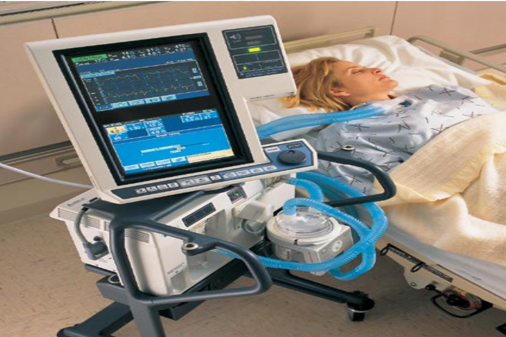
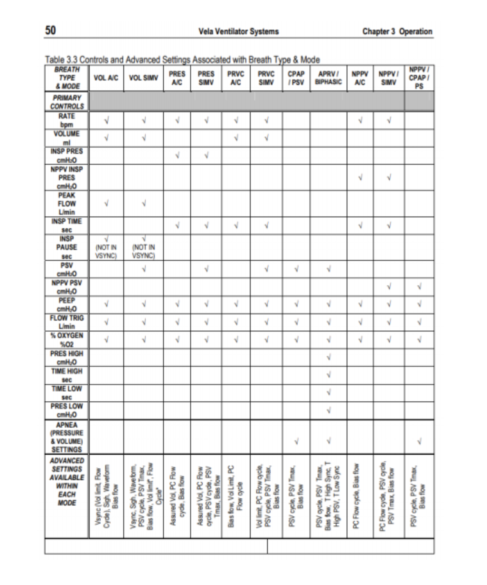

# Types of Mechanical Ventilators

### Volume cycled
* Preset volume of gas (tidal volume) is predetermined and delivered despite the amount of pressure generated

### Pressure cycled
* Gas pressure is predetermined
* Gas flow to patient ceases when pressure reaches preset level
* May mean that patient does not receive targeted
tidal volume

# Question 1
What differentiates a Volume Cycled and Pressure Cycled Mechanical Ventilator?

[RIGHT] Volume Cycled ventilators have a predetermined tidal volume, Pressure Cycled ventilators cease gas flow when pressure reaches the preset level
[WRONG] Volume Cycled ventilators have a predetermined tidal volume, Pressure Cycled ventilators begin gas flow when pressure reaches the preset level

# Models of Mechanical Ventilators

### PB 840 Ventilator

* Modes: A/C, SIMV, PS, Bilevel
* Mandatory Breath Type: Volume (VC), Pressure (PC), PRVC (VC+); NIV mode
* Touchscreen and dial knob navigation
* Adult/Pediatric/Infant
* Inspiratory/Expiratory hold functions for Pplat and Intrinsic PEEP monitoring
* Pressure/Flow/Volume waveforms and Flow/Volume + Pressure/Volume loops
* External alarm and streaming capabilities

### PB980 Ventilator

* Modes: A/C, SIMV, PS, Bilevel
* Mandatory Breath Type: Volume (VC), Pressure (PC), PRVC (VC+); NIV mode
* Adult/Pediatric/Infant (>7 kg)
* Same as PB840 with additional monitor and patient safety features:
    * Multiple graph views (up to 5 can be displayed)
    * Adjustable patient data parameters (Default will look the same as the PB840)
    * Vt/IBW monitoring
* External alarm and streaming capabilities

### Draeger XL

* Modes: IPPV, IPPVAssist/CMV, CMVAssist–SIMV, SIMVPsupp–MMV, MMVPsupp–BIPAP1), BIPAP1) ASB, BIPAP1) Assist / PCV+, PCV+Psupp, PCV+Assist–APRV –CPAP, CPAPASB CPAP/Psupp, CPAP/Psupp–ILV
* Pressure/Flow/Volume waveforms and Flow/Volume + Pressure/Volume loops
* Plateau pressure monitoring

### Servo-I

* Modes: A/C, SIMV, PS, Bilevel
* Mandatory Breath Type: Volume (VC), Pressure (PC), PRVC (Similar to VC+); NIV mode
* Inspiratory/Expiratory hold functions for Pplat and Intrinsic PEEP monitoring
* Pressure/Flow/Volume waveforms and Flow/Volume + Pressure/Volume loops
* Adult/Pediatric/Infant

### VyaireVela

* Modes –A/C, SIMV, PS
* Breath Types: VC, PC, PRVC, APRV (Bilevel)
* Pressure/Volume waveforms as well as Flow/Volume loops available

### Nihon KodenNKV- 550

* There is very limited information due to
this ventilator just being new to market
* Specifications can be found here: https://www.accessdata.fda.gov/cdrh_docs/pdf18/K181695.pdf
* Indicated for continuous ventilation
* Adult/Pediatric/Neonatal: Assisted/Control Mandatory Ventilation (A/CMV), Synchronized Intermittent Mandatory Ventilation (SIMV) or Spontaneous Ventilation (SPONT)
* Lung Protection software
* PEEP recruitment software

### LTACH/Sub Acute Ventilators

* Ideally, these ventilators are meant for patients who are chronic ventilator patients or patients with
lower ventilator requirements.
* PEEP < 8 CmH2O, FiO2 < 50%, Stable PIP
* These ventilators may be used in the acute care settings however have limited monitoring capabilities
* No graphics, non streaming, does not have external alarm capabilities

### LTV 1200

* Modes –A/C, Spontaneous
* Mandatory breath type –PC, VC
* Lacks graphics and waveforms, only displays numerical data
* Ideal for chronic ventilator patients but can be used in the critical care setting on patients with minimal ventilator requirements

### Trilogy 100

* Typically used as a home ventilator
* Modes –A/C, SIMV, AVAPS-AE, NIV
* Mandatory Breath – PC/VC, SIMV-PS
* Normally does not have a 50 PSI connection and must have O2 bleed in from a flow meter

### Phillips V60 (Invasive Mode)

* Intended for spontaneously breathing patients who require assisted ventilation.
* Requires different adapters to connect to either trach or ETT.
* The mode of ventilation will be PCV
* Single limb circuit with bi-directional flow

