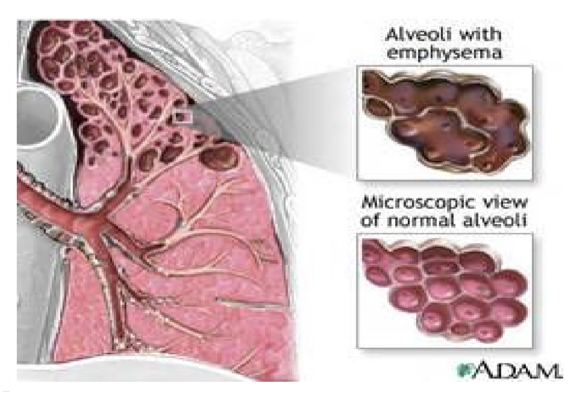
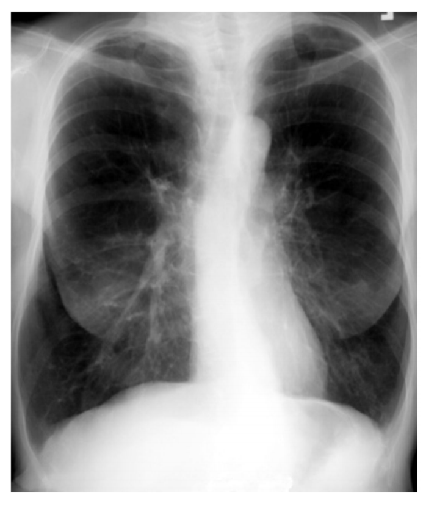
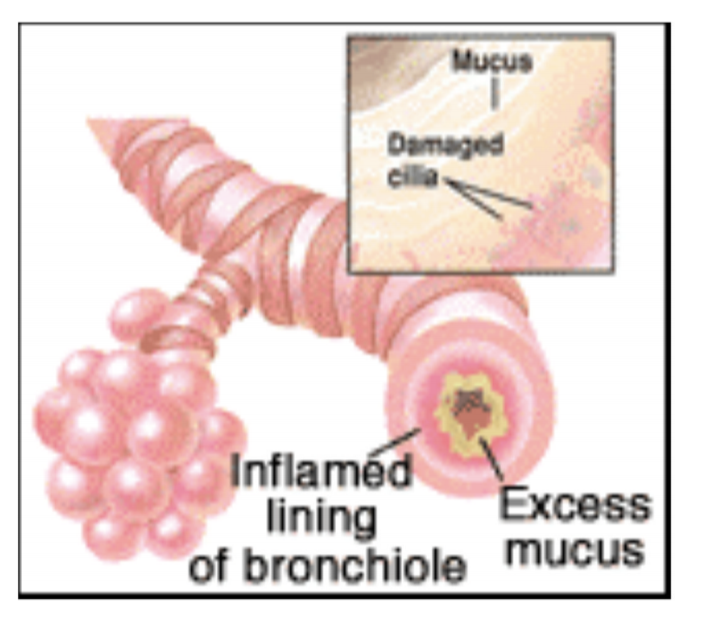

# Chronic Lung Disease

* Chronic Obstructive Pulmonary Disease (COPD) is a condition of chronic dyspnea with expiratory airflow limitation that does not significantly fluctuate
* COPD is the fourth leading cause of death in the United States
* It is also known as chronic obstructive lung disease (COLD)
* The Global Initiative for Chronic Obstructive Lung Disease defines it as “a preventable and treatable disease with some significant extrapulmonary effects that may contribute to the severity in individual patients”
* There are two classifications of COPD: chronic bronchitis and emphysema. These two types of COPD can have overlapping signs and symptoms
* The primary cause of the obstruction may vary; examples include airway inflammation that narrow or blocks airflow, mucous secretion that blocks airways, and alveolar wall destruction.

# ~Question 1
As a cause of death in the United States, COPD ranks:

[WRONG] Second
[WRONG] Third
[RIGHT] Fourth
[WRONG] Fifth

* COPD is the fourth leading cause of death in the United States

# ~Question 2
Which two diseases are included in categories of COPD?

[WRONG] Asthma and atelectasis
[RIGHT] Chronic bronchitis and emphysema
[WRONG] Pneumonia and pleurisy
[WRONG] Tuberculosis and pleural effusion

* Chronic bronchitis and emphysema belong to the old classification of COPD. Asthma may be one of the chronic pulmonary diseases but atelectasis is not. Pneumonia and pleurisy are not classified under the COPD. Tuberculosis and pleural effusion are not chronic pulmonary diseases.

# ~Question 3
Which factor is involved in the underlying pathophysiology of COPD?

[WRONG] Inflamed airways that obstruct airflow
[WRONG] Mucus secretion that blocks airways
[WRONG] Alveolar wall destruction
[RIGHT] Variations in all of the above

* Inflammation, hypersecretion of mucus, and alveolar wall destruction are included in the pathophysiology of COPD. Inflammation occurs through the proximal and peripheral airways, lung parenchyma, and pulmonary vasculature. Hypersecretion occurs due to the increase in the number of goblet cells. Alveolar wall destruction leads to loss of alveolar attachments and a decrease in elastic recoil.

# ~Question 4
In a patient with COPD, where does the abnormal inflammatory response occur?

[WRONG] Airways
[WRONG] Lung parenchyma
[WRONG] Pulmonary vasculature
[RIGHT] All of the above areas

* The airways, parenchyma, and pulmonary vasculature undergo inflammation in COPD.

# ~Question 5
Which condition is NOT considered a category of COPD?

[RIGHT] Pneumonia
[WRONG] Emphysema
[WRONG] Chronic bronchitis

# Emphysema -  Pathological Diagnosis

An abnormal distention of airspaces beyond the terminal bronchioles and destruction of the walls of the alveoli
* Patients with Emphysema, often referred to as "Pink Puffers," tend to be thin, cachetic persons with marked shortness of breath. Decreased lung compliance leads to increased work of breathing and dyspnea.

### Pathology
* Airway obstruction
* Hyperinflation
* Loss of lung elastic recoil
* Destruction of the alveolar-capillar interface

### Emphysema (Pink puffer)
* Progressive constant dyspnea
* Onset after 50 years of age
* Mild sputum – clear
* Thin, wasted, chest AP diameter increased
* BARREL chest
* Percussion – hyperresonant
* HCT normal
* CXR – bullae, blebs, hyperinflation
* Pursed lip breathing

### Emphysema
* Decreased ventilation despite increased lung capacity
* Decreased pulmonary diffusion surface
* Changes more prominent during exhalation
* Air trapping
* Tissue loses elasticity
* Alveolar septum is destroyed
* Increased number of mucus-secreting glands and cells
* Submucosal edema
* Narrowing of bronchial lumen
* Thickening of bronchial/bronchiolar walls
* Increased deadspace
* Dilation of distal airways

## Alveolus and lungs in Emphysema

### Alveolus in Emphysema

### Lung in Emphysema

### Destroyed Lung parenchyma

### CXR of patient with Emphysema

# ~Question 3
Which data are characteristic of a patient with emphysema?

[RIGHT] Onset after 50 years of age, AP diameter increased, lung capacity increased, pursed lip breathing
[WRONG] Onset after 50 years of age, AP diameter decreased, lung capacity decreased, pursed lip breathing
[WRONG] Onset after 50 years of age, AP diameter increased, lung capacity decreased, percussion (hyper resonant)
[WRONG] Onset after 50 years of age, AP diameter decreased, lung capacity increased, percussion (hyper resonant)

# Chronic Bronchitis - Clinical Diagnosis
A disease of the airways, defined as the presence of cough and sputum production for at least 3 months in each of 2 consecutive years
* Patients with Chronic Bronchitis, often referred to as "Blue Bloaters," tend to be large persons with cyanosis, edema, and relatively little dyspnea.

### Pathology
* Thickened bronchial walls
* Hyperplasia and hypertrophied mucous glands
* Mucosal inflammation in the bronchial wall and airways

### Chronic Bronchitis (Blue Bloater)
* Intermittent mild/moderate dyspnea
* Onset after 35 years of age
* Copious sputum production
* Purulent sputum during acute infection
* Stocky, obese with normal chest AP diameter
* Percussion – normal
* HCT increased
* Hypercapnea
* Hypoxemia
* Smoker's cough
* Pulmonary HTN
* Hepatomegaly

### Chronic Bronchitis (Blue Bloater)
* Cough and sputum production for at least 3 months/year
* Overinflation of alveoli
* Abnormal distribution of ventilation
* Narrowed airways due to thickened bronchial walls
* Mucus plugs
* Bronchial and bronchiolar wall inflammation
* Decreased number and function of cilia
* Increased number and size of mucus-secreting glands

### Airway in Chronic Bronchitis

# ~Question 6
Chronic bronchitis is characterized by:

[RIGHT] Excessive secretion of bronchial mucus
[WRONG] Irritation of the sinus cavities
[WRONG] Permanent enlargement of air spaces distal to the bronchiole

# Question 7
Which condition is manifested by a productive cough for greater than 3 months in at least 2 consecutive years in the absence of any other disease?

[RIGHT] Chronic bronchitis
[WRONG] Acute pneumonia
[WRONG] Pneumothorax

# Infection and Pulmonary Hypertension

### Acute Infection
The most common cause of death

### Pulmonary Hypertension

May result in signs and symptoms of right heart failure
* Dyspnea
* Angina at rest
* Syncope
* Cyanosis
* Peripheral edema
* Hepatomegaly
* Renal dysfunction

# ~Question 8
Which condition is a complication of pulmonary hypertension?

[RIGHT] Right heart failure
[WRONG] Pulmonary embolism
[WRONG] Pleuritis

# ~Question 9
Which findings are signs and symptoms of right heart failure?

[RIGHT] Dyspnea, syncope, peripheral edema
[WRONG] Productive cough, fever, elevated white blood count
[WRONG] Hypotension, erythema, palpitations

# Question 10
Which of the following conditions require a higher PEEP to be applied in recruiting collapsed alveoli?

[WRONG] Asthma
[RIGHT] Acute Respiratory Distress Syndrome
[WRONG] Bronchietasis
[WRONG] Emphysema

# Risk Factors in Chronic Bronchitis and Emphysema

* Cigarette smoking
* Chronic respiratory infections
* Occupational/environmental exposure – dust,chemicals, fumes
* Allergies
* A-protease inhibitor deficiency

COPD gradually worsens. HOWEVER, early detection, treatment and modification of risk factors can alter the disease course.

# ~Question 5
Which environmental risk factor is most important in development of emphysema?

[WRONG] Air pollution
[WRONG] Allergens
[WRONG] Infectious agents
[RIGHT] Cigarette smoking

* Cigarette smoking is the foremost factor in the development of emphysema. Air pollution is a risk factor in the development of emphysema but it is not the primary factor. Allergens may contribute to the development of emphysema but it is not the main factor. Infectious agents are part of the risk factors for emphysema but it is not the main factor.

# Question 4
Which condition is characterized by an abnormal permanent enlargement of the air spaces distal to the bronchioles?

[RIGHT] Emphysema
[WRONG] Chronic bronchitis
[WRONG] Pneumonia