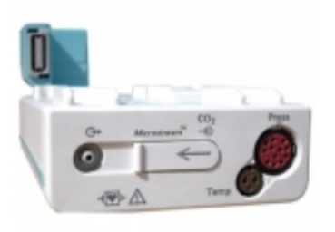
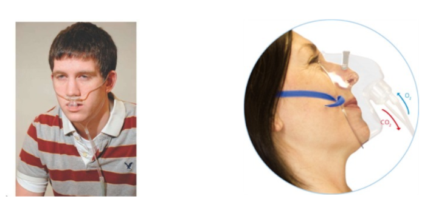

# Physiology

Monitoring end-tidal CO2 (PetCO2) provides instantaneous information about ventilation (how effectively CO2 gas is being exhaled/eliminated by the respiratory system), perfusion (how effectively CO2 is being transported through the vascular system to the lungs), and metabolism (how effectively CO2 is being produced by cellular metabolism). 

To use PetCO2 as a measure of blood flow:

* Ventilation must be constant (inhalation and exhalation are stable/normal
* Metabolism must be constant (activity/metabolic demand are stable)
* Under these conditions, PetCO2 will reflect pulmonary blood flow and can serve as gauge for effectiveness of chest compressions 
 * As cardiac output increases from compressions or return of spontaneous circulation (ROSC), more CO2 is returned to the lungs, increasing the level of PetCO2
 * If perfusion decreases from poor compressions or decreasing cardiac output, less CO2 is returned to lungs, decreasing the level of PetCO2

# Measurement

## MSBI Nurses 

You may/will see a Pulmonary/CC Attending or Fellow measuring PetCO2 during in a Code (and some RRT-intubation).

They will be using a hand held device (like one seen above) that will attach to the bag-valve to either a mask or to an ET or trach tube via tubing and connector (see below).

In some units/areas the PetCO2 may be measured on a bedside monitor (or portable/transport monitor defibrillator) with module and connector as seen below.

# End Tidal CO2

Continuous PetCO2 in line between airway and BVM or ventilator circuit.

Sensor links to monitor & displays numeric ETCO2 and waveform.

Remember CO2 is a result of tissue metabolism and circulation. Therefore if you have circulation/perfusion, the end result will be production of CO2. and then PetCO2 can be measured. Better the numeric = better the perfusion/circulation.

End Tidal CO2 Can also be measured and monitored in spontaneously breathing patients via nasal cannula or mask (see pictures below)

Same connectors and monitor would be used as seen in the previous section. This monitoring is often employed in PACU and procedure/post procedure areas.

# PetCO2 uses during CPR

### Confirm adequacy of chest compressions

* Measurement of a low PetCO2 value (< 10 mmHg) during CPR in an intubated patient suggests that the quality of chest compressions needs improvement.
 * Ensure proper rate (approximately 100/min)
 * Ensure proper depth with adequate release/recoil of thorax (1/2 thorax or minimum 2.5 inches)
* Persistently low PetCO2 values (<10mmHg) despite optimal chest compressions in intubated patients suggest ROSC is unlikely (data not available for patients receiving bag-valve ventilation (given that air leak can result in a low measured PetCO2 )

### Identification of the return of circulation

* Monitor for a significant increase in the EtCO 2 to near normal (normal ETCO 2 = 35- 45 mmHg) –represents marked increase of CO2 delivery to lungs, suggesting ROSC
* If patient develops an organized rhythm after VF/VT/asystole – check PetCO2 to see if ROSC has occurred

### Confirm placement of ETT

* After intubation, if ETCO 2 >10mm Hg –tube in trachea
 * If undetectable, ETT may be in esophagus or cardiac output too low to detect

# Pitfalls of interpreting PetCO2 levels

#### If PetCO2 level is low/undetectable, can be explained by

* pulmonary blood flow is low (large/massive PE)
* pulmonary exhaled air is low (status asthmaticus)
* poor offloading of C02 to lungs (pulmonary edema)

#### NaHC03 will increase PetCO2 (because it splits into CO2 and H20)

* So, if rises after NaHCO3, do not misinterpret as ROSC

#### Vasopressors will decrease PetCO2 (they cause high afterload, increasing BP and myocardial blood flow but a decrease in cardiac output)

* PetCO2 may decrease after epinephrine

# AHA guidline recommendations (for intubated patients):

#### Use PetCO2 to confirm Endotracheal Tube Placement (IA)

Will not be able to detect CO2 if ETT in esophagus

If PetCO2 < optimize compression parameters – rate/depth (IIB).

If PetCO2 abruptly increases to 35-40 mmHg, may indicate ROSC (IIB).

The value of using quantitative waveform capnography in non-intubated patients to monitor and optimize CPR quality and detect ROSC is uncertain (Class IIb, LOE C).

# Protocol

#### CO2 detectors will be carried to all cardiac arrests by PCCM Team (Fellow/Attending)

* Detectors to be stored and kept charged by PCCM Division

#### C02 detector must be immediately attached to BVM (or ETT if applicable)

* Code team members and PCCM Division must learn PetCO2 monitor installation and operation during Code team training exercises
* PetCO2 monitor to be placed on bed within view of compression team
* Compression team to monitor PetCO2 levels while performing compressions, must inform code leader of:
 * Initial measured PetCO2 level
 * Any significant change in PetCO2 level
  * Achievement of PetCO2 levels >10mmHg
  * Sudden increase to near 35-40mm Hg
  * Inability to achieve PetCO2 >10mm Hg

# Question 1
What is end tidal CO2?

[WRONG] Amount of CO2 in blood stream
[WRONG] Amount of CO2 in venous blood
[RIGHT] Partial pressure of CO2 in lungs measured at the end of expiration
[WRONG] 2nd derivative of Cardiac Output
[WRONG] Cardiac output during exhalation

# Question 2
End tidal CO2 is a useful measurement for all of the following EXCEPT:

[WRONG] Ventilation
[WRONG] Approximating PaCO2
[RIGHT] Oxygenation
[WRONG] Perfusion
[WRONG] Circulation

# Question 3
You should expect a normal to high end-tidal CO2 in all of the following pts EXCEPT 

[WRONG] 25 year old who just ran up a flight of stairs
[WRONG] Return of normal circulation during CPR
[RIGHT] Arsenic poisoning impeding cellular metabolism 
[WRONG] Patient in cardiac arrest with proper intubation and good compressions
[WRONG] A patient on a ventilator

# Question 4
You should expect a low end tidal CO2 in all of the following pts EXCEPT 

[WRONG] A person who just suffered a pulmonary embolism
[WRONG] A patient in hemorrhagic shock
[WRONG] A person with cardiac tamponade
[WRONG] A patient receiving vasopressors
[RIGHT] A patient receiving sodium bicarbonate

# Question 5
An end tidal CO2 level < 10 mmHg is associated to any of the following EXCEPT

[WRONG] Endotracheal tube placed into esophagus
[RIGHT] Return of normal circulation during CPR
[WRONG] Poor prognosis of CPR
[WRONG] Severe asthma
[WRONG] Bad chest compressions