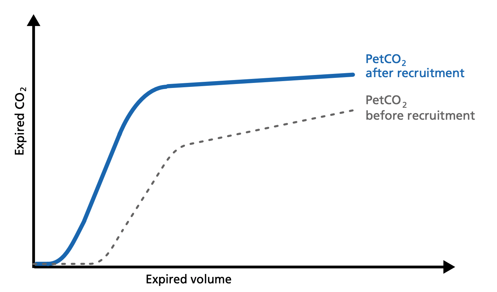
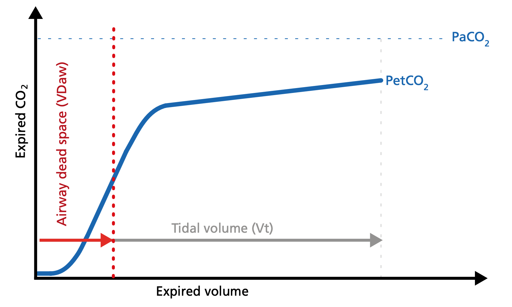

# Insight into the patient‘s lung condition

The volumetric capnogram can also be divided into three areas:
* Area X - CO2 elimination
* Area Y - Alveolar dead space
* Area Z - Anatomical dead space

The size of the areas, as well as the form of the curve, can give you more insight into the patient‘s lung condition regarding:
* Dead space fraction – VDaw /Vte
* Alveolar minute ventilation – V‘alv

1. Slope of Phase III
2. Slope of Phase II
3. The intersection of lines 1 and 2 defines the limit between Phases II and III.
4. A perpendicular line is projected onto the x-axis and its position is adjusted until the areas **p** and **q** on both sides become equal.

# Area X – CO2 elimination (V'CO2)
Area X represents the actual volume of CO 2 exhaled in one breath (VeCO2). Adding up all of the single breaths in one minute gives you the total elimination of CO 2 per minute (V‘CO2). If cardiac output, lung perfusion, and ventilation are stable, this is an assessment of the production of CO2 called V‘CO2. The V‘CO2 value displayed on the ventilator can be affected by any change in CO2 production, cardiac output, lung perfusion, and ventilation. It indicates instantly how the patient’s gas exchange responds to a change in ventilator settings. Monitoring trends allows for detection of sudden and rapid changes in V‘CO2.

### Decreasing V‘CO2
Hypothermia, deep sedation, hypothyroidism, paralysis, and brain death decrease CO2 production and induce a decrease in V‘CO2. Decreasing V‘CO2 can also be due to a decrease in cardiac output or blood loss, and may also suggest a change in blood flow to the lung areas. Pulmonary embolism, for example, exhibits V‘CO2 reduction and a slope reduction in Phase II.

### Increase in V‘CO2
Is usually due to bicarbonate infusion or an increase in CO 2 production that can be caused by:
* Fever
* Sepsis
* Seizures
* Hyperthyroidism
* Insulin therapy

# Area Y - Alveolar dead space
Area Y represents the amount of CO2 that is not eliminated due to alveolar dead space.

### Increase
Alveolar dead space is increased in cases of lung emphysema, lung overdistension, pulmonary embolism, pulmonary hyper- tension, and cardiac output compromise.

### Decrease
If the above mentioned conditions improve due to successful therapy, the alveolar dead space decreases.

# Area Z - Anatomical dead space
Anatomical dead space measurement using a volumetric capnogram gives an effective, in-vivo measure of volume lost in the conducting airway. This area represents a volume without CO2. It does not take part in the gas exchange and consists of the airway, endotracheal tube, and artificial accessories, such as a flextube positioned between the CO 2 sensor and the patient.

### An expansion of Area Z 
Can indicate an increase in anatomical dead space ventilation (VDaw). Consider a reduction of your artificial dead space volume.

### A diminution of Area Z 
Is seen when artificial dead space volume is decreased and when excessive PEEP is decreased.

# Alveolar minute ventilation – V‘alv
Phase III of the waveform represents the quantity of gas that comes from the alveoli and actively participates in gas exchange. V‘alv is calculated by subtracting the anatomical dead space (VDaw) from the tidal volume (Vte) multiplied by the respiratory rate from the minute volume (MinVol): V’alv = RR⋅Vtalv = RR⋅(Vte-VDaw)

### Increase
An increase in V‘alv is seen after an efficient recruitment maneuver and induces a transient increase in V‘CO 2.

### Decrease 
A decrease in V‘alv can indicate that fewer alveoli are participating in the gas exchange, for example, due to pulmonary edema.

# Dead space ventilation VDaw/Vte ratio
The ratio of anatomical dead space (VDaw) to tidal volume (Vte) – the VDaw/Vte ratio – gives you an insight into the effectiveness of ventilation.

* A rising VDaw/Vte ratio can be a sign of ARDS.
* In a normal lung, the VDaw/Vte ratio is between 25% and 30%.
* In early ARDS, it is between 58% and up to 83%.