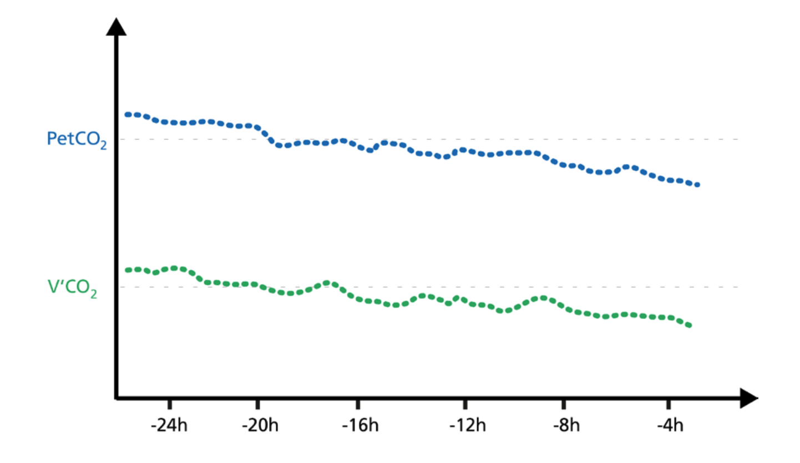
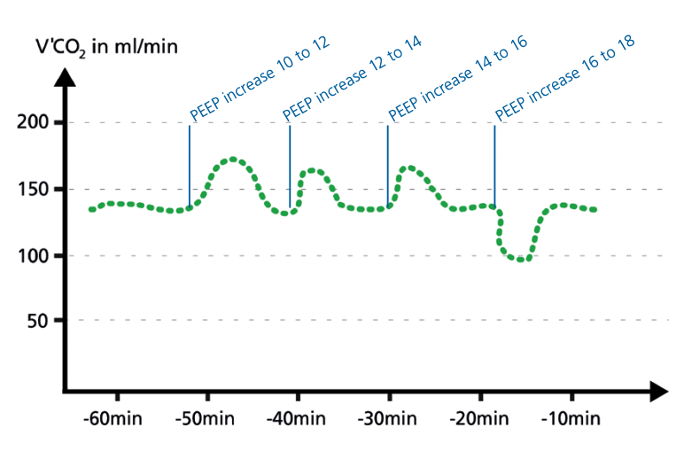

# PetCO 2 versus V‘CO2 - Opposing, asynchronous trends
If the PetCO2 trend moves up while the V‘CO2 trend decreases for a while and then returns to baseline, this indicates a worsening of ventilation.

If the PetCO2 trend moves down while the V‘CO2 trend increases for a while and then returns to baseline, this indicates an improvment of ventilation.

# PetCO2 versus V‘CO2 - Synchronous trends

Rising PetCO 2 and V‘CO2 trends indicate increasing CO 2 production (agitation, pain, fever).

Falling PetCO2 and V‘CO2 trends indicate a decrease in CO2 production.

# Optimizing PEEP by trends

When PEEP change is associated with an improving ventilation/perfusion ratio, V‘CO2 shows a transient increase for a couple of minutes and then returns back to baseline, that is, in equilibrium with CO2 production.

When PEEP change is associated with a worsening of the ventilation/perfusion ratio, V‘CO2 transiently decreases for a few minutes and then returns to baseline.

# Detecting alveolar derecruitment
Volumetric CO2 provides continuous monitoring to detect derecruitment and recruitment of alveoli.

Alveolar ventilation and V‘CO2 will first decrease if the lung derecruits, and will then stabilize again at equilibrium.

Recruitment, during, for example,a PEEP increase, can be detected by short V‘CO2 peaks before V‘CO2 returns to equilibrium.

# Question 1
Most capnography systems measure end tidal CO2 using:

[WRONG] Mass spectrometry
[WRONG] Magnetic resonance
[RIGHT] Infrared absorption
[WRONG] Carbon dioxide sensitivity

# Question 2
As a person exhales:

[RIGHT] The alveoli empty at varied rates and degrees
[WRONG] The alveoli in the apices empty first followed by the alveoli in the dependent regions
[WRONG] The alveoli that are more compliant empty first
[WRONG] The alveoli empty equally, regardless of location

# Question 3
In the normal patient the ETCO2 reading will be within _____ mmHg of the PaCO2.

[WRONG] 1-3
[RIGHT] 3-10
[WRONG] 5-15
[WRONG] 10-20

# Question 4
When using capnography, it is unnecessary to do an arterial blood gas.

[WRONG] True
[RIGHT] False

# Question 5
A normotensive patient has just been intubated and the monitor is reading a PetCO2 of
3mmHg. This would indicate:

[RIGHT] An esophageal intubation
[WRONG] Normal Function
[WRONG] Increased shunt
[WRONG] Cardiopulmonary instability

# Question 6
The End Tidal CO2 reatding appears to be normal but the reading varies by 15 from the
PaCO2.  What are the possible causes? A.  Bronchospasm B. Pulmonary Emboli C. V/Q
mismatch

[RIGHT] A, B, C
[WRONG] A only
[WRONG] B only
[WRONG] A and C