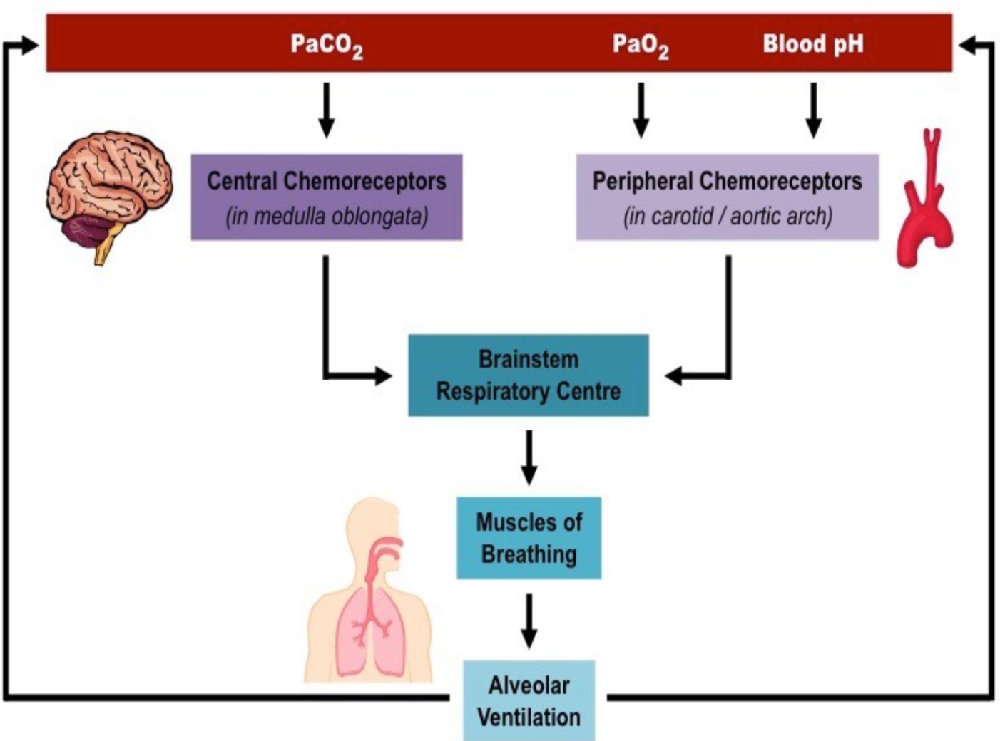

# Oxygenation and Ventilation

## Oxygenation and ventilation are measured differently

**Oxygenation**

* Pao2
* O2 Saturation

**Ventilation**

* Pco2 (35-45 mmHg)
* End tidal CO2 (30-43 mmHg)
* Minute ventilation
 *Tv x RR

1000 mL/min