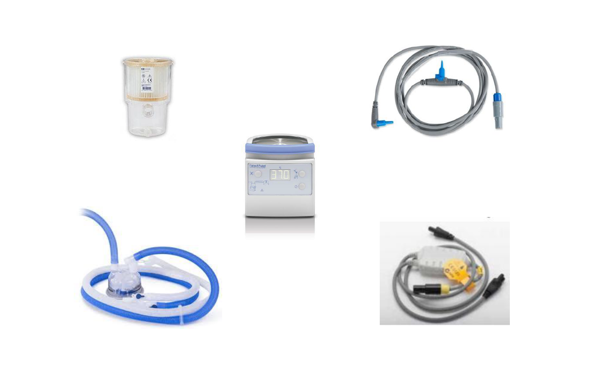

# Ventilator Circuit Components

# Modes of Ventilation

*A/C –Assist Control
* *Each breath is either “Assisted” or “Controlled”*
* *Controlled breaths are determined by the rate or frequency (“f”) that is set.*
* *Assisted breaths that are triggered by the patient (spontaneous)*

*VC –Volume Control: Set Vt(tidal volume)
*PC-Pressure Control: Set P (inspiratory pressure)
*PS –Pressure Support: Set positive pressure above PEEP (patient must be spontaneously breathing)

# Ventilation Settings 

*f –Frequency or Rate (breaths/minute)
*Vt –Tidal Volume (amount of air/gas that is
inhaled per breath)
*FiO2 – Fraction of Inspired Oxygen, is the
percentage of oxygen that is being delivered
*PEEP – Positive End Expiratory Pressure,
amount of positive pressure applied at the end
expiration

# Measured Values
*PIP –Peak Inspiratory Pressure
*MAP –Mean Airway Pressure
*PEEP –Positive End Expiratory Pressure (Measured)
*I:E –Inspiratory to Expiratory Ratio (this is a ratio and not a measurement
of time i.e. seconds)
*F(tot) –Total respiratory rate, mechanical and spontaneous
*Vt(e) –Measurement of Exhaled tidal volume
*Ve(tot) –Total Minute Volume (Ftot X Vte)

# Procedural Buttons

*100% FiO2 – Increases FiO2 to 100% for two minutes: To be used to prior to suctioning the patient
*Inspiratory Pause – breath hold at the peak of inspiration: Used to determine Plateau Pressure as well as Static and Dynamic Compliance
*Expiratory Pause –breath hold at the end of expiration: Used to determine Intrinsic PEEP or AutoPEEP

# Alarms

## Common Alarms

*↑ Ppeak–High peak pressure
Most common causes are: coughing, thick secretions, mucous plug, kinks in the circuit
*↓ Ppeak–Low peak pressure
Leak (either in the circuit or the airway cuff)
Will most likely also be associated with ↓ Vteand ↓ Ve
Vt does not meat patients demand

*↑Vte–High expired tidal volume
Most common cause is a nebulizer is being run inline which the vent reads as additional tidal volume.

*↓Vte–Most common causes are either a leak in the circuit or airway cuff or Ventilator-Patient Desynchrony

*↑Ve–High minute ventilation
Most commonly due to tachypnea or secondary to ↑Vte due to nebulizer running inline

*↓Ve–Low minute volume
 Leaks

*Circuit Disconnect –Patient may have become disconnected from the vent.
This will also occur with patient-ventilator dyssynchrony(patient vent demands are not met)

## High-Priority Alarms

*These alarms must not be ignored, patient safety is at risk! If any of these alarms occur assess your
patient (if vital signs are stable then attempt to rectify, if not then manually ventilate and call RCS)
*Patient Disconnect
*Severe Occlusion
*These alarms cannot be reset until rectified

## Low and Medium Priority (! And !!)

*These alarms are indicators of a change in a patients ventilation status and should be addressed.
* *Coughing*
* *Secretions*
* *Water in the tube*

