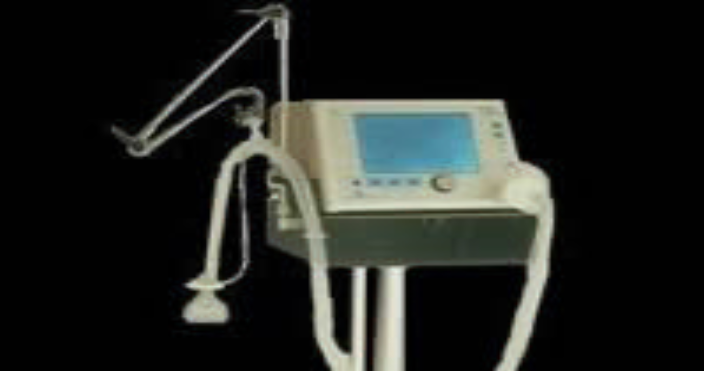
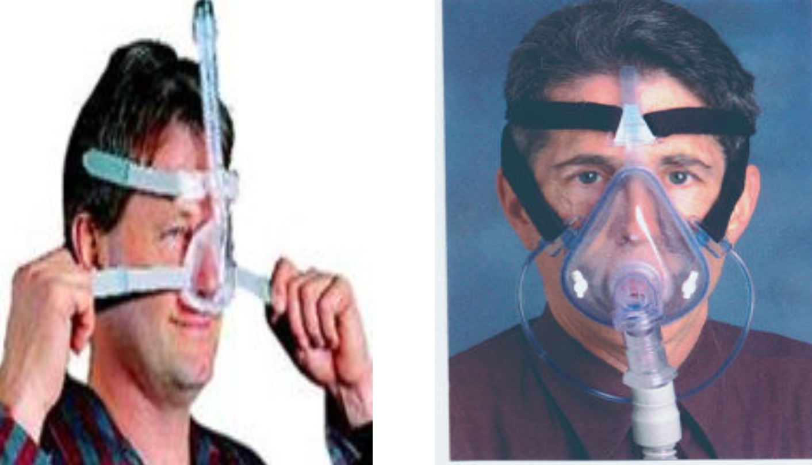
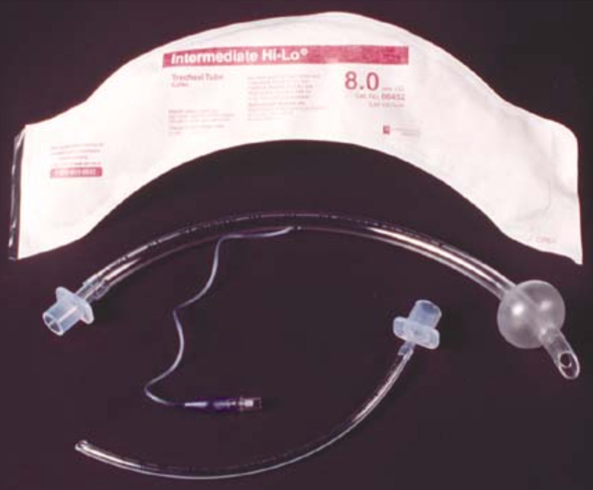
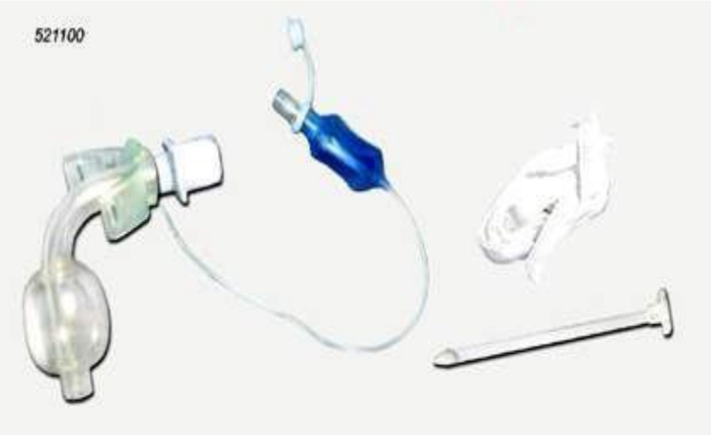
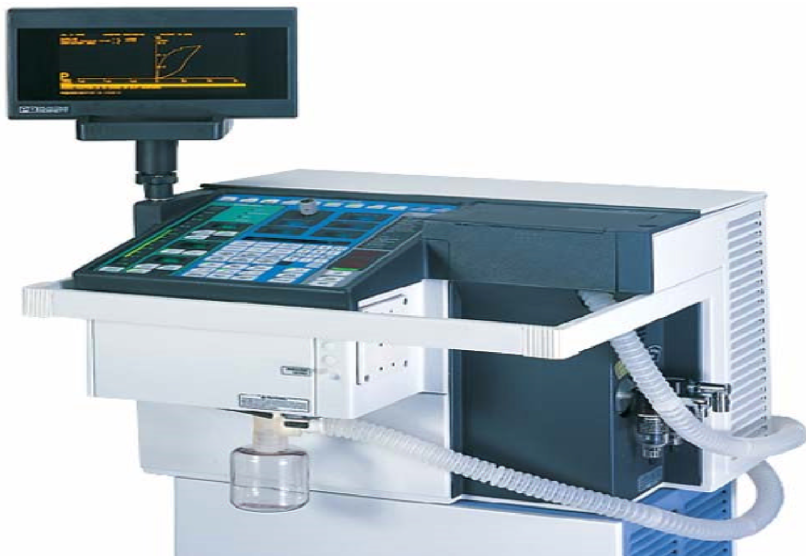
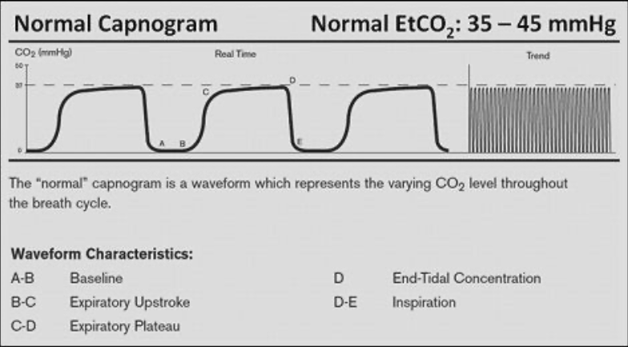
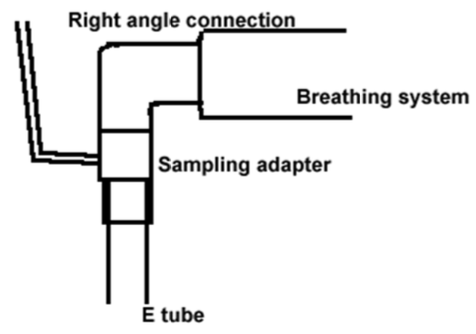
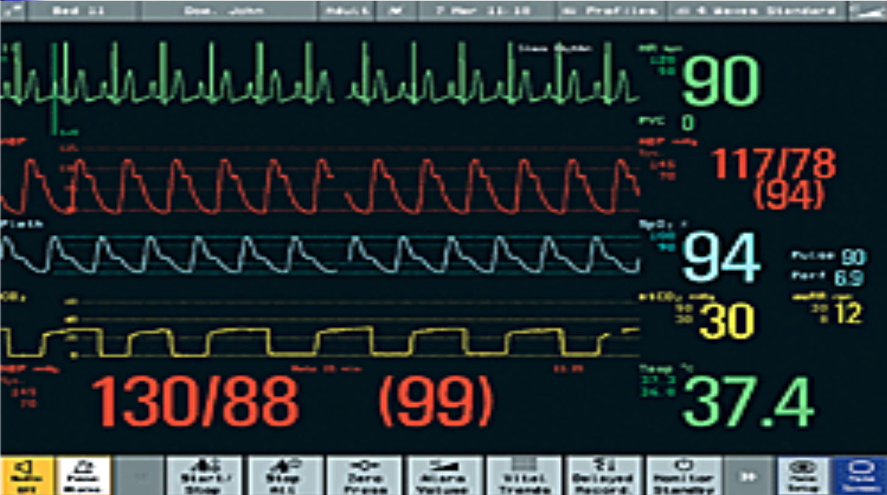

# Critical Care Course - Pulmonary Module - Mechanical Ventilation

# Non-Invasive Positive Ventilation

Method of ventilation without intubation.

Tight fitting nasal, oro-nasal or face mask attached to a non-invasive pressure support ventilator (NIPSV or BIPAP) unit.

Unit programmed to set back-up
* Respiratory rate
* Inspiratory positive airway pressure(IPAP)
* Expiratory pressure (EPAP)
* Supplemental FiO2 to maintain O2 sat > 92%

# BiPAP Machine

# BiPAP Masks

# Indications

## Inability to maintain adequate ventilation

* Ventilation – ability to remove CO2 from lungs
* High PaCO2 – hypoventilation
* Low PaCO2 - hyperventilation

## Inability to maintain adequated oxygenation

* Hypercarbia and hypoxemia frequently occur together
* Hypoxemia with low to normal CO2
* PaO2 cannot be maintained >50 mmHg by ncreasing FiO

## Work of breathing is greater than the patient can maintain

* Ventilation is inefficient and exhausting
* Increased RR due to stiff compliance
* Decreased vital capacity

**Isolate and protect the airway**
**Relieve airway obstruction**
**Facilitate suctioning of tracheobronchial tree**

# Routes

* Endotracheal
 * Proper ET placement – 2 cm (2 fingers) above carina
* Nasotracheal
* Tracheal-Tracheostomy (elective)
* Cricoidotomy (urgent)

## Endotrachael tubes

## Tracheostomy tube

# Types of Mechanical Ventilators

## Volume cycled
* Preset volume of gas (tidal volume) is predetermined and delivered despite the amount of pressure generated

## Pressure cycled
* Gas pressure is predetermined
* Gas flow to patient ceases when pressure reaches preset level
* May mean that patient does not receive targeted
tidal volume

## PB 7200 Ventilator

## PB 840 Ventilator

# Modes of Ventilation

## Control Mechanical Ventilation (CMV)
* Preset tidal volume and respiratory rate

### Disadvantages
* No spontaneous breathing
* Patient cannot adjust to changes in demands
* Lack of control –* panic
* May lead to hyperventilation
* Requires sedation/paralysis

## Assist Control (AC)
* Combines CMV with patient triggered mode
* Preset tidal volume and respiratory rate

### Advantages
* Patient can adjust to changes in demand
* Patient sets own breath interval
* Resting of respiratory muscles

### Disadvantages
* May decrease cardiac output
* Respiratory alkalosis

## Synchronized Intermittent Mandatory
* Ventilation (SIMV)
* Combines spontaneous breathing with mechanical ventilatory support
* Preset rate, tidal volume but allows spontaneous breaths at whatever tidal volume

### Advantages
* Synchronized respirations – less stacking and air trapping
* Allows exercise of respiratory muscles
* Possible less resp alkalosis in anxious patient

## Synchronized Intermittent
* Mandatory Ventilation (SIMV)

### Disadvantages
* Limited capacity to meet increasing ventilatory demands
* Resp acidosis may occur if insufficient ventilation
* Fatigue of respiratory muscles can occur

# Modes of Ventilation

## Pressure Support Ventilation (PSV)
* Pressure-assisted form of mechanical ventilation
* Augments patient’s own spontaneous efforts

### Advantages
* Patient controls inspiratory timing
* Gas flow can be changed to increase comfort
* Work of breathing can be relieved or progressively allowed
* Used in weaning
* Support ventilation along with SIMV

### Disadvantages
* Tidal volumes can decrease – due to decrease compliance
* Not for full support of unstable patients
* Back-up rate is not guaranteed if used alone

## Pressure Control Ventilation (PCV)
* Describes as pressure-control with inverse ratio ventilation
* Mechanical inspiratory phase limited to prevent lung trauma
* Inspiratory phase is longer than expiratory phase providing an I:E ratio from 2:1 to 4:1 (instead of normal I:E ratio of 1:2)

### Advantage
* Improved arterial oxygenation and ventilation with lower peak pressure

### Disadvantages
* Limited use – requires technical support and experience
* Requires sedation and neuromuscular paralysis

# Adjuncts to Mechanical Ventilation

## Positive-End Expiratory Pressure (PEEP)
* Airway pressure is maintained at end of expiration
* Increases functional residual capacity (FRC) thus improving lung volume and promoting alveolar recruitment
* Used for patients with refractory hypoxemia and bilateral lung disease

## Complications
* Reduced cardiac output
* May increase intracerebral pressure
* Increase risk for barotrauma
* Increase risk for pneumothorax

## Continuous Positive Airway Pressure (CPAP)
* Patient breathes independently, either through the ventilator circuit or with CPAP mask
* No preset tidal volume
* FiO2 and gas pressure at end-exhalation are controlled
* Used most often with patients requiring intubation for airway management
* Also used as weaning mode
* Commonly used as treatment for sleep apnea

**PEEP – used when patient is receiving a mechanical breath**
**CPAP – used when patient is breathing spontaneously**

# End Tidal CO2 measurement (PETCO2)
With spontaneous circulation (ROSC), continuous PETCO 2 will
* Be expected to be between 35 &* 40 mm Hg
* Reflect the quality and effectiveness of ventilation

**Remember CO2 is a result of tissue metabolism and circulation.**

## Capnography

# Complications of Mechanical Ventilation

## Infection
* Normal filtering system (nose) is bypassed
* Breaks in aseptic technique
* Debilitated patients

## Airway Obstruction
* Inadequate humidification causing thickened mucus
* Increased secretions with inadequate pulmonary toiletry
* Patient biting tube

## Atelectasis
* Bedrest
* Inadequate tidal volume
* Absent intermittent deep lung infections

## Oxygen Toxicity
* Prolonged high oxygen levels – FiO2 0.7-1.0
* Impaired surfactant activity

## Gastrointestinal Bleeding
* Stress
* Gastric hypersecretion of acid
* Lack of antacid therapy

## Pneumothorax
* Positive pressure causing a break in the integrity of the visceral pleura

## Hypotension
* Normal negative pressure becomes positive – decreases venous return
* Decreased pulmonary blood flow due to increased intrathoracic pressure compressing capillaries
* Compression of heart between the lungs - decreasing stroke volume

# Issues in Nursing Management
## Assessment of patient
* Signs and symptoms of inadequate ventilation or oxygenation
* Signs and symptoms of possible pneumothorax and progression to tension pneumothorax

## Helping patient cope
* Remove airway secretions
* Provide different ways to communicate
* Remove accumulated water from tubing
* Comfort measures
* Sedation

## Clinical Indications for Suctioning
* Audible airway noises
* Coughing
* Respiratory distress
* Assess and improve airway patency

## Technique
* Sterile technique
* Suction catheter size and pressure
* Preoxygenated with a high FiO2
* Hyperventilation prior to suctioning
* Do not suction during cath insertion
* Limit suctioning time per attempt
* Saline instillation

## Nutrition
### Malnourishment may cause
* Reduced response to hypoxia and hypercabnia
* Muscle atrophy
* Respiratory infection
* Decreased surfactant production
* Slowed healing of damaged tissues
* Lower serum albumin levels

### Overfeeding
* Problems with COPD and other patients unable to clear CO2
* Feeding with high carbohydrate tube feedings or parenteral nutrition increases the CO2 load
* Use of lipids to replace some of the caloric needs can reduce carbohydrate load

# Troubleshooting the Ventilator
**Guard against incorrect ventilator settings**
**Ventilator disconnect from patient is a common problem**

## High pressure alarm
* Patient needs suctioning
* Patient is biting the tube
* Tracheal tube has become misplaced
* Compliance is decreased
* Barotrauma

## Not receiving set tidal volume
### Cuff leak/insufficient air in cuff
* **ALARM: low volume air**
* **RX: Ventilate patient until cause is identified**

### Airway resistance. Compliance
* **ALARM: upper airway pressure alarm**
* **RX: Ventilate patient until cause is identified**

## NO tidal volume
* Patient disconnect from ventilator
* Large cuff leak
* Tube disconnect
* **ALARM: low volume alarm**
* **RX: Reconnect tubing, attempt to ambu until reintubation**

## Increased Airway Pressure
* Secretions, mucous plug, biting on the tube
* Decreased compliance – pneumothorax, atelectasis
* ETT slipped into RIGHT mainstem bronchus
* Increased resistance – high diaphragm
* **ALARM: airway pressure alarm**
* **RX: Suctioning, bite plate**
 * Assess breath sounds for ET placement
 * Position patient
 * Sedation

## Decreased or Loss of Volume
* Leak in ventilator system
* Cuff leak
* Humidifier leak
* **RX: Correct leak source**

## Respiratory Alkalosis
* CO2<35 pH >7.45
* Increased respiratory rate
* Restlessness, pain, anxiety
* Rate set up too high
* Tidal volume set too high
* **RX: Sedation**
 * Adjust rate, tidal volume

## Respiratory Acidosis
* CO2>45 pH <7.35
* **RX: Increase tidal volume**
 * Adjust rate, tidal volume

## Thick Secretions
* Inadequate hydration
* Insufficient humidification
* Infection, fever
* **RX: Water in humidifier**
 * Monitor fluid status

## High PaO2
* Delivering too high FiO2
* Improved clinical status
## Low PaO2
* VQ mismatch
* Pulmonary embolus
* Pulmonary edema
* **RX: Monitor ABG and adjust FiO2 accordingly**
 * **Peep**

## Decreased cardiac output
* Decreased venous return
* Relief of work effort
* PEEP
* Inadequate fluid volume status
* **ALWAYS ASSESS PATIENT FIRST, THEN CHECK THE VENTILATOR TUBING WHILE AMBUING**